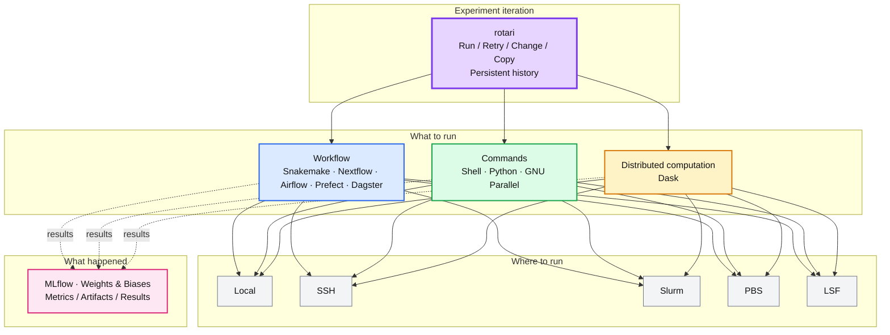

<picture>
  <source media="(prefers-color-scheme: dark)" srcset="docs/assets/rotari-logo-dark.svg">
  <source media="(prefers-color-scheme: light)" srcset="docs/assets/rotari-logo-light.svg">
  
</picture>

---

[](https://github.com/kamo-naoyuki/rotari/actions/workflows/ci.yml) [](https://github.com/kamo-naoyuki/rotari/actions/workflows/scheduler-integration.yml) [](https://codecov.io/gh/kamo-naoyuki/rotari) [](https://sonarcloud.io/summary/new_code?id=kamo-naoyuki_rotari) [](https://kamo-naoyuki.github.io/rotari/)

**Rotari turns trial-and-error into a repeatable loop**: run a batch of jobs, see which failed, fix only their commands, and run it again — without losing the history of what already worked.

It is for experiments and builds that you run repeatedly, but where defining a
full workflow up front would be more work than the iteration itself.

**Local commands, remote SSH commands, and scheduler jobs (Slurm, PBS, LSF) live
in the same queue**, even when they depend on each other. **Every run keeps its
own snapshot** of commands, status, and logs, so nothing gets lost between
"one more try" and the next.

**No DAGs to design. No pipeline to describe up front.**: Just queue what you want to run. **State lives in plain JSON files on disk**,
with no server or database to set up — it works the same whether you're on your
laptop or logged into a remote compute node.

| Plain shell (background jobs) | rotari |
| --- | --- |
|  |  |

## How is rotari different?

Rotari focuses on **managing the iteration of experiments**, rather than executing or distributing individual tasks.
If you've used [Kaldi](https://github.com/kaldi-asr/kaldi)'s or [ESPnet](https://github.com/espnet/espnet)'s `run.pl`/`queue.pl`, the model should feel familiar: commands are dispatched locally or to a cluster, with logs and success/failure tracked consistently across backends. rotari extends this idea with persistent run history and experiment-oriented iteration.

* **[Shell scripts](https://www.gnu.org/software/bash/)** are flexible and easy to start with, but repeated executions and their history are usually managed manually. rotari makes that iteration history explicit.
* **[GNU Parallel](https://www.gnu.org/software/parallel/)** makes it easy to run many shell commands in parallel. rotari goes further by giving those executions persistent identities, logs, status, and an iteration history.
* **[Slurm](https://github.com/SchedMD/slurm), [PBS](https://github.com/openpbs/openpbs), and LSF** focus on scheduling and executing jobs on a cluster. rotari adds an experiment-oriented layer for tracking, inspecting, retrying, and modifying runs.
* **[MLflow](https://github.com/mlflow/mlflow) and [Weights & Biases](https://github.com/wandb/wandb)** focus on tracking experiments, metrics, parameters, and artifacts. rotari focuses on running experiments, managing their execution, and keeping track of the history of successive runs. They can be used together: a rotari run can launch a training job that logs its results to MLflow or Weights & Biases.
* **[Snakemake](https://github.com/snakemake/snakemake)**, **[Nextflow](https://github.com/nextflow-io/nextflow)**, **[Airflow](https://github.com/apache/airflow)**, **[Prefect](https://github.com/PrefectHQ/prefect)**, and **[Dagster](https://github.com/dagster-io/dagster)** focus on defining and orchestrating workflows by explicitly modeling tasks and their relationships. rotari focuses on successive runs of an experiment without requiring the workflow to be defined up front.
* **[Dask](https://github.com/dask/dask)** focuses on distributing Python computations across workers. rotari focuses on running experiments as command-line jobs and keeping track of their execution history.




## Installation

### Prebuilt binary

Download the latest binary for your platform, make it executable, and put it
somewhere on your `PATH`:

```sh
os=$(uname -s | tr '[:upper:]' '[:lower:]')
arch=$(uname -m | sed 's/x86_64/amd64/; s/aarch64/arm64/')
curl -fL "https://github.com/kamo-naoyuki/rotari/releases/latest/download/rotari-${os}-${arch}" \
  -o /tmp/rotari
install -m 755 /tmp/rotari ~/.local/bin/rotari
```

Prebuilt binaries for Linux and macOS are available from the GitHub Releases
page. Go is not required when using a prebuilt binary.

The latest release is also
available from the [GitHub Releases](https://github.com/kamo-naoyuki/rotari/releases)
page.

Check the version:

```sh
rotari version
rotari --version
```

### Build from source

If you have Go installed, you can build rotari from source:

```sh
go build -o rotari ./cmd/rotari
install -m 755 ./rotari ~/.local/bin/rotari
```

Alternatively, install the latest version directly with `go install`:

```sh
go install github.com/kamo-naoyuki/rotari/cmd/rotari@latest
```

## Shell completion

Completion scripts are available for Bash, Zsh, and Fish:

```sh
# Install for the default shell reported by $SHELL
rotari completion install

# Select the shell explicitly when running a nested shell
rotari completion install bash
rotari completion install zsh
rotari completion install fish
```

Completion covers subcommands, command options, executor values, run selection
values, and the `server` subcommands. `completion install` updates the shell
configuration idempotently; it does not duplicate an existing rotari completion
block. Start a new shell after installation, or source the shell configuration
to apply it to the current shell.

Dynamic candidates include project names, saved run IDs, and job IDs. Job ID
completion normally includes IDs from the current queue and saved runs; when
`--run-id RUN_ID` is present, it is limited to jobs in that run.

For manual setup, `rotari completion bash`, `rotari completion zsh`, and
`rotari completion fish` print the raw completion scripts.

## FAQ

See [FAQ](docs/FAQ.md) for answers to specific "what happens if...?" questions
about project/run resolution, retries, array jobs, interrupted runs, and locking.

## Quick start

```sh
# Set the project once for the current shell. 
export ROTARI_PROJECT_NAME=build
# State is shared under ~/.local/state/rotari 
# by default; set ROTARI_BASEDIR to use another location.
# export ROTARI_BASEDIR="$HOME/.local/state/rotari"

# Start this example from a clean queue. This preserves run history but
# discards any commands currently queued for the project.
rotari reset

# Queue multiple commands, then run them together.
rotari add make
rotari add go test ./...
rotari run

# Or add and run a single command immediately.
rotari add --run go test ./...
```

`add` adds a command. `run` executes the queued commands and waits for
completion. Use `--retry N` to retry failed jobs up to N additional times, or
`--retry -1` to retry failed jobs indefinitely. Jobs explicitly cancelled by
the user are terminal for that run and are not automatically retried; a later
`rotari retry` can select them explicitly as failed/unfinished. A project
contains its current queue and saved runs. For regular use, set
`ROTARI_PROJECT_NAME` once in the shell; the project name can also be supplied
with `--project-name` or omitted.
When omitted, if only one project exists in the state directory, it is selected
automatically; if multiple projects exist, commands other than a bare `show`
ask you to specify one. A bare `rotari show` prints a warning and falls back to
the project list.
Use `--job-name NAME` to label a submitted job.
Use `--run-name NAME` to label a run; the generated run ID remains available for
unambiguous paths and commands.
Use `add --run` to add a command and immediately execute the queue in one command.
Use `add --run-async` for the same operation while returning after the run starts;
these options cannot be combined. See [Async runs](#async-runs) for the
background-run workflow.

Use `--depends-on NAME` to make a job wait for a named prerequisite. Repeat the
option to specify multiple prerequisites:

```sh
rotari add --job-name prepare ./prepare.sh
rotari add --job-name train --depends-on prepare ./train.sh
rotari run
```

The shortest retry loop is:

```sh
rotari show --project-name build --failed-logs
rotari retry --project-name build
```

`rotari retry` reruns failed and unfinished job bodies without rerunning
successful jobs. Jobs that already succeeded are carried forward into the new
run with their previous result and a link back to the original output, so the
whole run shows up together on one run page. When a failed job needs its saved
command edited before retrying, use `rotari change`; see the inspection and
recovery commands below.

### Example

```sh
./scripts/example.sh
```

### Python interface

The repository includes a small Python client that delegates execution to the
`rotari` executable. Install it from a checkout with:

```sh
python3 -m pip install --no-deps ./python
```

It provides convenient queue, run, wait, and status calls without duplicating
rotari's execution logic:

```python
from rotari import Rotari

rotari = Rotari(basedir=".rotari-state", project="experiment")
rotari.add(["./train.sh"], job_name="train")
run = rotari.run(async_=True)
summary = rotari.wait(run.run_id)
```

The client invokes the `rotari` executable without a shell, so the `rotari`
command must be available on `PATH` for the Python process. `wait` and `show`
use the CLI's machine-readable JSON modes; all queue and run semantics remain
owned by the CLI. This is intentionally a thin wrapper, not a Python-native
job executor: it accepts command argument lists such as `['./train.sh']`, not
Python functions to serialize and submit. For a function-oriented Python job
submission framework, see [Submitit](https://github.com/facebookincubator/submitit);
rotari instead exposes the existing CLI and its local, SSH, and scheduler
backends to Python.


## Local web UI

See the [web demo](https://kamo-naoyuki.github.io/rotari/) for a read-only UI
using generated example data.


Start the local web status UI separately from the job runner:

```sh
rotari web
```

Pass `--allow-control=false` for a read-only UI that only serves state, logs,
and the CLI/env docs and rejects the control APIs with `403 Forbidden`.
For a non-loopback listener, set `ROTARI_WEB_AUTH_TOKEN` or pass
`--auth-token TOKEN`; requests must include `Authorization: Bearer TOKEN` (or
`X-Rotari-Token: TOKEN`). For the browser UI, use Basic authentication with
username `rotari` and the token as the password. Prefer the environment
variable so the token does not appear in the process list. This is lightweight
HTTP authentication, not encryption, so use HTTPS or a trusted/private network
when the token or job data must be protected in transit.
The `/api/state` and `/environment/` pages report which environment
variables are *set*, never their values, so secrets such as API tokens are
not exposed over HTTP. When a config file is active, the project and run pages
also let you view its raw contents; keep the Web UI bound to a trusted host
because config files may contain secrets.

## Projects, queues, runs, and state

A project groups one current queue and its run history. `add` assembles the
next experiment in `queue.json`. `run` freezes that batch into one run ID and
stores its snapshot, logs, and results separately.


The state directory mirrors this lifecycle:

```text
<basedir>/
├── server.log
└── projects/
  └── <project-name>/
    ├── queue.json
    └── runs/
      └── <run-id>/
        ├── commands.json
        ├── summary.json
        └── <job-id>/
          ├── command.json
          └── output
```

Each submitted command has a stable job ID. `run` saves the complete command
snapshot under `runs/<run-id>/`, together with a summary and each job's log.
After it finishes, the queue is emptied, while the run can be inspected or used
with selections such as `rotari retry`. The next `add` starts a new batch while
keeping the previous run history. Use `delete` to remove saved run logs
explicitly. Use `run --async` when an experiment should continue after the
terminal returns.

## Scheduler

Each job can choose its execution backend and backend-specific options:

```sh
rotari add --project-name build make
rotari add --project-name build \
  --executor slurm \
  --executor-option="-p short --cpus-per-task=2" \
  ./heavy-test.sh
rotari run --project-name build --local-concurrency 4 --batch-concurrency 8
```

Local jobs and scheduler-backed jobs may be mixed in the same queue. Use
`--local-concurrency` for local jobs and `--batch-concurrency` as the default
submission limit for non-local execution backends. Use `--ssh-concurrency`,
`--slurm-concurrency`, `--pbs-concurrency`, or `--lsf-concurrency` for
backend-specific limits.
`--batch-concurrency` only limits how many jobs rotari submits and tracks
concurrently. It does not change the scheduler's own queue priority or
execution limits; after submission, the scheduler decides whether each job is
`pending`, `running`, or in another state.
`--executor-option` is the common dispatch option list. Use `--ssh-options`,
`--slurm-options`, `--pbs-options`, or `--lsf-options` for backend-specific
options. Backend-specific settings take precedence over common dispatch
settings, while job-specific executor options take precedence over both.

Use `--env KEY=VALUE` with `add` to save environment variables on a job. They
are exported for every executor, including local, SSH, Slurm, PBS, and LSF, and
are preserved when the job is copied or retried. `rotari change --env KEY=VALUE`
replaces the job's saved environment; repeat it for multiple variables, or use
`--clear-env` to remove them. rotari's own `ROTARI_*` context variables take
precedence over a same-named user value.

### SSH executor

For the `ssh` executor, the first `--executor-option` is the SSH destination;
remaining options are passed to `ssh`. rotari runs the command over that SSH
session, then stores its output, exit status, and destination host in the
local run directory. Use `--working-directory DIR` to set the execution
directory; for SSH this is a directory on the remote host. It can be changed
later with `rotari change` or the web UI.

```sh
rotari add --project-name build \
  --executor ssh \
  --executor-option="builder@worker-01" \
  --executor-option="-p 2222" \
  --working-directory=/work/build \
  --env DATASET=nightly \
  --env CUDA_VISIBLE_DEVICES=0 \
  ./heavy-test.sh
rotari run --project-name build
```

### Array jobs

Array jobs can be added with a numeric range or a comma-separated task list:

```sh
rotari add --array 1-10 --executor local ./train.sh
rotari add --array 1-10 --executor slurm ./train.sh
rotari add --array 1,3,4 --executor slurm ./train.sh
```

Each task is tracked separately. Local execution starts one process per task;
Slurm, PBS, and LSF submit native scheduler arrays when the complete range is
selected. Sparse task lists are submitted as independent jobs so they work
with scheduler versions that do not support sparse native arrays. For each
array task, rotari exposes:

- `ROTARI_ARRAY_TASK_ID`: current task number
- `ROTARI_ARRAY_FIRST`: first task number in the array
- `ROTARI_ARRAY_LAST`: last task number in the array
- `ROTARI_ARRAY_SIZE`: total number of tasks

Scheduler-backed arrays also map the native index variable into these values,
for example `SLURM_ARRAY_TASK_ID`, `PBS_ARRAY_INDEX`, or `LSB_JOBINDEX`.

The Slurm and PBS executors are integration-tested in CI against a Slurm
container and an OpenPBS container. These tests do not certify compatibility
with every real cluster configuration. The LSF executor is covered by unit
tests using fake scheduler commands, but has not yet been tested against a
real LSF installation.

## Async runs

```sh
rotari run --project-name build --async
rotari wait --run-id RUN_ID
```

To add a command and start the queue in one step, returning immediately after
the run starts:

```sh
rotari add --run-async go test ./...
```

The async start message prints commands for checking status and cancelling the
run. `wait` returns the overall run exit code. Pass multiple run IDs to wait
for independent async runs together:

```sh
rotari run --project-name build --async
rotari run --project-name test --async
rotari wait RUN_ID_FROM_BUILD RUN_ID_FROM_TEST
```

When the project is already running, `rotari wait` without a run ID waits for
that active run automatically. Use `--project-name` when more than one
project exists.

Pressing Ctrl-C during a synchronous `rotari run` requests cancellation and
returns your terminal immediately (exit code 130) — it does not wait for
jobs to stop. The supervisor keeps running in the background, cancels the
still-running jobs, and only then finishes its normal cleanup, including the
run summary, queue clearing, and run-lock removal; a new `run`/`add`/`copy`
against the same project may be briefly rejected until that finishes.
Routine interruption does not require `unlock` or `server shutdown`.

Pressing Ctrl-D during a synchronous `rotari run` detaches the client without
cancelling the run. The terminal returns immediately and the run continues as
if it had been started with `--async`; use `rotari wait --run-id RUN_ID` or
`rotari show --run-id RUN_ID` to follow it.

Ctrl-Z only suspends the foreground client through the shell's job control; the
run continues while the client remains stopped, and `fg` resumes watching it.
However, closing the terminal then kills the stopped client and disconnects
the synchronous run, which requests cancellation. It is not a clean detach,
so use Ctrl-D (or start with `rotari run --async`) when you want to leave the
interactive progress view.

An async run is started as a detached process in a new session (`setsid`), so
it keeps running even if the terminal that launched it is closed. Use
`rotari wait --run-id RUN_ID` from any terminal (or later) to block on the run, and
`rotari cancel` to stop it.

The detached supervisor is not auto-restarted by rotari if the process itself
crashes or is killed. The run lock records its PID and host, and local jobs use
self-reporting wrappers so `rotari show --run-id RUN_ID` can still see job
status written after the supervisor disappeared. If the run remains
interrupted, confirm the jobs have stopped, then use the recovery command shown
by `show` (`unlock` to keep the queue, or `reset --recover` to discard it).

## Inspect

To inspect the latest run or list all runs:

```sh
rotari show --basedirs
rotari show --projects
rotari show --project-name build
rotari show --project-name build --runs
rotari show --project-name build --failed
rotari show --project-name build --job-id JOB_ID
rotari show --project-name build --logs
rotari show --project-name build --failed-logs
```

`show --projects` lists every project in the resolved basedir with its queued
job count, run state, and latest run ID. It does not select a project, so it
also works when the basedir contains multiple projects. The output includes
commands for selecting a project and inspecting its latest run; `latest` is an
alias for the latest saved run when used with `--run-id`.

`show --basedirs` prints the resolved master directory and state directories
known through its run and live-server registries. This is not exhaustive: a
basedir with no registered run and no running server cannot be discovered this
way. Use `--masterdir DIR` to inspect a non-default master registry.

`--logs` prints the output log for every job in the selected run.
`--failed-logs` prints logs only for jobs that failed. Both options accept
`--run-id RUN_ID` to inspect a specific run.
Without `--run-id`, `show` displays the active run while a project is running,
then the current queue when it has commands, and otherwise the latest run. A
queued-jobs view includes the exact `rotari run` command needed to execute them.
Use `--run-id` to inspect a specific saved run, or use `--run-id latest` for
the latest saved run.

If a runner exits before finalizing its run, `show` reports the interrupted run
and blocks `add`, `copy`, and `run` until you acknowledge it. First confirm
that all jobs have stopped:

```sh
rotari show --project-name build
```

To keep the retained queue for the next run, execute the `rotari unlock`
command printed by `show` (for example, `rotari unlock --run-id RUN_ID`). To
discard the queue while preserving the interrupted run's history, use:

```sh
rotari reset --recover
```

Use `retry` or result filters when the interrupted run contains completed jobs.
Outside an interrupted run, `rotari reset` simply discards the current queue.
When output is a terminal, log views (including `--job-id`) longer than 24
lines open in `$PAGER` (or `less -R` by default). Use `--no-pager` to print
directly; piped and redirected output is always printed directly.

### LLM error diagnosis

**Experimental:** The LLM diagnosis command is an opt-in early feature. Its
prompt, supported providers, and response format may change in future releases.

See the [LLM diagnosis guide](docs/LLM_DIAGNOSIS.md) for setup,
provider details, configuration, and execution examples.


## Recover and rerun
### run and retry

`run` can select jobs from the latest run, or from a saved run given by
`--run-id`, and execute them as a new run while carrying forward everything
else. Result filters select which jobs are copied into the new queue for
execution; jobs with completed results that do not match are copied as
carry-forward results. In other words, `run --failed`, `run --unfinished`, and
similar commands copy the selected jobs and then run the resulting queue.

```sh
rotari run --project-name build --failed
rotari run --project-name build --unfinished
rotari run --project-name build --success
rotari run --project-name build --failed --unfinished
rotari run --project-name build --job-id JOB_ID
```

`retry` is shorthand for `run --failed --unfinished`. It selects failed and
unfinished jobs from the reference run, copies them into the next run with
successful results carried forward, and executes that run:

```sh
rotari retry --project-name build
```

The result filters select which jobs are actually re-executed:

| Option | Executed jobs |
| --- | --- |
| `--failed` | Finished jobs with a non-zero exit code. |
| `--unfinished` | Jobs without a completed result. |
| `--success` | Finished jobs with exit code zero. |
| `--failed --unfinished` | Failed or unfinished jobs. |

Result filters and job IDs may be combined; jobs matching any selected filter
or ID are copied for execution. Jobs that do not match but already have a
finished result in the reference run are copied as carry-forward results: they
are not re-executed, and their previous result and output remain visible on the
new run's page. Jobs that neither match nor have a previous result are simply
left unfinished.
For example, `--failed --unfinished` re-executes failed or unfinished jobs
while carrying forward everything that already succeeded.

Use `--failed --unfinished` when a run may have been interrupted and you want to
recover everything that did not complete successfully. Use `--job-id` to select
specific jobs by ID instead of filtering by result; it may be repeated and is
mutually exclusive with the result filters above. `--run-id ID` changes the
reference run used for both the queue snapshot and the result filters.

`run --run-id ID` can select jobs directly from a saved run instead of the live
queue. It restores that run's jobs first, then applies result filters
(`--failed`, `--unfinished`, `--success`, or `--job-id`). A non-empty queue
requires confirmation before replacement; add `--overwrite` to `run --run-id`
to replace it without asking. Finished jobs that do not match the filter are
carried forward instead of re-executed. For example:

```sh
rotari run --project-name build --run-id RUN_ID --failed
```

For an array job (`--array`), result filters default to per-task selection
(`--partial-array=true`): only the tasks matching the filter (e.g. the failed
ones) re-execute, and the rest carry forward their own previous result
instead of the whole array running again. Pass `--partial-array=false` to
re-execute every task whenever any one of them matches, as in earlier
versions.


### copy and change

Copy jobs from a previous run into the current queue without executing them:

```sh
rotari copy --project-name build --run-id RUN_ID --failed --unfinished
```

This is the explicit form of what `run --failed --unfinished` does: copy the
selected jobs into the current queue, then run that queue. The same applies to
`run --failed`, `run --unfinished`, `run --success`, and other filter
combinations.

`copy` keeps the source job ID unless it would collide with the destination
queue, and preserves dependencies between copied jobs. A non-empty queue
requires confirmation before replacement; use `--append` to add jobs or
`--overwrite` to replace it without asking. Selection options include
`--failed`, `--unfinished`, `--success`, and repeated `--job-id`. Copied jobs
remain pending, with source run, status, and working-directory metadata kept
for later inspection.

Use `copy` when a selected job needs to be edited before it is run again. It
restores jobs into the current queue without executing them; then `change` can
modify their commands or options while preserving the saved run history:

```sh
rotari copy --project-name build --run-id RUN_ID --failed --unfinished
rotari change --job-name train --executor local
rotari change --job-name train --executor-option="-p gpu"
rotari change --job-name train --depends-on prepare -- ./train-v2.sh
rotari run
```

`change` requires exactly one target selector: `--job-id ID` or
`--job-name NAME`. It also requires at least one change, such as a new command,
`--executor`, `--executor-option`, `--set-job-name`, or `--depends-on`.
It replaces only the options specified, keeps the job ID, and edits the current
batch. If the queue is empty, the latest run snapshot is restored first. Use
`--run-id` to select another run.

## Queue and job control

Remove jobs from the current queue without affecting saved run history:

```sh
rotari remove --project-name build --job-name train
rotari remove --project-name build --job-id JOB_ID --job-id OTHER_JOB_ID
```

If the queue is empty, `remove` restores the latest run snapshot first. Use
`--run-id` to select another run. Specify exactly one target selector:
`--job-name NAME` or one or more `--job-id ID` options. Removing a job that
another queued job depends on is rejected.

Stop running jobs without stopping the supervisor:

```sh
rotari cancel --project-name build
rotari cancel --project-name build --job-id JOB_ID
```

`--job-id` is optional. Without it, all running jobs in the queue are
cancelled. With it, only the specified running jobs are cancelled, and the
option may be repeated. `--job-id` cannot be used with `--wait`.

Whole-run cancel (no `--job-id`) and, for `local`-executor jobs, `--job-id`
cancel/suspend/resume all signal the runner or job by PID, which only means
something on the host that actually runs it; run these commands from that
host if it differs from wherever `cancel`/`suspend`/`resume` is invoked. See
the [FAQ](docs/FAQ.md#client-control-and-job-cancellation) for what happens
when you can't.

Temporarily suspend and resume running jobs:

```sh
rotari suspend --project-name build
rotari suspend --project-name build --job-id JOB_ID
rotari resume --project-name build --job-id JOB_ID
```

Without `--job-id`, all currently running jobs are affected. Repeat `--job-id`
to control selected jobs. Local jobs use `SIGSTOP`/`SIGCONT`; Slurm jobs use
`scontrol suspend`/`scontrol resume`.

Delete saved run logs while keeping queued commands:

```sh
rotari delete --project-name build
rotari delete --project-name build --run-id RUN_ID
```

`--run-id` removes only the specified run. Without it, all saved run logs are removed.

The commands affect the current queue and saved run history differently:


## State and project resolution

rotari resolves the state directory before it resolves the project name. The
first matching state-directory entry wins:

The resolution order for the state directory is:
1. `--basedir` option
2. `ROTARI_BASEDIR` environment variable
3. `./.rotari-state` (if it exists in the current directory)
4. Default location (`$XDG_STATE_HOME/rotari` or `~/.local/state/rotari`)

The resolution logic for the project name when `--project-name` is omitted is:
1. `--project-name` option
2. `ROTARI_PROJECT_NAME` environment variable
3. Automatically select if exactly one project exists in the state directory
4. Default project name (`default`) if no projects exist yet (if multiple projects exist, an error will prompt you to specify one)

These rules apply consistently to commands that do not identify an existing
run through its run registry. Use `--basedir` and `--project-name` when a
command must target a specific location explicitly.

## Configuration files

Run the following command to choose a config file location interactively and
generate a template. The available options and their descriptions are shown
there.

```sh
rotari config
```

The resolution order is:

```text
CLI option (e.g., --retry)
environment variable (e.g., ROTARI_RUN_RETRY)
project config path (e.g., <basedir>/projects/demo/config.yaml)
basedir config path (e.g., <basedir>/config.yaml)
global config path (e.g., ~/.config/rotari/config.yaml)
built-in default
```

`rotari show` includes the resolved config path list in its header when config
files are present, so the effective config chain is visible in the CLI as well
as in the web UI.

## Run completion webhook

Set `webhook.url` in a config file, or use `ROTARI_WEBHOOK_URL`, to send a JSON
`POST` notification after a run is finalized. The optional `webhook.on` or
`ROTARI_WEBHOOK_ON` value can be `always` (the default), `success`, or
`failure`. Multiple values may be comma-separated. Webhook delivery failures
are reported as warnings and do not change the run result.

```toml
[webhook]
url = "https://example.example/rotari-hook"
on = "failure"
# format = "slack"  # or "teams" / "discord"
```

```sh
export ROTARI_WEBHOOK_URL=https://example.example/rotari-hook
export ROTARI_WEBHOOK_ON=failure
# export ROTARI_WEBHOOK_FORMAT=slack  # or teams / discord
```

The payload contains the event, project, run, status, exit code, successful and
failed job counts, and failed job IDs. For failed runs, `show_command` contains
a copy-pasteable command that displays the failed job logs. A successful delivery creates
`webhook.sent` in the run directory so the same run is not notified twice.

For direct Slack setup and notes about other notification services, see
[Webhook integrations](docs/WEBHOOK_INTEGRATIONS.md).

## Environment variables

The same environment can be used to configure the CLI and to inspect the
currently running job. Variables with a matching CLI option are read as that
option's default; an explicit command-line option always takes precedence. Job
variables are injected into command processes and can also be passed
explicitly to another rotari command.

Each command's `--help` output identifies an option's matching environment
variable, when one is available.

Use `rotari env` to print the same list with values from the current process.


## Server management

The supervisor starts automatically when a run needs it and stops after the
run finishes. These commands are mainly useful for inspection and cleanup:

```sh
rotari server status
rotari server list
rotari server shutdown
```

The supervisor records lifecycle, request, and error events in
`<basedir>/server.log`. The file is capped at 1 MiB and is truncated before a
new event would exceed that limit.

## Run registry maintenance

Run IDs do not contain the base directory or project name. rotari therefore
keeps a master **run registry**, a lookup table that maps each run ID back to
the base directory and project that own it. This lets commands such as
`show --run-id`, `wait --run-id`, and `copy --run-id` work without repeating
`--basedir` and `--project-name`.

The run data itself remains under the project state directory:

```text
<basedir>/projects/<project>/runs/<run-id>/
```

The registry is stored separately, with one JSON file per run:

```text
<masterdir>/runs/<run-id>.json
```

`<masterdir>` is selected from `--masterdir`, `ROTARI_MASTERDIR`,
`$XDG_STATE_HOME/rotari/master`, or `~/.local/state/rotari/master`, in that
order. A registry file contains the run ID, base directory, and project name;
it is only a lookup index, not the source of the run's logs or results.

`gc` is separate from inspection and recovery: it maintains this master
registry after run data was removed outside rotari. First scan for orphaned
registry entries:

```sh
rotari gc
```

The candidates and their locations are printed and cached for ten minutes.
The temporary GC plan is stored at `<masterdir>/gc.json`.
Malformed or invalid registry files are listed and left untouched; inspect
their run data and repair or remove them manually.
After reviewing them, apply that exact plan:

```sh
rotari gc --apply
```

The apply step removes registry entries only. It skips candidates whose
registry location changed or whose run directory reappeared, and never deletes
run data.

## Shared filesystem locking

Multiple hosts may use the same queue when they share the same state directory
(`--basedir` or `ROTARI_BASEDIR`) on an NFS filesystem. Queue updates such as
`add`, `change`, `remove`, `copy`, `run`, and `delete` are serialized with an
advisory file lock. NFSv4 servers and clients must be configured to support
file locking. rotari waits up to 30 seconds when another update holds this
lock, then returns an error; it does not remove the advisory lock file because
doing so cannot release an active `flock` lock safely.

An active run is recorded in `running.lock` with its run ID, PID, and host.
On the host that started the run, rotari removes the lock automatically when
the PID is no longer alive, but retains the run metadata as interrupted and
blocks queue mutations until `unlock` acknowledges recovery. A lock created on
another host is always treated as active: rotari cannot reliably determine
whether a remote PID is still alive.

This coordination is intentionally file-based, not a distributed lock service.
It depends on the shared filesystem providing consistent `O_EXCL`, atomic
rename, and advisory `flock` behavior. It does not fence a host after a
network partition or repair stale/inconsistent mounts, so do not use the same
project through mounts that can disagree about the state files. After a host
failure, confirm that its jobs stopped before using `unlock` from another host.
Different project names have separate queue, metadata, and run-lock files, so
using different projects on multiple hosts is substantially safer than sharing
one project. The base-level server, run registry, and filesystem are still
shared, however.

If a remote host has failed and the run is confirmed stopped, remove its stale
run lock explicitly. First find the run ID, then unlock that exact run:

```sh
rotari show --project-name build --runs
rotari unlock --project-name build --run-id RUN_ID
```

`unlock` checks that the current lock or interrupted metadata belongs to the
supplied run ID, removes a matching lock when present, and returns the project
to queue collection. Do not use it while the run could still be executing;
doing so can allow a second run for the same queue.

## Security model

rotari assumes a trusted single-user or HPC/lab environment. The optional Web
UI token described above provides lightweight HTTP authentication, but does
not encrypt traffic. Other access is gated by:

- **Filesystem permissions.** By default, the state directory tree
  (`--basedir`), server registry (`--masterdir`), and everything under them
  (`queue.json`, `meta.json`, locks, job `output`/status, wrapper scripts)
  are created with the same permissive `0755`/`0644` rotari has always used
  — this is the "shared state" default, since colleagues on the same
  HPC/lab cluster commonly point each other at a job's log path directly.
  Set `ROTARI_PRIVATE_STATE=true` to switch to owner-only `0700`/`0600`
  instead if you don't need that sharing and want to keep job commands,
  working directories, and output readable only to yourself. This only
  affects newly created paths — existing directories are not
  retroactively re-chmod'd, and it's an all-or-nothing setting per
  `--basedir` (mixing it complicates permissions on shared paths).
- **The background server's Unix socket** (`<basedir>/server.sock`) accepts
  `submit`/`cancel`/`suspend`/`resume`/`run`/`shutdown` — reaching it means
  being able to control that server. Unlike the rest of the state
  directory, it is always created `0600` regardless of `ROTARI_PRIVATE_STATE`,
  and on Linux the server also verifies each connection's peer UID
  (`SO_PEERCRED`) matches its own before accepting it.
- **`rotari web`** (see above) adds an HTTP surface. Without
  `ROTARI_WEB_AUTH_TOKEN` or `--auth-token`, keep it bound to `127.0.0.1`;
  with a token, expose it only through a trusted network or HTTPS proxy.

None of this defends against another user with access to your own UID
(e.g. root, or anyone who can read your home directory), only against other
unprivileged users on a shared machine.

## Development

See [rotari internals](docs/INTERNALS.md) for the architecture, persistent-state
contracts, resolution rules, and code ownership used by maintainers and coding agents.
