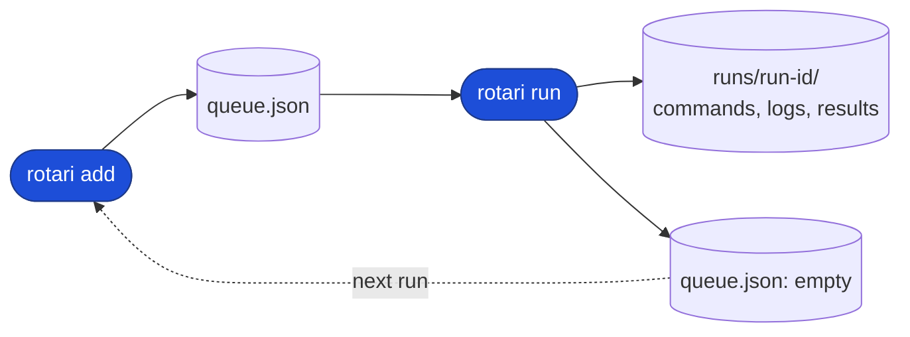
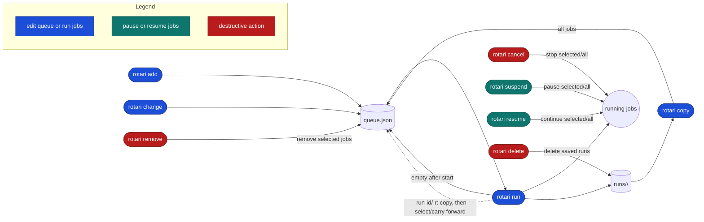
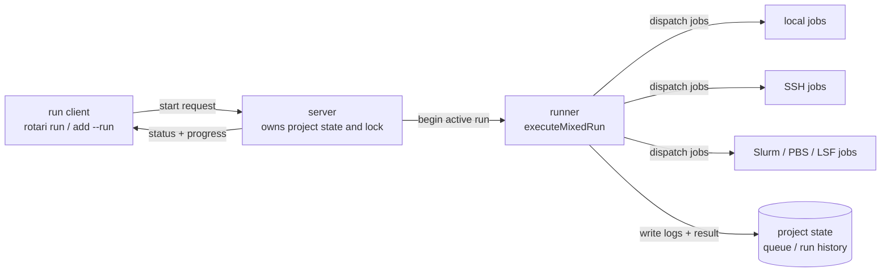

<picture>
  <source media="(prefers-color-scheme: dark)" srcset="docs/assets/rotari-logo-dark.svg">
  <source media="(prefers-color-scheme: light)" srcset="docs/assets/rotari-logo-light.svg">
  
</picture>

---

[](https://github.com/kamo-naoyuki/rotari/actions/workflows/ci.yml) [](https://github.com/kamo-naoyuki/rotari/actions/workflows/scheduler-integration.yml) [](https://codecov.io/gh/kamo-naoyuki/rotari) [](https://sonarcloud.io/summary/new_code?id=kamo-naoyuki_rotari) [](https://kamo-naoyuki.github.io/rotari/)

**Rotari turns trial-and-error into a repeatable loop**: run a batch of jobs, see which failed, fix only their commands, and run it again — without losing the history of what already worked.

It is a lightweight workflow engine for experiments and builds that you run repeatedly. **Workflows are built from the CLI commands you already have**, with simple dependencies between them. There is no new workflow language to learn and no external database or server to set up.

**Local commands, remote SSH commands, and scheduler jobs (Slurm, PBS, LSF) live in the same queue**, even when they depend on each other. **Every run keeps its own snapshot** of commands, status, and logs, so nothing gets lost between "one more try" and the next.

## How is rotari different?

| Plain shell (background jobs) | rotari |
| --- | --- |
|  |  |


Rotari is intentionally lightweight. It is for experiments and builds where **ordinary shell scripts are already a natural way to describe what should run**, but running those commands repeatedly starts to become difficult to manage.

You do not need to turn a simple sequence of commands into a workflow definition just to run it. **Write the commands as you normally would in a shell script, and use rotari when you need execution, parallelism, logs, status, and run history.**

If you've used [Kaldi](https://github.com/kaldi-asr/kaldi)'s or [ESPnet](https://github.com/espnet/espnet)'s `run.pl`/`queue.pl`, the basic idea should feel familiar: commands are dispatched locally or to a cluster, with logs and success/failure tracked consistently across backends.

* [**Snakemake**](https://github.com/snakemake/snakemake) is built around rules, inputs, outputs, and dependencies. This is useful when the workflow itself is an important part of the problem. But for a small experiment where a shell script already expresses what you want to run, introducing a separate workflow definition can add concepts that are unnecessary for the task. **Rotari lets the shell script remain the workflow.**


* [**Nextflow**](https://github.com/nextflow-io/nextflow) provides a DSL for describing processes, dataflow, and workflows. It is useful when you want to express a workflow explicitly, but it also introduces a dedicated language for doing so. **Rotari is for cases where the commands you already have are enough to describe the workflow, and learning another workflow language would be unnecessary overhead.**

* [**Airflow**](https://github.com/apache/airflow), [**Prefect**](https://github.com/PrefectHQ/prefect), and [**Dagster**](https://github.com/dagster-io/dagster) provide programmatic ways to define and orchestrate workflows. They are a good fit when the workflow itself needs to be expressed and managed as a program. **Rotari is aimed at a narrower case: when the CLI commands you already have are enough to describe the workflow, you can keep them as they are and use Rotari to run and manage them.**

The goal is not to replace shell scripts or compete with full-featured workflow systems. **It is to add just enough structure to the commands you already use, and let the commands remain the workflow.**


## Installation

### Prebuilt binary

Download the latest binary for your platform, make it executable, and put it
somewhere on your `PATH`:

```sh
os=$(uname -s | tr '[:upper:]' '[:lower:]')
arch=$(uname -m | sed 's/x86_64/amd64/; s/aarch64/arm64/')
curl -fL "https://github.com/kamo-naoyuki/rotari/releases/latest/download/rotari-${os}-${arch}" \
  -o /tmp/rotari
install -m 755 /tmp/rotari ~/.local/bin/rotari
```

Prebuilt binaries for Linux and macOS are available from the GitHub Releases
page. Go is not required when using a prebuilt binary.

The latest release is also
available from the [GitHub Releases](https://github.com/kamo-naoyuki/rotari/releases)
page.

Check the version:

```sh
rotari version
rotari --version
```

### Build from source

If you have Go installed, you can build rotari from source:

```sh
go build -o rotari ./cmd/rotari
install -m 755 ./rotari ~/.local/bin/rotari
```

Alternatively, install the latest version directly with `go install`:

```sh
go install github.com/kamo-naoyuki/rotari/cmd/rotari@latest
```

## Shell completion

Completion scripts are available for Bash, Zsh, and Fish:

```sh
# Install for the default shell reported by $SHELL
rotari completion install

# Select the shell explicitly when running a nested shell
rotari completion install bash
rotari completion install zsh
rotari completion install fish
```

Completion covers subcommands, command options, executor values, run selection
values, and the `server` subcommands. `completion install` updates the shell
configuration idempotently; it does not duplicate an existing rotari completion
block. Start a new shell after installation, or source the shell configuration
to apply it to the current shell.

Options with a fixed set of values, such as `--executor/-e`, reject values outside
the choices shown by completion and `rotari schema --json` during CLI parsing.

Dynamic candidates include project names, saved run IDs, and job IDs. Job ID
completion normally includes IDs from the current queue and saved runs; when
`--run-id/-r RUN_ID` is present, it is limited to jobs in that run.

For manual setup, `rotari completion bash`, `rotari completion zsh`, and
`rotari completion fish` print the raw completion scripts.

## FAQ

See [FAQ](docs/FAQ.md) for answers to specific "what happens if...?" questions
about project/run resolution, retries, array jobs, interrupted runs, and locking.

## Quick start

```sh
# Set the project once for the current shell.
export ROTARI_PROJECT_NAME=build
# State is shared under ~/.local/state/rotari
# by default; set ROTARI_BASEDIR to use another location.
# export ROTARI_BASEDIR="$HOME/.local/state/rotari"

# Start this example from a clean queue. This preserves run history but
# discards any commands currently queued for the project.
rotari reset

# Queue multiple commands, then run them together.
rotari add make
rotari add go test ./...
rotari run

# Or add and run a single command immediately.
rotari add --run go test ./...
```

`add` adds a command. `run` executes the queued commands and waits for
completion. Use `--retry N` to retry failed jobs up to N additional times, or
`--retry -1` to retry failed jobs indefinitely. Jobs explicitly cancelled by
the user are terminal for that run and are not automatically retried; a later
`rotari retry` can select them explicitly as failed/unfinished. A project
contains its current queue and saved runs. For regular use, set
`ROTARI_PROJECT_NAME` once in the shell; the project name can also be supplied
with `--project-name/-p` or omitted.
When omitted, if only one project exists in the state directory, it is selected
automatically; if multiple projects exist, commands other than a bare `show`
ask you to specify one. A bare `rotari show` prints a warning and falls back to
the project list.
Use `--job-name NAME` to label a submitted job.
Use `--run-name NAME` to label a run; the generated run ID remains available for
unambiguous paths and commands.
Use `add --run` to add a command and immediately execute the queue in one command.
Use `add --run-async` for the same operation while returning after the run starts;
these options cannot be combined. See [Async runs](#async-runs) for the
background-run workflow.

Use `--depends-on NAME` to make a job wait for a named prerequisite. Repeat the
option to specify multiple prerequisites:

```sh
rotari add --job-name prepare ./prepare.sh
rotari add --job-name train --depends-on prepare ./train.sh
rotari run
```

A typical workflow is: run a script, inspect the jobs list, then drill into a
failed or interesting job's output. For a detailed view, use the inspect commands
below (`jobs` and `show`). Quick run + inspect flow:

```sh
# Add and run a script immediately.
rotari add --run ./scripts/example.sh
# Check the current job status across projects.
rotari jobs
# Inspect one specific attempt in detail, including its output path and status.
rotari show -j ATTEMPT_ID
# Show only the failed-job logs for the selected project/run.
rotari show -p build --failed-logs
```

The shortest retry loop is:

```sh
rotari show -p build --failed-logs
rotari retry -p build
```

`rotari retry` reruns failed and unfinished job bodies without rerunning
successful jobs. Jobs that already succeeded are carried forward into the new
run with their previous result and a link back to the original output, so the
whole run shows up together on one run page. When a failed job needs its saved
command edited before retrying, use `rotari change`; see the inspection and
recovery commands below.

### Shorthand options

Frequently used options have short forms:

| Long option | Short option |
| --- | --- |
| `--project-name` | `-p` |
| `--basedir` | `-b` |
| `--run-id` | `-r` |
| `--job-id` | `-j` |
| `--executor` | `-e` |


### Example

```sh
./scripts/example.sh
```

The example adds a dependent job, a two-task array,
and a job that intentionally fails once. The first run therefore has failures;
`rotari retry` reruns only the failed array task and job, while carrying the
successful work forward.

To run the array job through Slurm instead, pass the optional flag. The local
`prepare` and `failing-job` jobs remain local:

```sh
./scripts/example.sh --slurm
```

The first positional argument selects the project name, for example
`./scripts/example.sh --slurm scheduler-demo`.

### Python interface

The repository includes a small Python client that delegates execution to the
`rotari` executable. Install it from a checkout with:

```sh
python3 -m pip install --no-deps ./python
```

It provides convenient queue, run, wait, and status calls without duplicating
rotari's execution logic:

```python
from rotari import Rotari

rotari = Rotari(basedir=".rotari-state", project="experiment")
rotari.add(["./train.sh"], job_name="train")
run = rotari.run(async_=True)
summary = rotari.wait()
rotari.reset()
```

The client runs `rotari` directly, so the executable must be on the Python
process's `PATH`. It accepts command argument lists such as `['./train.sh']`,
not Python functions. `wait(selector)` accepts a project name, run name, or run
ID (or waits for the active run by default); `reset(recover=True)` enables
interrupted-run recovery. For function-oriented submission, see
[Submitit](https://github.com/facebookincubator/submitit).

## Local web UI

See the [web demo](https://kamo-naoyuki.github.io/rotari/) for a read-only UI
using generated example data.


Start the local web status UI separately from the job runner:

```sh
rotari web
```

Use `--allow-control=false` for a read-only UI that serves state, logs, and
CLI/env docs and returns `403 Forbidden` for control APIs. For non-loopback
listeners, set `ROTARI_WEB_AUTH_TOKEN` (preferred) or pass `--auth-token TOKEN`;
API requests use `Authorization: Bearer TOKEN` or `X-Rotari-Token: TOKEN`, and
the browser UI uses Basic auth with username `rotari` and the token as password.
This is HTTP authentication, not encryption: use HTTPS or a trusted network.
`/api/state` and `/environment/` show only whether variables are set. 

## Projects, queues, runs, and state
### Project and queue
A project has one mutable queue of jobs ready to run and an immutable history
of completed runs. The live queue is `queue.json`; each run snapshots it under
`runs/<run-id>/`, so retries and filtered reruns leave earlier history unchanged.

```text
<basedir>/projects/<project>/
├── queue.json                 # current queue
└── runs/
    └── <run-id>/              # immutable run history
        ├── commands.json
        ├── summary.json
        └── <job-id>/...
```

### Run and state

Each run records its own command snapshot, success/failure status, logs, and
metadata. When a run finishes, the runner updates the project state and leaves
the completed run immutable, which makes retry loops and inspection easy to
reason about without losing the earlier outcome.



Each submitted command has a stable job ID. `run` saves the complete command
snapshot under `runs/<run-id>/`, together with a summary and each job's log.
After it finishes, the queue is emptied, while the run can be inspected or used
with selections such as `rotari retry`. The next `add` starts a new batch while
keeping the previous run history. Use `delete` to remove saved run logs
explicitly. Use `run --async` when an experiment should continue after the
terminal returns.

### IDs and location resolution

Rotari uses three different IDs:

| ID | Meaning |
| --- | --- |
| `run-id` | One execution of a project queue. It identifies the run snapshot, summary, and history. |
| `job-id` | A logical job in a queue or run. For an array, expanded task IDs look like `job-id-1`, `job-id-2`, and so on. |
| `attempt-id` | One concrete execution of one logical job, including a retry. It identifies the attempt output and status. |

The `run-id` identifies a run and provides its project location. An
`attempt-id` identifies one job execution and provides its `job-id` and
`run-id`, so the command can resolve the same project location from the attempt
alone.

The `--job-id/-j` option accepts either a logical `job-id` or an `attempt-id`.
When an `attempt-id` is provided, its associated job, run, project, and basedir
are resolved automatically.

| Selector | Information available for resolution | Options that can be omitted |
| --- | --- | --- |
| `-r RUN_ID` | `run-id`, `basedir`, and `project` | `--basedir/-b`, `--project-name/-p` |
| `-j ATTEMPT_ID` | `attempt-id`, `job-id`, `run-id`, `basedir`, and `project` | `--basedir/-b`, `--project-name/-p`, `--run-id/-r` |

With an ordinary `job-id`, the location still needs to come from the explicit
project/run options, the corresponding environment variables, or the normal
single-project/current-run resolution rules. For example:

```sh
# rotari show -b BASE_DIR -p PROJECT_NAME -r RUN_ID -j ATTEMPT_ID
# is equivalent to
rotari show -j ATTEMPT_ID
```
```sh
# rotari copy -b BASE_DIR -p PROJECT_NAME -r RUN_ID -j JOB_ID
# is equivalent to
rotari copy -r RUN_ID -j JOB_ID
```

The following commands accept an `ATTEMPT_ID` as their `--job-id/-j` selector:

- `ATTEMPT_ID` supported: `show`, `diagnose`, `cancel`, `suspend`, `resume`,
  `copy`, `run`, `retry`.
- `ATTEMPT_ID` not supported: `add`, `change`, `remove`, `delete`, `wait`.
  These commands operate on queue definitions or whole runs, not individual attempts.


## Scheduler

Each job can choose its execution backend and backend-specific options:

```sh
rotari add -p build make
rotari add -p build \
  -e slurm \
  --executor-option="-p short --cpus-per-task=2" \
  ./heavy-test.sh
rotari run -p build --local-concurrency 4 --batch-concurrency 8
```

Local jobs and scheduler-backed jobs may be mixed in the same queue. Use
`--local-concurrency` for local jobs and `--batch-concurrency` as the default
submission limit for non-local execution backends. Use `--ssh-concurrency`,
`--slurm-concurrency`, `--pbs-concurrency`, or `--lsf-concurrency` for
backend-specific limits.
`--batch-concurrency` only limits how many jobs rotari submits and tracks
concurrently. It does not change the scheduler's own queue priority or
execution limits; after submission, the scheduler decides whether each job is
`pending`, `running`, or in another state.
`--executor-option` is the common dispatch option list. Use `--ssh-options`,
`--slurm-options`, `--pbs-options`, or `--lsf-options` for backend-specific
options. Backend-specific settings take precedence over common dispatch
settings, while job-specific executor options take precedence over both.

Use `--env KEY=VALUE` with `add` to save environment variables on a job. They
are exported for every executor, including local, SSH, Slurm, PBS, and LSF, and
are preserved when the job is copied or retried. `rotari change --env KEY=VALUE`
replaces the job's saved environment; repeat it for multiple variables, or use
`--clear-env` to remove them. Rotari's own `ROTARI_*` context variables take
precedence over a same-named user value.

### SSH executor

For `ssh`, the first `--executor-option` is the destination and subsequent
options go to `ssh`; `--working-directory` is a remote directory. Rotari
records output, status, and host locally. The remote host needs Linux `/proc`,
`setsid`, and standard command-line tools; cancellation reconnects to terminate
the recorded process.

```sh
rotari add -p build \
  -e ssh \
  --executor-option="builder@worker-01" \
  --executor-option="-p 2222" \
  --working-directory=/work/build \
  --env DATASET=nightly \
  --env CUDA_VISIBLE_DEVICES=0 \
  ./heavy-test.sh
rotari run -p build
```

### Array jobs

Array jobs can be added with a numeric range or a comma-separated task list:

```sh
rotari add --array 1-10 -e local ./train.sh
rotari add --array 1-10 -e slurm ./train.sh
rotari add --array 1,3,4 -e slurm ./train.sh
```

Each task is tracked separately. Local execution starts one process per task;
Slurm, PBS, and LSF submit native scheduler arrays when the complete range is
selected. Sparse task lists are submitted as independent jobs so they work
with scheduler versions that do not support sparse native arrays. For each
array task, rotari exposes:

- `ROTARI_ARRAY_TASK_ID`: current task number
- `ROTARI_ARRAY_FIRST`: first task number in the array
- `ROTARI_ARRAY_LAST`: last task number in the array
- `ROTARI_ARRAY_SIZE`: total number of tasks

Scheduler-backed arrays also map the native index variable into these values,
for example `SLURM_ARRAY_TASK_ID`, `PBS_ARRAY_INDEX`, or `LSB_JOBINDEX`.

The Slurm and PBS executors are integration-tested in CI against a Slurm
container and an OpenPBS container. These tests do not certify compatibility
with every real cluster configuration. The LSF executor is covered by unit
tests using fake scheduler commands, but has not yet been tested against a
real LSF installation.

## Async runs

```sh
rotari run -p build --async
rotari wait build
```

To add a command and start the queue in one step, returning immediately after
the run starts:

```sh
rotari add --run-async go test ./...
```

The async start message prints commands for checking status and cancelling the
run. `wait` returns the overall run exit code. Pass a project name, run name,
or run ID as a positional selector. Rotari checks them in that order, so a
project name wins over a run name and a run ID when the same string is used for
more than one kind of identifier. Use `--run-id/-r` to select a run explicitly.
Pass multiple selectors to wait for independent async runs together:

```sh
rotari run -p build --async
rotari run -p test --async
rotari wait build test
```

`--async` detaches the run so it survives terminal closure. Use `rotari wait`
with a project, run name, or run ID from any terminal, and `rotari cancel` to
stop it. Without a selector, `wait` uses the single active project or asks you
to choose when several projects are running.

During synchronous `rotari run`, Ctrl-C requests cancellation and returns exit
code 130 while cleanup finishes. Ctrl-D detaches without cancelling; Ctrl-Z
only suspends the client.

If the supervisor crashes or is killed, `show` reports the interrupted run.
After confirming jobs have stopped, use `unlock` to keep the queue or
`reset --recover` to discard it.

## Inspect

Use `jobs` to inspect the current project activity and recent execution history across the selected basedir.

```sh
rotari jobs # list running and recently finished jobs across projects; good for a quick status scan
rotari jobs --since 7d # include finished jobs from the last seven days
rotari jobs --all # list jobs across basedirs known to the master registry
rotari jobs --all --format "%s %b %p %a %n %c %t %e" # choose displayed fields
```

Use `show` to inspect the active run, an interrupted run, the pending queue, or any saved run.

```sh
rotari show # show the active run, interrupted run, current queue, or latest run
rotari show --basedirs # print the resolved master directory and state directories
rotari show --projects # list every project in the resolved basedir
rotari show -p build # show the selected project's current queue and latest run
rotari show -p build --runs # list the project's saved runs
rotari show -p build --failed # list failed jobs in the selected run
rotari show -j ATTEMPT_ID # show one job attempt in detail: status, executor, command, and saved output path
rotari show -p build --logs # print output logs for every job in the selected run
rotari show -p build --failed-logs # print only the logs for failed jobs in the selected project/run
rotari show -j ATTEMPT_ID --report # print an AI-ready Markdown report for one attempt
rotari show -r RUN_ID --report # describe the whole run and include recent logs
```

If a runner exits before finalizing its run, `show` reports the interrupted run
and blocks `add`, `copy`, and `run` until you acknowledge it. First confirm
that all jobs have stopped:

```sh
rotari show -p build
```

To keep the retained queue for the next run, execute the `rotari unlock`
command printed by `show` (for example, `rotari unlock -r RUN_ID`). To
discard the queue while preserving the interrupted run's history, use:

```sh
rotari reset --recover
```

Use `retry` or result filters when the interrupted run contains completed jobs.
Outside an interrupted run, `rotari reset` simply discards the current queue.
When output is a terminal, log views (including `--job-id/-j`) longer than 24
lines open in `$PAGER` (or `less -R` by default). Use `--no-pager` to print
directly; piped and redirected output is always printed directly.

### Check run readiness

To check whether a project can start its queued run without changing any
state:

```sh
rotari check -p build
```

`check` reports whether the project is ready to run, together with its project,
queue, and lock state. It exits with status 0 when the queued run can start and
status 1 otherwise. Pass `--json` for machine-readable output, or `--deep` to
also check executables and local working directories on the current host.

The command is read-only and does not reserve the project or remove a stale
lock. `run` and `reset` repeat the applicable checks before changing state, so
they remain safe if the project changes after `check` returns. Inconsistent
saved state is reported instead of starting or recovering a run.

## Diagnosis
**Experimental:** The `diagnose` command/API is an early feature. Its command
options, prompts, supported providers, and response format may change in future
releases.

### LLM error diagnosis
See the [LLM diagnosis guide](docs/LLM_DIAGNOSIS.md) for setup,
provider details, configuration, and execution examples.

### Local rule-based error diagnosis

For common, recognizable failures, rotari runs local rule-based diagnosis when
a failed job is finalized. The saved analysis is informational only: it never
changes job status, retries, dependencies, or scheduler control. View it with:

```sh
rotari show -j ATTEMPT_ID
```

Every finalized failed job records a recognized diagnosis, an explicit no-match
result, or an analysis-unavailable result when its output cannot be read.
The Web UI shows a `Diagnosis` button beside every job's log button and enables
it when a finalized failed job has saved analysis.

To check a saved job manually, run:

```sh
rotari diagnose -j ATTEMPT_ID --rules
```

The `diagnose` command/API is experimental. With `--rules`, it sends nothing
over the network and needs no API key or model. It checks the scheduler error
and recorded output against the documented [local diagnosis
rules](docs/LOCAL_DIAGNOSIS.md), which cover common scheduler, GPU,
distributed-compute, Python, filesystem, network, and HTTP failures.


## Recover and rerun
### run and retry

`run` can select jobs from the latest run, or from a saved run given by
`--run-id/-r`, and execute them as a new run while carrying forward everything
else. Result filters select which jobs are copied into the new queue for
execution; jobs with completed results that do not match are copied as
carry-forward results. In other words, `run --failed`, `run --unfinished`, and
similar commands copy the selected jobs and then run the resulting queue.

```sh
rotari run -p build --failed
rotari run -p build --unfinished
rotari run -p build --success
rotari run -p build --failed --unfinished
rotari run -j ATTEMPT_ID
```

`retry` is shorthand for `run --failed --unfinished`. It selects failed and
unfinished jobs from the reference run, copies them into the next run with
successful results carried forward, and executes that run:

```sh
rotari retry -p build
```

The result filters select which jobs are actually re-executed:

| Option | Executed jobs |
| --- | --- |
| `--failed` | Finished jobs with a non-zero exit code. |
| `--unfinished` | Jobs without a completed result. |
| `--success` | Finished jobs with exit code zero. |
| `--failed --unfinished` | Failed or unfinished jobs. |

Result filters and repeated `--job-id/-j` select jobs to re-execute. Finished
non-matching jobs carry forward their previous result and output; jobs without
a result remain unfinished. Use `--failed --unfinished` to recover everything
that did not complete successfully.

`--run-id/-r ID` selects a saved run as both the queue snapshot and filter
reference. A non-empty queue requires confirmation; add `--overwrite` to
replace it without asking:

```sh
rotari run -p build -r RUN_ID --failed
```

For array jobs, filters select matching tasks by default
(`--partial-array=true`); use `--partial-array=false` to re-execute every task
when any task matches.


### copy and change

Copy jobs from a previous run into the current queue without executing them:

```sh
rotari copy -j ATTEMPT_ID
```

This is the explicit form of what `run --failed --unfinished` does: copy the
selected jobs into the current queue, then run that queue. The same applies to
`run --failed`, `run --unfinished`, `run --success`, and other filter
combinations.

`copy` keeps the source job ID unless it would collide with the destination
queue, and preserves dependencies between copied jobs. A non-empty queue
requires confirmation before replacement; use `--append` to add jobs or
`--overwrite` to replace it without asking. Selection options include
`--failed`, `--unfinished`, `--success`, and repeated `--job-id/-j`. Copied jobs
remain pending, with source run, status, and working-directory metadata kept
for later inspection.

Use `copy` when a selected job needs to be edited before it is run again. It
restores jobs into the current queue without executing them; then `change` can
modify their commands or options while preserving the saved run history:

```sh
rotari copy -j ATTEMPT_ID
rotari change --job-name train -e local
rotari change --job-name train --executor-option="-p gpu"
rotari change --job-name train --depends-on prepare -- ./train-v2.sh
rotari run
```

`change` requires exactly one target selector: `--job-id/-j ID` or
`--job-name NAME`. It also requires at least one change, such as a new command,
`--executor/-e`, `--executor-option`, `--set-job-name`, or `--depends-on`.
It replaces only the options specified, keeps the job ID, and edits the current
batch. If the queue is empty, the latest run snapshot is restored first. Use
`--run-id/-r` to select another run.

## Queue and job control

Remove jobs from the current queue without affecting saved run history:

```sh
rotari remove -p build --job-name train
rotari remove -p build -j JOB_ID -j OTHER_JOB_ID
```

If the queue is empty, `remove` restores the latest run snapshot first. Use
`--run-id/-r` to select another run. Specify exactly one target selector:
`--job-name NAME` or one or more `--job-id/-j ID` options. Removing a job that
another queued job depends on is rejected.

Stop running jobs without stopping the supervisor:

```sh
rotari cancel -p build
rotari cancel -j ATTEMPT_ID
```

`--job-id/-j` is optional. Without it, all running jobs in the queue are
cancelled. With it, only the specified running jobs are cancelled, and the
option may be repeated. `--job-id/-j` cannot be used with `--wait`.

Whole-run cancel (no `--job-id/-j`) and, for `local`-executor jobs, `--job-id/-j`
cancel/suspend/resume all signal the runner or job by PID, which only means
something on the host that actually runs it; run these commands from that
host if it differs from wherever `cancel`/`suspend`/`resume` is invoked. See
the [FAQ](docs/FAQ.md#client-control-and-job-cancellation) for what happens
when you can't.

Temporarily suspend and resume running jobs:

```sh
rotari suspend -p build
rotari suspend -j ATTEMPT_ID
rotari resume -j ATTEMPT_ID
```

Without `--job-id/-j`, all currently running jobs are affected. Repeat `--job-id/-j`
to control selected jobs. Local jobs use `SIGSTOP`/`SIGCONT`; Slurm jobs use
`scontrol suspend`/`scontrol resume`.

Delete saved run logs while keeping queued commands:

```sh
rotari delete -p build
rotari delete -p build -r RUN_ID
```

`--run-id/-r` removes only the specified run. Without it, all saved run logs are removed.

The commands affect the current queue and saved run history differently:



## State and project resolution

Rotari resolves the state directory before it resolves the project name. The
first matching state-directory entry wins:

The resolution order for the state directory is:
1. `--basedir/-b` option
2. `ROTARI_BASEDIR` environment variable
3. `./.rotari-state` (if it exists in the current directory)
4. Default location (`$XDG_STATE_HOME/rotari` or `~/.local/state/rotari`)

The resolution logic for the project name when `--project-name/-p` is omitted is:
1. `--project-name/-p` option
2. `ROTARI_PROJECT_NAME` environment variable
3. Automatically select if exactly one project exists in the state directory
4. Default project name (`default`) if no projects exist yet (if multiple projects exist, an error will prompt you to specify one)

These rules apply consistently to commands that do not identify an existing
run through its run registry. Use `--basedir/-b` and `--project-name/-p` when a
command must target a specific location explicitly.

## Configuration files

Run the following command to choose a config file location interactively and
generate a template. The available options and their descriptions are shown
there.

```sh
rotari config
```

Use `rotari config --list` to list the existing config files found in the
global, basedir, and project locations.

```sh
rotari config --list --basedir DIR --project-name NAME
```

The resolution order is:

```text
CLI option (e.g., --retry)
environment variable (e.g., ROTARI_RUN_RETRY)
project config path (e.g., <basedir>/projects/demo/config.yaml)
basedir config path (e.g., <basedir>/config.yaml)
global config path (e.g., ~/.config/rotari/config.yaml)
built-in default
```

`rotari show` includes the highest-priority config path in its header when
config files are present. The web UI uses the same project, basedir, then
global priority and displays only that one path.

## Run completion webhook

Set `webhook.url` in a config file, or use `ROTARI_WEBHOOK_URL`, to send a JSON
`POST` notification after a run is finalized. The optional `webhook.on` or
`ROTARI_WEBHOOK_ON` value can be `always` (the default), `success`, or
`failure`. Multiple values may be comma-separated. Webhook delivery failures
are reported as warnings and do not change the run result.

```toml
[webhook]
url = "https://example.example/rotari-hook"
on = "failure"
# format = "slack"  # or "teams" / "discord"
```

```sh
export ROTARI_WEBHOOK_URL=https://example.example/rotari-hook
export ROTARI_WEBHOOK_ON=failure
# export ROTARI_WEBHOOK_FORMAT=slack  # or teams / discord
```

The payload contains the event, project, run, status, exit code, successful and
failed job counts, and failed job IDs. For failed runs, `show_command` contains
a copy-pasteable command that displays the failed job logs. A successful delivery creates
`webhook.sent` in the run directory so the same run is not notified twice.

For direct Slack setup and notes about other notification services, see
[Webhook integrations](docs/WEBHOOK_INTEGRATIONS.md).

## Environment variables

The same environment can be used to configure the CLI and to inspect the
currently running job. Variables with a matching CLI option are read as that
option's default; an explicit command-line option always takes precedence. Job
variables are injected into command processes and can also be passed
explicitly to another rotari command.

Each command's `--help` output identifies an option's matching environment
variable, when one is available.

Use `rotari env` to print the same list with values from the current process.

## Internal execution model

This section is the runtime architecture view: it explains who owns the project
state, which process actually launches jobs, and how the queue, server, and
runner fit together during a run.



The CLI is the user-facing entry point. It sends a run request to the
long-lived server for the project, and the server owns the queue, lock, and
final run state. The runner then executes the queued jobs, persists their logs
and results, and reports progress back through the same server state.


## Server management

The supervisor starts automatically when a run needs it and stops after the
run finishes. These commands are mainly useful for inspection and cleanup:

```sh
rotari server status
rotari server list
rotari server shutdown
```

## Run registry maintenance

Run IDs do not contain the base directory or project name. Rotari therefore
keeps a master **run registry**, a lookup table that maps each run ID back to
the base directory and project that own it. This lets commands such as
`show --run-id/-r`, `wait --run-id/-r`, and `copy --run-id/-r` work without repeating
`--basedir/-b` and `--project-name/-p`.

The run data itself remains under the project state directory:

```text
<basedir>/projects/<project>/runs/<run-id>/
```

The registry is stored separately, with one JSON file per run:

```text
<masterdir>/runs/<run-id>.json
```

`<masterdir>` is selected from `--masterdir`, `ROTARI_MASTERDIR`,
`$XDG_STATE_HOME/rotari/master`, or `~/.local/state/rotari/master`, in that
order. A registry file contains the run ID, base directory, and project name;
it is only a lookup index, not the source of the run's logs or results.

`gc` is separate from inspection and recovery: it maintains this master
registry after run data was removed outside rotari. First scan for orphaned
registry entries:

```sh
rotari gc
```

The candidates and their locations are printed and cached for ten minutes.
The temporary GC plan is stored at `<masterdir>/gc.json`.
Malformed or invalid registry files are listed and left untouched; inspect
their run data and repair or remove them manually.
After reviewing them, apply that exact plan:

```sh
rotari gc --apply
```

The apply step removes registry entries only. It skips candidates whose
registry location changed or whose run directory reappeared, and never deletes
run data.

## Shared filesystem use

Hosts sharing `--basedir/-b`/`ROTARI_BASEDIR` on NFS can share a queue. Updates
are coordinated through the shared state directory. This requires a consistent
shared filesystem; it cannot fence a host after a network partition or repair
inconsistent mounts. Confirm that jobs on a failed host have stopped before
recovering the project. Separate project names keep their queue and run history
separate, but the base directory and filesystem remain shared.

After confirming a failed host's run has stopped, unlock that exact run:

```sh
rotari show -p build --runs
rotari unlock -p build -r RUN_ID
```

`unlock` verifies the run ID, removes a matching lock, and returns the project
to queue collection. Never use it while the run may still be executing, or a
second run could start for the same queue.

## Security model

Rotari assumes a trusted single-user or HPC/lab environment. The Web UI token
provides HTTP authentication, not encryption.

- **State files:** `--basedir/-b`, `--masterdir`, and their contents default to
  shared `0755`/`0644` permissions. Set `ROTARI_PRIVATE_STATE=true` for
  owner-only `0700`/`0600`; this affects only newly created paths and applies
  to the whole `--basedir/-b`.
- **Web UI:** without `ROTARI_WEB_AUTH_TOKEN` or `--auth-token`, bind it to
  `127.0.0.1`; with a token, use only a trusted network or HTTPS proxy.

None of this defends against another user with access to your own UID
(e.g. root, or anyone who can read your home directory), only against other
unprivileged users on a shared machine.

## Development

See [rotari internals](docs/INTERNALS.md) for the architecture, persistent-state
contracts, resolution rules, and code ownership used by maintainers and coding agents.
