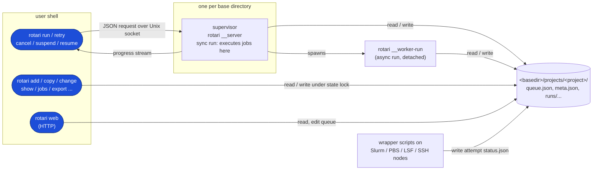
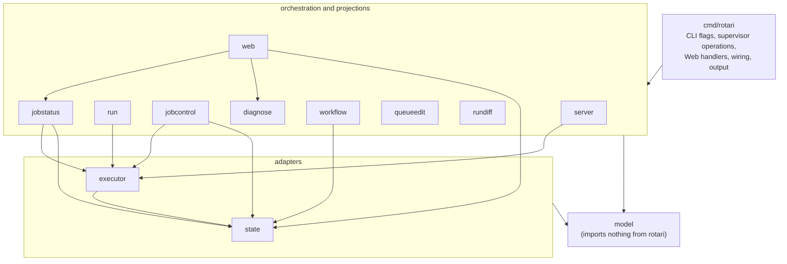

# Code architecture

This is a map of the code: which process does what, which package owns which
responsibility, and which functions a command passes through. Read it before
changing code you have not touched before.

It describes structure, not rules. The behavior that must be preserved (state
layout, fallback chains, locking, path rules) is in
[CONTRACTS.md](CONTRACTS.md). User-facing behavior is in the
[README](../README.md) and the guides it links to.

## Processes

Rotari is one binary, but at runtime it plays several roles. Knowing which
process a piece of code runs in explains most of the structure.

- **CLI client.** Every `rotari <command>` invocation. Most commands (`add`,
  `copy`, `change`, `show`, `jobs`, `export`, ...) read and write the project
  files directly under the project's state lock. Only `run`, `retry`,
  `cancel`, `suspend`, and `resume` go through the supervisor.
- **Supervisor.** `rotari __server`, started on demand by `ensureServer`
  ([cmd/rotari/server.go](../cmd/rotari/server.go)) and stopped after one
  idle minute. The source still calls it the *server*. It serializes run
  starts and job control for one base directory. It is not an authority for
  state: everything it knows is also on disk.
- **Run worker.** For a synchronous `run`, the jobs are executed inside the
  supervisor while the client streams progress. For `run --async`, the
  supervisor spawns `rotari __worker-run` as a detached child and returns; the
  worker executes the same code path (`executeMixedRun`).
- **Web server.** `rotari web` ([cmd/rotari/web.go](../cmd/rotari/web.go)).
  It reads project files to build JSON for the browser UI, and its control
  endpoints (`/api/copy`, `/api/cancel-job`, ...) call the same `cmd/rotari`
  functions the CLI uses.
- **Jobs and wrappers.** Local jobs are child processes of the run worker.
  Scheduler jobs run elsewhere through a generated wrapper script that writes
  the attempt's `status.json`, which the run worker polls.

Because the filesystem is the shared medium, any process can die and the next
one can reconstruct what happened from the files. That is why so much code
takes a `state.ProjectPaths` and not an in-memory object.

## Packages

Dependencies point one way: `cmd/rotari` imports every `internal` package, and
no `internal` package imports `cmd/rotari`.

Arrows mean "imports". `cmd/rotari` imports every `internal` package, and
every package imports `model`; those edges are drawn once per group.

`go list -f '{{.ImportPath}}: {{join .Imports " "}}' ./internal/...` prints
the current graph if this list drifts.

| Package | Owns | Start reading at |
| --- | --- | --- |
| [internal/model](../internal/model/) | Domain types and pure rules: queue, queued command, job spec, result, summary, selections, dependencies, arrays. No I/O. | `model.go`, `selection.go`, `dependencies.go` |
| [internal/state](../internal/state/) | The filesystem: path resolution and validation, JSON load/write, locks, run and attempt directory listing. No execution policy. | `paths.go`, `project_paths.go`, `store.go`, `lock.go` |
| [internal/executor](../internal/executor/) | How one job attempt is started, waited for, cancelled, and suspended: local processes, Slurm, PBS, LSF, SSH, wrapper scripts. No run semantics. | `contracts.go` (`JobExecutor`), `local.go`, `slurm.go` |
| [internal/run](../internal/run/) | Run orchestration: which jobs execute or are carried forward, dependency unblocking, retries, per-executor lanes and concurrency, the final summary. | `rerun.go` (`PlanRerun`), `engine.go` (`ExecuteJobs`), `dispatch.go` (`Dispatcher`) |
| [internal/jobstatus](../internal/jobstatus/) | Read side: turns attempt files and the summary into one displayed result and timestamps. Shared by CLI and Web. | `job.go`, `attempt.go`, `times.go` |
| [internal/server](../internal/server/) | Supervisor transport: request/response types, socket, lease, peer checks, idle shutdown, attached-run streaming. Work is delegated to an `Operations` interface. | `protocol.go`, `serve.go`, `client.go` |
| [internal/jobcontrol](../internal/jobcontrol/) | Cancel, suspend, resume of running jobs through executors. | `jobcontrol.go` |
| [internal/web](../internal/web/) | JSON projections of runs, jobs, attempts, and timelines for the Web UI. | `loader.go` |
| [internal/queueedit](../internal/queueedit/) | Pure queue edits, such as building a queue from an earlier run (`copy`, `retry`). | `copy.go` |
| [internal/workflow](../internal/workflow/) | Workflow manifests: `export` merge and `import` reconciliation. | `manifest.go`, `export.go`, `reconcile.go` |
| [internal/rundiff](../internal/rundiff/) | Comparison of two loaded runs for `diff` and `show --lineage`. | `rundiff.go` |
| [internal/diagnose](../internal/diagnose/) | Rule-based and provider-backed failure diagnosis. | `analysis.go` |

Many `internal` functions take callbacks (`run.WorkerCallbacks`,
`run.BatchLaneCallbacks`, `run.OriginResults`, `server.Operations`). This is
how `cmd/rotari` supplies file access and output without the internal package
importing it. When a callback's body is long, the logic probably belongs in an
internal package.

### Where does new code go?

- Can it be explained without paths, files, or locks, and does it only define
  or validate rotari concepts? `internal/model`.
- Does it read or write a file or directory layout? `internal/state`.
- Does it decide the next execution step of a run? `internal/run`.
- Does it talk to a process or scheduler? `internal/executor`.
- Does it decide what status a job shows? `internal/jobstatus`.
- Is it flag parsing, message wording, or colors? `cmd/rotari`.

## Files in cmd/rotari

`cmd/rotari` is the largest package. Each command has a `cmdXxx` function,
dispatched from `run` in [main.go](../cmd/rotari/main.go).

| Role | Files |
| --- | --- |
| Entry, dispatch, run finalization, async launch | `main.go` |
| Flag metadata, help, config defaults, completion | `cli_spec.go`, `config.go`, `completion.go`, `schema.go`, `guide.go`, `environment.go` |
| Queue editing (direct file access) | `add.go`, `change.go`, `copy.go`, `remove.go`, `reset.go`, `delete.go`, `gc.go`, `unlock.go` |
| Starting a run (client and supervisor side) | `run_command.go`, `run_selection.go`, `run_context.go`, `run_registry.go`, `job_executor.go` |
| Executing a run | `mixed_run.go` (`executeMixedRun`) |
| Project state checks (idle / running / interrupted) | `project_state.go` |
| Supervisor and its registry | `server.go`, `registry.go` |
| Job control | `job_control.go`, `wait.go` |
| Reading results | `show.go`, `jobs.go`, `diff.go`, `report.go`, `diagnose.go`, `check.go` |
| Workflow manifests | `export.go`, `import.go`, `workflow_source.go` |
| Web server and assets | `web.go`, `web_assets.go`, `assets/` |
| Notifications and terminal output | `webhook.go`, `color.go`, `terminal*.go` |

## Walkthroughs

### `rotari add`

1. `cmdAdd` ([add.go](../cmd/rotari/add.go)) parses flags into
   `model.QueuedCommand` values.
2. `enqueueCommands` resolves `state.ProjectPaths`, takes the state lock,
   checks the project is idle, appends to `queue.json`, and writes it back.

No supervisor is involved.

### `rotari run`

Client side, in [run_command.go](../cmd/rotari/run_command.go):

1. `cmdRun` resolves the target project and, for `--run-id`, `--failed`, or
   `--job-id`, first repopulates the queue from an earlier run
   (`copyRunToQueue`, backed by `internal/queueedit`).
2. `ensureServer` starts the supervisor if needed.
3. It sends a `server.Request{Op: OpRun}`. Synchronous runs use
   `sendRunRequest`, which streams progress and handles Ctrl-C (cancel) and
   Ctrl-D (detach).

Supervisor side:

1. `server.Server.Handle` ([internal/server/serve.go](../internal/server/serve.go))
   dispatches `OpRun` to `serverOperations.Run` (sync) or `StartRun` (async)
   in [server.go](../cmd/rotari/server.go).
2. `runServerSync` / `startServerRun` take the state lock, check the project is
   idle, create the run ID, take the run lock (`running.lock`), write run
   context, and mark `meta.json` as running. `startServerRun` then calls
   `launchAsyncRun` ([main.go](../cmd/rotari/main.go)), which spawns
   `__worker-run`; `cmdWorkerRun` wraps the same steps in `run.RunWorker`.

Execution, in `executeMixedRun` ([mixed_run.go](../cmd/rotari/mixed_run.go)):

1. Load the queue, convert it to `model.JobSpec`s, and validate IDs and
   dependencies.
2. `planRerunSelection` → `run.PlanRerun`: decide which jobs execute and which
   results are carried from an earlier run.
3. Write `runs/<run-id>/commands.json`.
4. `run.NewDispatcher` builds one lane per executor with its own concurrency.
   `run.ExecuteJobs` ([internal/run/engine.go](../internal/run/engine.go)) is
   the loop: start jobs whose dependencies are satisfied, collect results,
   retry, and stop if the project is being cancelled.
5. Each lane calls the executor's `Submit` and `Wait`
    ([internal/executor/contracts.go](../internal/executor/contracts.go)).
    The executor writes attempt files under
    `runs/<run-id>/<job-id>/attempts/<attempt-id>/`.
6. `run.BuildRunSummary` writes `summary.json`, with diagnoses attached.

Finish:

1. `finishRun` ([main.go](../cmd/rotari/main.go)) clears the consumed queue
    and finalizes `meta.json` (`state.FinalizeRun`), sends the webhook, and the
    run lock is removed.

### `rotari show` and the Web UI

1. `cmdShow` ([show.go](../cmd/rotari/show.go)) or a Web handler resolves the
   run and job directories through `internal/state`.
2. Each job's outcome comes from `internal/jobstatus` (`ReadJob`,
   `ResolveAttempt`, `Timestamps`), which falls back from the attempt's
   `status` file to its wrapper `status.json` to `summary.json`.
3. The CLI formats text; `internal/web` ([loader.go](../internal/web/loader.go))
   builds JSON for the browser.

Never read status files directly in a renderer; go through `jobstatus` so the
CLI and Web UI agree.

### `rotari cancel`

1. `cmdCancel` ([job_control.go](../cmd/rotari/job_control.go)) sends
   `OpCancel` to the supervisor.
2. `cancelQueueJobs` calls `jobcontrol.Controller.Cancel`
   ([internal/jobcontrol/jobcontrol.go](../internal/jobcontrol/jobcontrol.go)),
   which finds the running run through its run lock, marks `meta.json` as
   `cancelling` for a whole-run cancel, and calls the executor's `Cancel` for
   each running job.
3. The run loop sees the cancelled results and the `cancelling` phase, and
   stops starting or retrying jobs.

## Naming pitfalls

- **Project vs. queue.** A project owns one queue, and much of the code still
  uses `queue` or `QueueName` for the project name
  (`server.Request.QueueName`, `queueName` variables). They mean the project.
- **Server vs. supervisor.** The background coordinating process is called the
  supervisor in documentation, and `server` in code (`internal/server`,
  `rotari server`). The HTTP process is the Web server.
- **Import aliases.** `cmd/rotari` imports `internal/run` as `runcontract` and
  `internal/server` as `serverinternal`, because `run` and `server` are
  already function names in `package main`.
- **Job vs. attempt.** A job has a stable ID within a run; each execution of it
  (including retries) is an attempt with its own directory and an `att_` ID.
