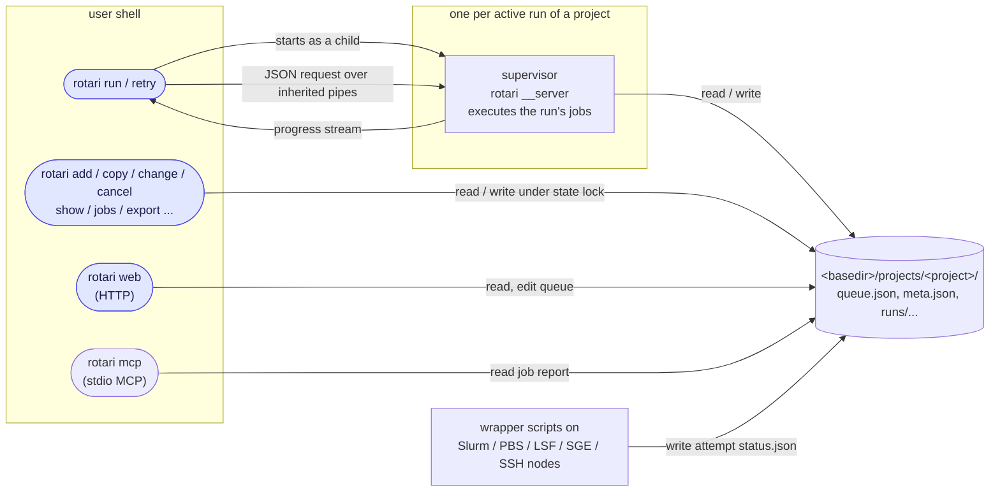
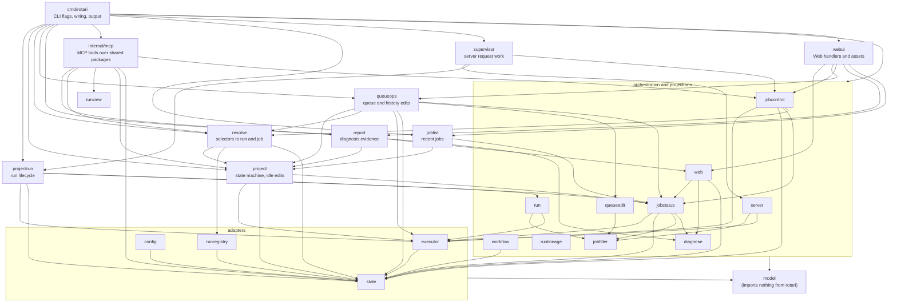

# Code architecture

This is a map of the code: which process does what, which package owns which
responsibility, and which functions a command passes through. Read it before
changing code you have not touched before.

It describes structure, not rules. The behavior that must be preserved (state
layout, fallback chains, locking, path rules) is in
[contracts/README.md](../contracts/README.md). User-facing behavior is in the
[README](https://github.com/kamo-naoyuki/rotari#documentation) and the guides
it links to.

## Processes

Rotari is one binary, but at runtime it plays several roles. Knowing which
process a piece of code runs in explains most of the structure.


```mermaid
flowchart LR
  subgraph clients["user shell"]
    runcli(["rotari run / retry"])
    direct(["rotari add / copy / change / cancel<br/>show / jobs / export ..."])
    webcli(["rotari web<br/>(HTTP)"])
      mcpcli(["rotari mcp<br/>(stdio MCP)"])
  end
  subgraph sup["one per active run of a project"]
    supervisor["supervisor<br/>rotari __server<br/>executes the run's jobs"]
  end
  files[("&lt;basedir&gt;/projects/&lt;project&gt;/<br/>queue.json, meta.json, runs/...")]
   nodes["wrapper scripts on<br/>Slurm / PBS / LSF / SGE / SSH nodes"]

  runcli -->|"starts as a child"| supervisor
  runcli -->|"JSON request over inherited pipes"| supervisor
  supervisor -->|progress stream| runcli
  supervisor -->|read / write| files
  direct -->|"read / write under state lock"| files
  webcli -->|"read, edit queue"| files
   mcpcli -->|"read job report"| files
  nodes -->|write attempt status.json| files

   classDef command fill:#e0e7ff,stroke:#4f46e5,color:#1e1b4b
  class runcli,direct,webcli command
```

- **CLI client.** Every `rotari <command>` invocation. Most commands (`add`,
  `copy`, `change`, `show`, `jobs`, `export`, ...) read and write the project
  files directly under the project's state lock. Only `run` and `retry` go
  through the supervisor; `cancel`, `suspend`, and `resume` signal jobs from
  the calling process, as the Web UI does.
- **Supervisor.** `rotari __server`, started by `run` and `retry` through
  `startSupervisor` ([cmd/rotari/server.go](../cmd/rotari/server.go)) for
  each run, and stopped when that run ends. The source still calls it the
  *server*. It serves one run of one project, talks only to its `run`
  command over pipes inherited as descriptors 3 and 4, and holds a lease
  (`server.lock`, `server.pid`) in the project directory. Because it is a child of the `run` command, it and
  the run's jobs inherit that command's working directory and environment,
  which is why a supervisor is never reused (RUN-3 in
  [contracts](../contracts/02-run-lifecycle-and-execution.md#run-lifecycle)).
  It is not an authority for state: everything it knows is also on disk.
- **Run execution.** Every run, sync or async, executes inside its
  supervisor; see [Sync and async runs](#sync-and-async-runs).
- **Web server.** `rotari web` ([cmd/rotari/web.go](../cmd/rotari/web.go) parses flags; [internal/webui](../internal/webui/) serves).
   It lists registered basedirs and lightweight project/run metadata, checks
   project locks across the selected basedir, and loads a project's queue and
   run summaries only when that project is opened. Job/attempt details load
   only for the selected run or active runs monitored for notifications.
   The dedicated history-search API scans only the user-selected basedir,
   project, and run scopes without expanding the lightweight `/api/state` index.
   Expanding another basedir reads only its project directory names. Static
   export remains a complete snapshot. Its control endpoints (`/api/copy`,
   `/api/cancel-job`, ...) call the same internal operations as the CLI.
- **Jobs and wrappers.** Local jobs are child processes of the supervisor.
  Scheduler jobs run elsewhere through a generated wrapper script that writes
  the attempt's `status.json`, which the supervisor polls.

### Sync and async runs

Both modes run the same lifecycle, `projectrun.Runner.Run`, inside the run's
supervisor; they differ only in whether the client stays attached.

| | Sync run (`rotari run`) | Async run (`rotari run --async`) |
| --- | --- | --- |
| Client | Stays attached and streams progress | Returns after "Run started" |
| Process that executes the jobs | The supervisor | The supervisor |
| PID in `running.lock` | The supervisor | The supervisor |
| Entry point | `supervisor.Operations.Run` ([internal/supervisor/run.go](../internal/supervisor/run.go)) | `supervisor.Operations.StartRun`, which runs `Runner.Run` in a goroutine |

```text
sync:   client ─starts─▶ supervisor: Begin → Run (Execute → Finish) ──▶ result to client
async:  client ─starts─▶ supervisor: Begin ──▶ "Run started" to client
                                     └─ Run (Execute → Finish), then the supervisor exits
```

The supervisor is started with `setsid`, detached from the client's terminal
session, so a run keeps going when an async client returns or a sync client
detaches with Ctrl-D.

Because the filesystem is the shared medium, any process can die and the next
one can reconstruct what happened from the files. That is why so much code
takes a `state.ProjectPaths` and not an in-memory object.

## Packages

Dependencies point one way: `cmd/rotari` imports every `internal` package, and
no `internal` package imports `cmd/rotari`.


```mermaid
flowchart TB
  cmd["cmd/rotari<br/>CLI flags, wiring, output"]
   mcpadapter["internal/mcp<br/>MCP tools over shared packages"]
  projectrun["projectrun<br/>run lifecycle"]
  project["project<br/>state machine, idle edits"]
  resolve["resolve<br/>selectors to run and job"]
  queueops["queueops<br/>queue and history edits"]
  report["report<br/>diagnosis evidence"]
  joblist["joblist<br/>recent jobs"]
  supervisor["supervisor<br/>server request work"]
  webui["webui<br/>Web handlers and assets"]
  subgraph l2["orchestration and projections"]
    server
    run
    jobcontrol
    web
    jobstatus
    workflow
    queueedit
   runlineage
    diagnose
      jobfilter
  end
  subgraph l1["adapters"]
    executor
    state
    runregistry
    config
  end
  model["model<br/>(imports nothing from rotari)"]

  cmd --> projectrun
  cmd --> project
  cmd --> resolve
  cmd --> queueops
  queueops --> project
  queueops --> resolve
  queueops --> queueedit
  queueops --> executor
  queueops --> state
  queueops --> jobstatus
  cmd --> report
   cmd --> mcpadapter
   mcpadapter --> report
   mcpadapter --> resolve
   mcpadapter --> runview
   mcpadapter --> project
   mcpadapter --> state
   mcpadapter --> jobcontrol
  report --> web
  report --> project
  report --> diagnose
  cmd --> joblist
  joblist --> jobstatus
  joblist --> project
  cmd --> supervisor
  supervisor --> server
  supervisor --> projectrun
  supervisor --> jobcontrol
  cmd --> webui
  webui --> web
  webui --> queueops
  webui --> jobcontrol
  webui --> report
  webui --> joblist
  config --> state
  resolve --> project
  resolve --> runregistry
  resolve --> state
  project --> jobstatus
  project --> executor
  project --> state
   run --> jobfilter
   queueedit --> jobfilter
   server --> jobfilter
  cmd --> l2
  projectrun --> run
  projectrun --> executor
  projectrun --> state
  projectrun --> jobstatus
  server --> executor
  run --> executor
  jobcontrol --> executor
  jobcontrol --> state
  jobcontrol --> jobstatus
   jobcontrol --> resolve
  web --> jobstatus
  web --> diagnose
  web --> state
  jobstatus --> executor
  jobstatus --> state
  jobstatus --> jobfilter
  jobstatus --> diagnose
  workflow --> state
  executor --> state
  runregistry --> state
  l1 --> model
  l2 --> model
```

Arrows mean "imports". `cmd/rotari` imports every `internal` package, and
every package imports `model`; those edges are drawn once per group.

`go list -f '{{.ImportPath}}: {{join .Imports " "}}' ./internal/...` prints
the current graph if this list drifts.

The boundary rules in
[contracts/00-overview.md](../contracts/00-overview.md#go-package-boundaries)
are checked against this graph by
[internal/archtest](../internal/archtest/boundaries_test.go).

| Package | Owns | Start reading at |
| --- | --- | --- |
| [internal/model](../internal/model/) | Domain types and pure rules: queue, queued command, job spec, result, summary, selections, command selectors, dependencies, arrays. No I/O. | `model.go`, `selection.go`, `command_selector.go`, `dependencies.go` |
| [internal/state](../internal/state/) | The filesystem: path resolution and validation, JSON load/write, locks, run and attempt directory listing. No execution policy. | `paths.go`, `project_paths.go`, `store.go`, `lock.go` |
| [internal/executor](../internal/executor/) | How one job attempt is started, waited for, cancelled, and suspended: local processes, Slurm, PBS, LSF, SGE, SSH, wrapper scripts. No run semantics. | `contracts.go` (`JobExecutor`), `local.go`, `slurm.go`, `sge.go` |
| [internal/project](../internal/project/) | A project's run state (idle, running, interrupted) from `running.lock` and `meta.json`, one run's phase (running, interrupted, finished, ended) for `wait` and the MCP run summary, consistency checks, recovery, and the idle-edit sequence: state lock, idle check, load, edit, metadata-then-queue write. | `inspect.go` (`Inspect`, `EnsureIdle`), `run_phase.go` (`RunPhaseOf`), `edit.go` (`EditQueue`, `CreateQueueGuarded`), `reset.go` (`Reset`) |
| [internal/resolve](../internal/resolve/) | Location and job-name rules shared by the commands that read existing state: a run ID through the run registry, an `att_` attempt ID, the latest-run fallback, run names, and job IDs or names looked up in the queue and latest runs. show's and wait's own selector orders build on it. | `resolve.go` (`ExistingRun`, `RunID`, `Jobs`, `JobIDsByName`) |
| [internal/config](../internal/config/) | Config file locations (global, base directory, project), which scope applies, and parsing YAML, TOML, and JSON. What the keys mean stays in `cmd/rotari`. | `config.go` (`PathsForRun`, `LoadFile`) |
| [internal/notification](../internal/notification/) | `notifications.toml`: its schema, scope lookup, validation, serialization, and the shared job/run event and batch model used by both webhook and browser notifications. Delivery stays in `cmd/rotari` and the Web assets. | `config.go` (`Load`, `Marshal`), `event.go` (`NewBatch`) |
| [internal/runregistry](../internal/runregistry/) | The master directory's run index, `<masterdir>/runs/<run-id>.json`: register, look up, unregister, and find stale entries for `gc`. | `registry.go` |
| [internal/projectrun](../internal/projectrun/) | One project's run against its files: `Begin` (context, run lock, registry, running metadata), `Execute` (snapshot, plan, dispatch, summary), and `Finish` (final context, queue and metadata finalization, lock removal). Shared by sync and async runs and by cancellation. Also checks that a queue can run with the known executors (`ValidateQueue`). | `lifecycle.go`, `execute.go`, `validate.go` |
| [internal/run](../internal/run/) | Run rules without file access: which jobs execute or are carried forward, dependency unblocking, retries, per-executor lanes and concurrency, the summary contents. | `rerun.go` (`PlanRerun`), `engine.go` (`ExecuteJobs`), `dispatch.go` (`Dispatcher`) |
| [internal/jobstatus](../internal/jobstatus/) | Read side: turns attempt files and the run's recorded results (the summary, or before it the carried results a run records at start) into one displayed result and timestamps, and reads the hosts, times, and log that job filters judge, following carried jobs to their attempt. Shared by CLI and Web. | `job.go` (`RecordedResults`), `attempt.go`, `times.go`, `facts.go` |
| [internal/runview](../internal/runview/) | Read-side loading of a persisted run snapshot and resolution of each job's displayed status, a project's runs in start order, the one-run summary, and the failures with no retry left that `wait --until-failure` stops on. Shared by run comparison, history views, and the MCP tools. | `run.go` (`LoadRun`), `order.go` (`RunsByStart`, `Summary`, `FinalFailureGroups`) |
| [internal/supervisor](../internal/supervisor/) | The work behind supervisor requests: sync and async runs, including preflight selection planning. Implements `server.Operations` and returns plain-text messages. | `run.go` (`Operations.Run`, `StartRun`) |
| [internal/server](../internal/server/) | Supervisor transport: request/response types, the pipe connection between `run` and its supervisor, the lease and liveness check, idle shutdown, attached-run streaming. Work is delegated to an `Operations` interface. | `protocol.go`, `serve.go`, `client.go`, `lease.go` |
| [internal/jobcontrol](../internal/jobcontrol/) | Cancel, suspend, resume of running jobs through executors. | `jobcontrol.go` |
| [internal/webui](../internal/webui/) | The Web UI: HTTP handlers and JSON API, static export, embedded assets, and the auth wrapper. CLI metadata, environment definitions, and the config template come in through `Options`. | `webui.go` (`handler`), `options.go`, `assets/` |
| [internal/web](../internal/web/) | JSON projections of runs, jobs, attempts, and timelines for the Web UI. | `loader.go` |
| [internal/queueops](../internal/queueops/) | Queue and run-history edits shared by the CLI, the Web UI, and the supervisor: add, change, remove, copy, and deleting runs. Loads and saves the files around `internal/queueedit` through the `internal/project` idle-edit sequence, and owns `ValidateJobs`. | `editor.go` (`Editor`), `change.go`, `copy.go` |
| [internal/queueedit](../internal/queueedit/) | Pure queue edits, such as building a queue from an earlier run (`copy`, `retry`). | `copy.go` |
| [internal/workflow](../internal/workflow/) | Workflow manifests: `export` merge and `import` reconciliation. | `manifest.go`, `export.go`, `reconcile.go` |
| [internal/workflowstate](../internal/workflowstate/) | Applies workflow manifests to saved project state: reads saved runs as sources to reconcile a manifest, imports a manifest into the queue under a `project.Guard`, and loads a settled run for export. Shared by `rotari import`, `rotari export`, and the MCP import and export tools. | `import.go` (`Import.Apply`), `sources.go`, `export.go` (`LoadSettledRun`) |
| [internal/joblist](../internal/joblist/) | Recent job attempts across a base directory's projects for `rotari jobs` and the Web UI's jobs page: which attempts are listed, their order, and how their times read. | `joblist.go` (`Collect`) |
| [internal/report](../internal/report/) | The redacted evidence report for AI-assisted diagnosis, shared by `show --report` and the Web UI. Reads jobs through `internal/web`'s projection. | `report.go` (`Build`) |
| [internal/mcp](../internal/mcp/) | MCP tools that `rotari mcp` (`cmd/rotari/mcp.go`) serves: read-only project list, run summary, bounded run wait, job report, project check, run comparison, and redacted run export, previewed, revision-guarded import and run start, job control of a running run, and previewed, revision-guarded reset. They present the shared functions the CLI uses (`project.Overviews`, `basedirregistry.Discover`, `runview.Summary`, `projectrun.Runner.Check`, `runlineage.Compare`, `report.Build`, `workflowstate.Import`, `projectrun.RunSource`, `projectrun.Runner.PreviewRun`), locate runs only through the master directory's run registry (`resolve.RegisteredRun`), and return no absolute paths; every tool is added through `addTool`, which hides state directories in errors. Starting a supervisor and new job IDs come from `cmd/rotari` as `Options`; it does not import `cmd/rotari`. | `server.go` (`NewServer`), `tools.go`, `wait.go`, `export.go`, `write.go`, `control.go`, `reset.go` |
| [internal/runlineage](../internal/runlineage/) | Comparison and summaries of loaded runs for `lineage`, and the grouping of a run's failures by cause that `show`, `lineage`, and the Web UI share. | `runlineage.go`, `failures.go` (`FailureGroups`) |
| [internal/jobfilter](../internal/jobfilter/) | The conditions of the `--filter-*` options that narrow a job selection, evaluated without file access; callers supply what a condition needs about each job. | `filter.go` (`Filter`, `Selects`) |
| [internal/diagnose](../internal/diagnose/) | Rule-based and provider-backed failure diagnosis. | `analysis.go` |
| [internal/archtest](../internal/archtest/) | Tests only: the package boundary rules checked against the import graph. | `boundaries_test.go` |
| [internal/doclinks](../internal/doclinks/) | Tests only: relative links and `#anchor` links in the root Markdown files, `contracts/`, and `docs/`. | `links_test.go` |
| [conformance](../conformance/) | Tests only: contract checks against the built binary and the Web API, importing only the standard library and their own harness, `conformance/support`. Document-to-directory mapping is in `layout.json`; tests are being migrated under the matching contract groups. | `harness_test.go`, `contracts_test.go`, `layout.json` |

Many `internal` functions take callbacks or hook fields
(`projectrun.Runner`, `run.BatchLaneCallbacks`, `run.OriginResults`, `server.Operations`). This is
how `cmd/rotari` supplies file access and output without the internal package
importing it. When a callback's body is long, the logic probably belongs in an
internal package.

### Where does new code go?

- Can it be explained without paths, files, or locks, and does it only define
  or validate rotari concepts? `internal/model`.
- Does it read or write a file or directory layout? `internal/state`.
- Does it decide the next execution step of a run? `internal/run`.
- Does it start, record, or finish a project's run on disk? `internal/projectrun`.
- Does it decide whether a project may be edited, or save an idle edit?
  `internal/project`.
- Does it edit a project's queue or run history on disk for more than one
  interface (CLI, Web, supervisor)? `internal/queueops`, with the pure queue
  transformation in `internal/queueedit`.
- Does it talk to a process or scheduler? `internal/executor`.
- Does it decide what status a job shows? `internal/jobstatus`.
- Does it decide which base directory, project, run, or job a selector
  names? `internal/resolve`.
- Is it a Web handler, the static export, or a Web asset? `internal/webui`.
- Is it flag parsing, message wording, or colors? `cmd/rotari`.

## Files in cmd/rotari

`cmd/rotari` is the largest package. Each command has a `cmdXxx` function,
dispatched from `run` in [main.go](../cmd/rotari/main.go).

| Role | Files |
| --- | --- |
| Entry and dispatch | `main.go` |
| Flag metadata, help, config defaults, completion | `cli_spec.go`, `config.go`, `completion.go`, `schema.go`, `guide.go`, `environment.go` |
| Queue editing (flags and output; `add`, `change`, `copy`, `remove`, and `delete` call `internal/queueops`) | `add.go`, `change.go`, `copy.go`, `remove.go`, `reset.go`, `delete.go`, `gc.go`, `unlock.go` |
| Starting a run (client side; the supervisor side is `internal/supervisor`) | `run_command.go`, `job_executor.go` |
| Default run registry wiring (`registerRun`, `resolveRunLocation`) | `run_registry.go` |
| Wiring the run lifecycle (`projectRunner`) | `project_run.go` |
| Supervisor process wiring, its server registry, and `show --basedirs` discovery | `server.go`, `registry.go` |
| Job control | `job_control.go`, `wait.go` |
| Reading results | `show.go`, `jobs.go`, `diff.go`, `diagnose.go`, `check.go` |
| Workflow manifests | `export.go`, `import.go`, `workflow_source.go` |
| `web` command and the Web UI's CLI metadata (`webOptions`) | `web.go` |
| Notifications and terminal output | `webhook.go`, `webhook_batch.go`, `color.go`, `terminal*.go` |

## Walkthroughs

### `rotari add`

1. `cmdAdd` ([add.go](../cmd/rotari/add.go)) parses flags into
   `model.QueuedCommand` values.
2. `queueops.Editor.Add` ([internal/queueops/add.go](../internal/queueops/add.go))
   resolves `state.ProjectPaths` and calls `project.EditQueue` ([internal/project/edit.go](../internal/project/edit.go)),
   which takes the state lock, checks the project is idle, loads
   `queue.json`, runs the callback that appends the new commands, and writes
   `meta.json` and then `queue.json`.

`change`, `copy`, and `remove` follow the same path through their
`queueops.Editor` methods, and `import` through its own callback; `delete`
uses `project.Edit` for the lock and idle check alone. The Web UI and the
supervisor call the same `queueops.Editor` methods.

No supervisor is involved.

### `rotari run`

Client side, in [run_command.go](../cmd/rotari/run_command.go):

1. `cmdRun` resolves the target project and, for `--run-id`, `--failed`, or
   `--job-id`, first repopulates the queue from an earlier run
   (`queueops.Editor.Copy`, backed by `internal/queueedit`).
2. `startSupervisor` starts a new supervisor for this run as a child process,
   so it inherits the command's working directory and environment, and waits
   for its ready message on the inherited pipes. It fails if the project
   already has one.
3. It sends a `server.Request{Op: OpRun}`. Synchronous runs use
   `sendRunRequest`, which streams progress and handles Ctrl-C (cancel) and
   Ctrl-D (detach).

Supervisor side:

1. `server.Server.Handle` ([internal/server/serve.go](../internal/server/serve.go))
   dispatches `OpRun` to `supervisor.Operations.Run` (sync) or `StartRun`
   (async) in [internal/supervisor/run.go](../internal/supervisor/run.go);
   [server.go](../cmd/rotari/server.go) only builds the `Operations`.
2. `Run` / `StartRun` share `prepareRun`: take the
   state lock, check the project is idle, and validate the queue. Then
   `projectrun.Runner.Begin`
   ([internal/projectrun/lifecycle.go](../internal/projectrun/lifecycle.go))
   writes `context.json`, takes the run lock (`running.lock`), registers the
   run, and marks `meta.json` as running.
3. `Runner.Run` then executes the run in the supervisor: a synchronous run
   streams progress to its client, and an async run answers at once and
   continues in a goroutine. The supervisor stops once the run ends.

Execution, in `Runner.Execute`
([internal/projectrun/execute.go](../internal/projectrun/execute.go)):

1. Load the queue, convert it to `model.JobSpec`s, and validate IDs and
   dependencies.
2. `Runner.PlanSelection` → `run.PlanRerun`: decide which jobs execute and
   which results are carried from an earlier run.
3. Write `runs/<run-id>/commands.json`.
4. `run.NewDispatcher` builds one lane per executor with its own concurrency.
   `run.ExecuteJobs` ([internal/run/engine.go](../internal/run/engine.go)) is
   the loop: start jobs whose dependencies are satisfied, collect results,
   retry, and stop if the project is being cancelled.
5. Each lane calls the executor's `Submit` and `Wait`
   ([internal/executor/contracts.go](../internal/executor/contracts.go)).
   The executor writes attempt files under
   `runs/<run-id>/<job-id>/attempts/<attempt-id>/`.
6. `run.BuildRunSummary` builds the summary, with diagnoses attached, and it
   is written to `summary.json`.

Finish, in `Runner.Finish`:

1. Record the final load in `context.json`.
2. `Finalize` clears the consumed queue and finalizes `meta.json`
   (`state.FinalizeRun`) after checking that the run lock is still this run's,
   then reports the finished run to the notification hook, which flushes any
   pending job events with it.
3. Remove the run lock.

### `rotari show` and the Web UI

1. `cmdShow` ([show.go](../cmd/rotari/show.go)) or a Web handler
   ([internal/webui](../internal/webui/webui.go)) resolves the
   run and job directories through `internal/state`.
2. Each job's outcome comes from `internal/jobstatus` (`ReadJob`,
   `ResolveAttempt`, `Timestamps`), which falls back from the attempt's
   `status` file to its wrapper `status.json` to `summary.json`.
3. The CLI formats text; `internal/web` ([loader.go](../internal/web/loader.go))
   builds JSON for the browser.

Never read status files directly in a renderer; go through `jobstatus` so the
CLI and Web UI agree.

### `rotari cancel`

1. `cmdCancel` ([job_control.go](../cmd/rotari/job_control.go)) resolves the
   project, the run a run or attempt ID names, and the job IDs with
   `resolve.JobSelection`, and calls `jobcontrol.Controller.Cancel` in its own
   process.
2. `jobcontrol.Controller.Cancel`
   ([internal/jobcontrol/jobcontrol.go](../internal/jobcontrol/jobcontrol.go)),
   which finds the running run through its run lock, rejects a named run that
   is not the active one, expands array job IDs to tasks, marks `meta.json` as
   `cancelling` for a whole-run cancel, and calls the executor's `Cancel` for
   each running job.
3. The run loop sees the cancelled results and the `cancelling` phase, and
   stops starting or retrying jobs.

## Naming pitfalls

- **Project vs. queue.** A project owns one queue, and much of the code still
  uses `queue` or `QueueName` for the project name
  (`server.Request.QueueName`, `queueName` variables). They mean the project.
- **Server vs. supervisor.** The background coordinating process is called the
  supervisor in documentation, and `server` in code (`internal/server`,
  `rotari server`). The HTTP process is the Web server.
- **Import aliases.** `cmd/rotari` imports `internal/run` as `runcontract` and
  `internal/server` as `serverinternal`, because `run` and `server` are
  already function names in `package main`.
- **Job vs. attempt.** A job has a stable ID within a run; each execution of it
  (including retries) is an attempt with its own directory and an `att_` ID.
