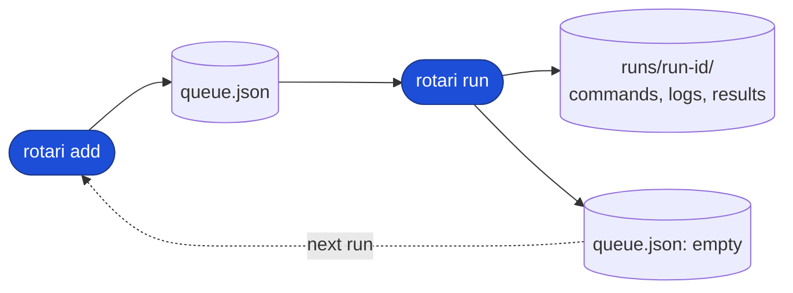
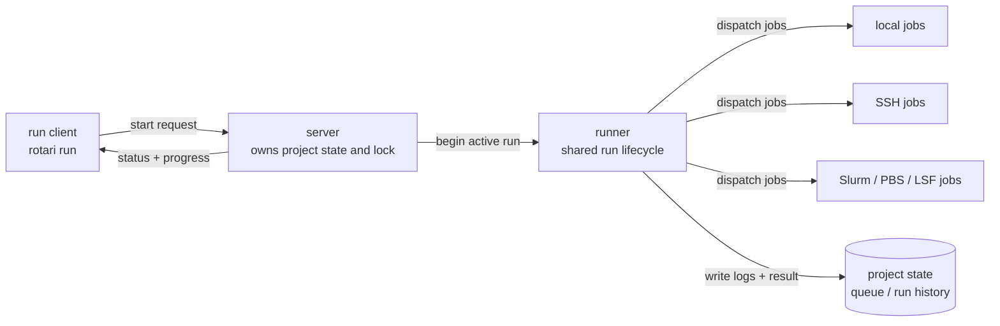

# Concepts

Projects, queues, runs, IDs, dependencies, and how rotari resolves the state directory and project.

## Projects, queues, runs, and state
### Project and queue
A project has one mutable queue of jobs ready to run and an immutable history
of completed runs. The live queue is `queue.json`; each run snapshots it under
`runs/<run-id>/`, so retries and filtered reruns leave earlier history unchanged.

The queue has different roles depending on the project state:

- While the project is `idle`, the queue is the current work target and the
  default place to add or edit jobs.
- While a project is `running`, the queue is treated as a preserved execution
  snapshot for that run. It still exists on disk, but it is not the primary
  user-facing work target.
- While a project is `interrupted`, the run remains the primary recovery target
  and the queue is the retained snapshot/backup that explains what was running
  when the interruption happened.

```text
<basedir>/projects/<project>/
├── queue.json                 # current queue
├── meta.json                  # latest project phase and run metadata
├── running.lock               # while a run is active: run ID, PID, and host
└── runs/
    └── <run-id>/              # immutable run history
        ├── commands.json      # command snapshot
        ├── context.json       # execution context and config snapshot paths
        ├── summary.json       # run result
        └── <job-id>/
            └── attempts/<attempt-id>/
                ├── command.json
                ├── output     # the job's log
                ├── status.json
                └── ...        # executor-specific state
```

Files may appear incrementally while a run is active. When reading state
directly, treat a missing optional file as an incomplete result, not as a
success.

### Run and state

Each run records its own command snapshot, success/failure status, logs, and
metadata. When a run finishes, the runner updates the project state and leaves
the completed run immutable, which makes retry loops and inspection easy to
reason about without losing the earlier outcome.



Each added command has a stable job ID. Use `add --job-name NAME` to give a
job a readable label, and `run --run-name NAME` (or `ROTARI_RUN_NAME`) to label
a run; the generated IDs remain available for unambiguous commands and paths. `run` saves the complete command
snapshot under `runs/<run-id>/`, together with a summary and each job's log.
After it finishes, the queue is emptied, while the run can be inspected or used
with selections such as `rotari retry`. The next `add` starts a new batch while
keeping the previous run history. Use `delete` to remove saved run logs
explicitly. Use `run --async` when an experiment should continue after the
terminal returns.

### IDs and location resolution

Rotari uses three different IDs:

| ID | Meaning |
| --- | --- |
| `run-id` | One execution of a project queue. It identifies the run snapshot, summary, and history. |
| `job-id` | A logical job in a queue or run. For an array, expanded task IDs look like `job-id-1`, `job-id-2`, and so on. |
| `attempt-id` | One concrete execution of one logical job, including a retry. It identifies the attempt output and status. |

The `run-id` identifies a run and provides its project location. An
`attempt-id` identifies one job execution and provides its `job-id` and
`run-id`, so the command can resolve the same project location from the attempt
alone.

`show` accepts a `RUN_ID`, `ATTEMPT_ID`,
`JOB_ID`, or job name as its optional positional argument. The associated run,
project, and basedir are resolved automatically when the selector identifies
them.

| Selector | Information available for resolution | Options that can be omitted |
| --- | --- | --- |
| `show RUN_ID` | `run-id`, `basedir`, and `project` | `--basedir/-b`, `--project-name/-p` |
| `show ATTEMPT_ID` | `attempt-id`, `job-id`, `run-id`, `basedir`, and `project` | `--basedir/-b`, `--project-name/-p`, `--run-id/-r` |
| `show JOB_ID` / `show JOB_NAME` | matching job in the relevant latest run or queue | `--job-id/-j`, `--job-name` |

When a selector matches more than one project, run, or job, `show` reports an
ambiguous-selector error instead of choosing silently. Use explicit options to
disambiguate. The option forms remain available when composing commands or
when an exact run/job context is required:

```sh
# These are equivalent exact selectors
rotari show -b BASE_DIR -p PROJECT_NAME -r RUN_ID
rotari show -r RUN_ID
rotari show RUN_ID # ID can be passed positionally; -r can be omitted

rotari show -b BASE_DIR -p PROJECT_NAME -r RUN_ID -j ATTEMPT_ID
rotari show -j ATTEMPT_ID
rotari show ATTEMPT_ID
```

The following commands accept an `ATTEMPT_ID` as their `--job-id/-j` selector:

- `ATTEMPT_ID` supported: `show`, `diagnose`, `cancel`, `suspend`, `resume`,
  `copy`, `run`, `retry`.
- `ATTEMPT_ID` not supported: `add`, `change`, `remove`, `delete`, `wait`.
  These commands operate on queue definitions or whole runs, not individual attempts.

`ATTEMPT_ID` and `RUN_ID` include the run and job context needed for resolution.
`JOB_ID` does not, so the following `JOB_ID` forms are equivalent only when no
other searched run or queue contains the same job ID.

```sh
rotari show -b BASE_DIR -p PROJECT_NAME -r RUN_ID -j JOB_ID
rotari show -j JOB_ID

rotari copy -b BASE_DIR -p PROJECT_NAME -r RUN_ID -j JOB_ID
rotari copy -r RUN_ID -j JOB_ID
```

Run and job IDs can also be passed positionally when a command accepts one:

```sh
rotari show JOB_ID
rotari copy -j JOB_ID RUN_ID
rotari remove JOB_ID OTHER_JOB_ID
rotari delete RUN_ID
rotari unlock -p PROJECT_NAME RUN_ID
rotari diagnose --model MODEL JOB_ID
rotari cancel JOB_ID OTHER_JOB_ID
rotari cancel RUN_ID
rotari suspend ATTEMPT_ID
rotari resume ATTEMPT_ID
rotari export TARGET [OUTPUT_FILE]
rotari import FILE PROJECT
```

These positional forms cannot be combined with the corresponding `--run-id/-r`
or `--job-id/-j` option. For export, `TARGET` names a project or run; use
`--project-name/-p` when explicitly combining a project and a run. `delete`
without an ID still removes all saved runs.
For `cancel`, `suspend`, and `resume`, a positional `JOB_ID` or `ATTEMPT_ID`
selects jobs the same way `--job-id/-j` does; a bare `RUN_ID` only locates the
target run through the run registry and is not itself a job selector, so it
behaves like omitting `--job-id/-j` (all running jobs in that run).

## Dependencies and stages

Use `--depends-on NAME` to define prerequisites.
Use a job's name as `NAME`; the job waits until that prerequisite succeeds.
Repeat the option to require multiple prerequisites.

For example, run `train.sh` only after `prepare.sh` completes successfully:

```sh
rotari add --job-name prepare -- ./prepare.sh
rotari add --job-name train --depends-on prepare -- ./train.sh
rotari run
```

For a barrier between batches of jobs, assign the jobs to a stage and depend on
the stage name. Jobs in a stage run concurrently; a dependent job starts only
after every job in the stage succeeds:

```sh
rotari add --stage prepare -- ./prepare-data.sh
rotari add --stage prepare -- ./prepare-config.sh
rotari add --job-name train --depends-on prepare -- ./train.sh
rotari run
```

`--depends-on` accepts either a job name or a stage name. A job name and stage
name cannot be the same within one queue.

Use `--depends-on-finished NAME` for a job that should run once its
prerequisites finish, whatever their result, like Slurm's `afterany`. It suits
aggregation and cleanup jobs that must still run when part of a sweep fails:

```sh
rotari add --stage sweep --matrix LR=0.1,0.01 -- python train.py
rotari add --job-name collect --depends-on-finished sweep -- python collect.py
rotari run
```

`collect` waits while a failed prerequisite still has `run --retry` attempts
left, and it also runs after a prerequisite is blocked or cancelled. A later
`run --failed` or `retry` that re-executes a prerequisite re-executes such
dependents too, so their output reflects the new results. A name cannot be
listed in both `--depends-on` and `--depends-on-finished` of one job. `show`
lists these prerequisites as `finished:NAME`. Use `change
--depends-on-finished` or `--clear-depends-on-finished` to edit them.

Use `rotari show --stage NAME` to list only the jobs in one stage of the
selected run or queue, and `rotari show --matrix NAME` for the jobs of one
matrix. The same `--stage` and `--matrix` select jobs for `change`, `remove`,
`copy`, `run`, and `retry`.

## State and project resolution

Rotari resolves the state directory before it resolves the project name. The
first matching state-directory entry wins:

The resolution order for the state directory is:
1. `--basedir/-b` option
2. `ROTARI_BASEDIR` environment variable
3. `./.rotari-state` (if it exists in the current directory)
4. Default location (`$XDG_STATE_HOME/rotari` or `~/.local/state/rotari`)

The resolution logic for the project name when `--project-name/-p` is omitted is:
1. `--project-name/-p` option
2. `ROTARI_PROJECT_NAME` environment variable
3. Automatically select if exactly one project exists in the state directory
4. Default project name (`default`) if no projects exist yet (if multiple projects exist, an error will prompt you to specify one)

These rules apply consistently to commands that do not identify an existing
run through its run registry. Use `--basedir/-b` and `--project-name/-p` when a
command must target a specific location explicitly.

## Internal execution model

This section is the runtime architecture view: it explains who owns the project
state, which process actually launches jobs, and how the queue, server, and
runner fit together during a run.



The CLI is the user-facing entry point. It sends a run request to the
long-lived server for the project, and the server owns the queue, lock, and
final run state. The runner then executes the queued jobs, persists their logs
and results, and reports progress back through the same server state.
