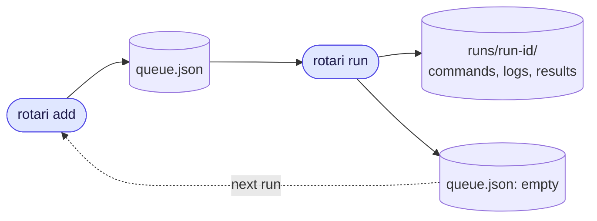

# Concepts

Projects, queues, runs, IDs, dependencies, and how rotari resolves the state directory and project.

## Projects, queues, runs, and state
### Project and queue
A project has one mutable queue of jobs ready to run and an immutable history
of completed runs. The live queue is `queue.json`. A run takes the queue when
it starts: its jobs move into `runs/<run-id>/commands.json`, and the queue is
left empty, keeping its default executor settings. Retries and filtered reruns
start new runs, so earlier history stays unchanged.

The queue therefore always holds the next run's jobs, never the jobs of a run
that has started:

- While the project is `idle`, the queue is the current work target and the
  default place to add or edit jobs.
- While a project is `running`, the run is the primary user-facing target, and
  `add`, `copy`, `change`, `remove`, `import`, and `reset` prepare the next
  run in the queue. `reset` clears only that queue; it does not affect the
  active run.
- While a project is `interrupted`, the run remains the primary recovery
  target, and the queue can still be edited or reset independently. After
  confirming its jobs have stopped, use `unlock`; its failed and unfinished
  jobs are rerun from the run with `rotari retry --run-id RUN_ID`.

```text
<basedir>/projects/<project>/
├── queue.json                 # current queue
├── meta.json                  # latest project phase and run metadata
├── running.lock               # while a run is active: run ID, PID, and host
└── runs/
    └── <run-id>/              # immutable run history
        ├── commands.json      # command snapshot
        ├── context.json       # execution context and config snapshot paths
        ├── sources.json       # git or jj revision the executed jobs ran from
        ├── summary.json       # run result
        └── <job-id>/
            └── attempts/<attempt-id>/
                ├── command.json
                ├── output     # merged log by default; stdout/stderr when separate
                ├── stdout     # separate-mode standard output
                ├── stderr     # separate-mode standard error
                ├── status.json
                └── ...        # executor-specific state
```

Files may appear incrementally while a run is active. When reading state
directly, treat a missing optional file as an incomplete result, not as a
success.

### Run and state

Each run records its own command snapshot, success/failure status, logs, and
metadata. The run empties the queue when it starts, and when it finishes, the
runner updates the project state and leaves the completed run immutable, which makes retry loops and inspection easy to
reason about without losing the earlier outcome.


```mermaid
flowchart LR
  add([rotari add]) --> queue[(queue.json)]
  queue --> run([rotari run])
  run --> history[(runs/run-id/<br/>commands, logs, results)]
  run --> empty[(queue.json: empty)]
  empty -. next run .-> add

  classDef command fill:#e0e7ff,stroke:#4f46e5,color:#1e1b4b
  class add,run command
```

Each added command has a stable job ID. Use `add --job-name NAME` to give a
job a readable label, and `run --run-name NAME` (or `ROTARI_RUN_NAME`) to label
a run; the generated IDs remain available for unambiguous commands and paths. `run` saves the complete command
snapshot under `runs/<run-id>/`, together with a summary and each attempt's
configured log. By default stdout and stderr are merged into `output`;
`add --log-mode separate` stores them as `stdout` and `stderr`.
Repeated `--output FILE` and `--error FILE` add external destinations without
changing the internal log mode. If `--error` is omitted, stderr follows the
`--output` destinations too. Missing parent directories are created on the
execution host before the command starts; `--open-mode truncate` truncates
destinations once, while append is the default.
After it finishes, the queue is emptied, while the run can be inspected or used
with selections such as `rotari retry`. The next `add` starts a new batch while
keeping the previous run history. Use `delete` to remove saved run logs
explicitly. Use `run --async` when an experiment should continue after the
terminal returns.

### Workflow and execution environment

A queue, a run's command snapshot, and an exported workflow describe the
command layer only: each job's command, its own `--env` and
`--working-directory`, and scheduling settings such as dependencies,
timeouts, and retries. The working directory and environment a job otherwise
sees come from the shell that runs `rotari run` or `rotari retry`, at the time
it runs, as with any command started from that shell:

```sh
cd ~/exp-a && rotari run   # jobs start in ~/exp-a with this shell's environment
cd ~/exp-b && rotari retry # jobs start in ~/exp-b with this shell's environment
```

So the same queue or workflow can be run again from another directory, or
after activating another environment, without editing it. Pin a job to a
directory or variable with `add --working-directory` or `add --env` when it
must not depend on where it is run from. `run` and `retry` default to
`--env=ALL`; use `--env=NONE` to omit ordinary caller variables for a run.
Job `--env` values still apply in either mode, and `PWD` always reflects the
effective job working directory. `ALL` may propagate secrets to remote
executors and scheduler records, so it is not secret management.

This holds whatever else is running: every run has its own supervisor process,
started by `run` or `retry` as its child, so one run never takes the directory
or environment of another. The run records its caller's directory in
`context.json`, and jobs see it as `ROTARI_CWD`; the caller's environment is
not recorded in that context file.

### IDs and location resolution

Rotari uses three different IDs:

| ID | Meaning |
| --- | --- |
| `run-id` | One execution of a project queue. It identifies the run snapshot, summary, and history. |
| `job-id` | A logical job in a queue or run. For an array, expanded task IDs look like `job-id-1`, `job-id-2`, and so on. |
| `attempt-id` | One concrete execution of one logical job, including a retry. It identifies the attempt output and status. |

The `run-id` identifies a run and provides its project location. An
`attempt-id` identifies one job execution and provides its `job-id` and
`run-id`, so the command can resolve the same project location from the attempt
alone.

`show` accepts a `RUN_ID`, `ATTEMPT_ID`,
`JOB_ID`, or job name as its optional positional argument. The associated run,
project, and basedir are resolved automatically when the selector identifies
them.

| Selector | Information available for resolution | Options that can be omitted |
| --- | --- | --- |
| `show RUN_ID` | `run-id`, `basedir`, and `project` | `--basedir/-b`, `--project-name/-p` |
| `show ATTEMPT_ID` | `attempt-id`, `job-id`, `run-id`, `basedir`, and `project` | `--basedir/-b`, `--project-name/-p`, `--run-id/-r` |
| `show JOB_ID` / `show JOB_NAME` | matching job in the relevant latest run or queue | `--job-id/-j`, `--job-name` |

When a selector matches more than one project, run, or job, `show` reports an
ambiguous-selector error instead of choosing silently. Use explicit options to
disambiguate. The option forms remain available when composing commands or
when an exact run/job context is required:

```sh
# These are equivalent exact selectors
rotari show -b BASE_DIR -p PROJECT_NAME -r RUN_ID
rotari show -r RUN_ID
rotari show RUN_ID # ID can be passed positionally; -r can be omitted

rotari show -b BASE_DIR -p PROJECT_NAME -r RUN_ID -j ATTEMPT_ID
rotari show -j ATTEMPT_ID
rotari show ATTEMPT_ID
```

The following commands accept an `ATTEMPT_ID` as their `--job-id/-j` selector:

- `ATTEMPT_ID` supported: `show`, `cancel`, `suspend`, `resume`, `copy`,
  `run`, `retry`.
- `ATTEMPT_ID` not supported: `add`, `change`, `remove`, `delete`, `wait`.
  These commands operate on queue definitions or whole runs, not individual attempts.

`ATTEMPT_ID` and `RUN_ID` include the run and job context needed for resolution.
`JOB_ID` does not, so the following `JOB_ID` forms are equivalent only when no
other searched run or queue contains the same job ID.

```sh
rotari show -b BASE_DIR -p PROJECT_NAME -r RUN_ID -j JOB_ID
rotari show -j JOB_ID

rotari copy -b BASE_DIR -p PROJECT_NAME -r RUN_ID -j JOB_ID
rotari copy -r RUN_ID -j JOB_ID
```

Projects, run IDs, and job IDs can also be passed positionally when a command
accepts one. A positional argument means the same thing whatever options are
given, and options may follow it, except in `add` and `change`:

```sh
rotari show PROJECT_NAME
rotari show JOB_ID
rotari copy -j JOB_ID RUN_ID
rotari remove JOB_ID OTHER_JOB_ID
rotari delete RUN_ID
rotari unlock PROJECT_NAME --run-id RUN_ID
rotari cancel JOB_ID OTHER_JOB_ID
rotari cancel RUN_ID
rotari suspend ATTEMPT_ID
rotari resume ATTEMPT_ID
rotari export RUN_ID_OR_PROJECT [OUTPUT_FILE]
rotari import FILE PROJECT
```

These positional forms cannot be combined with the corresponding `--run-id/-r`
or `--job-id/-j` option. For export, `TARGET` names a project or run; use
`--project-name/-p` when explicitly combining a project and a run. `delete`
without an ID still removes all saved runs.
For `cancel`, `suspend`, and `resume`, a positional `JOB_ID` or `ATTEMPT_ID`
selects jobs the same way `--job-id/-j` does; a bare `RUN_ID` only locates the
target run through the run registry and is not itself a job selector, so it
behaves like omitting `--job-id/-j` (all running jobs in that run). The run
must be the project's active run: a finished run's ID is an error rather than
acting on whatever run is active now. An array job's ID selects its running
tasks, and without `--project-name/-p` a `JOB_ID` is looked for in the active
run of every project.

## Dependencies and stages

Jobs can depend on other jobs or on a stage: a dependent job waits until its
prerequisites succeed, or, with `--depends-on-finished`, until they finish
regardless of result. Stages group jobs that may run concurrently and provide
a convenient dependency barrier. See
[Dependencies and stages](RUNNING.md#dependencies-and-stages) for usage and
selection options.

## State and project resolution

Rotari resolves the state directory before it resolves the project name. The
first matching state-directory entry wins:

The resolution order for the state directory is:
1. `--basedir/-b` option
2. `ROTARI_BASEDIR` environment variable
3. Cwd `.rotari.toml` `basedir`, then global config `basedir`
4. `./.rotari-state` (if it exists in the current directory)
5. Default location (`$XDG_STATE_HOME/rotari` or `~/.local/state/rotari`)

The resolution logic for the project name when `--project-name/-p` is omitted is:
1. `--project-name/-p` option
2. `ROTARI_PROJECT_NAME` environment variable
3. Selected basedir, cwd workspace, then global config `project-name`
4. Automatically select if exactly one project exists in the state directory
5. Default project name (`default`) if no projects exist yet (if multiple projects exist, an error will prompt you to specify one)

`rotari init [BASEDIR [PROJECT]]` writes cwd workspace defaults without creating
state. Workspace discovery never searches parents. Normal config values merge
global → workspace → basedir → project; location keys are restricted to avoid
cycles. See [Configuration](CONFIGURATION.md#configuration-files).

These rules apply consistently to commands that do not identify an existing
run through its run registry. Use `--basedir/-b` and `--project-name/-p` when a
command must target a specific location explicitly.

## Internal execution model

How `run` executes jobs through a per-run supervisor is described in
[Code architecture](ARCHITECTURE.md#processes).
