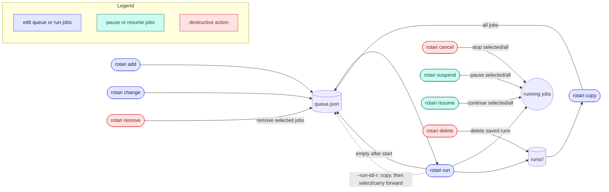

# Defining and controlling jobs

Define jobs and control the queue with arrays and matrices, dependencies,
automatic retries, timeouts, and job-level operations. To start and wait for
runs, see [Async runs, waits, and interruptions](RUNS.md). To rerun failed jobs
after a run, see [Recovering failed runs](RECOVERING.md).

## Array and matrix jobs

Array jobs can be added with a numeric range or a comma-separated task list:

```sh
rotari add --array 1-10 -e local ./train.sh
rotari add --array 1-10 -e slurm ./train.sh
rotari add --array 1-10 -e sge ./train.sh
rotari add --array 1,3,4 -e slurm ./train.sh
```

Each task is tracked separately. Local and SSH execution starts one process per
task. Slurm, PBS, and LSF may submit a complete contiguous range as a native
scheduler array, while SGE always submits independent jobs to avoid relying on
fork-specific native array syntax. Sparse selections use independent jobs
where native arrays are not applicable. For each array task, rotari exposes:

- `ROTARI_ARRAY_TASK_ID`: current task number
- `ROTARI_ARRAY_FIRST`: first task number in the array
- `ROTARI_ARRAY_LAST`: last task number in the array
- `ROTARI_ARRAY_SIZE`: total number of tasks

Scheduler-backed native arrays also map the scheduler index variable into
these values, for example `SLURM_ARRAY_TASK_ID`, `PBS_ARRAY_INDEX`, or
`LSB_JOBINDEX`.

To register a matrix as independent jobs, repeat `--matrix` on `add`:

```sh
rotari add --job-name train \
  --matrix python=3.10,3.11 \
  --matrix cuda=cpu,cuda \
  ./train.sh
```

This registers the Cartesian product as four jobs named like
`train-python3.10-cudacpu`. Each job receives its values as ordinary
environment variables, such as `python=3.10` and `cuda=cpu`. Matrix jobs have
independent job IDs and can be combined with `--array`; the array is applied to
each matrix combination. `--depends-on` can name the matrix's `--job-name` (for
example `--depends-on train`) to wait for every combination. If `copy`,
`remove`, or `change` later touches only part of the matrix, such dependencies
are rewritten to the remaining combination names. Repeat
`--matrix-exclude KEY=VALUE[,KEY=VALUE...]` to omit matching combinations; all
assignments in a rule must match, and separate rules are alternatives. The
option requires `--matrix`, and workflow export retains the exclusion rules.
Workflow manifests accept the equivalent `matrix_exclude` list.

## Dependencies and stages

Use `--depends-on NAME` to define prerequisites.
Use a job's name as `NAME`; the job waits until that prerequisite succeeds.
Repeat the option to require multiple prerequisites.

For example, run `train.sh` only after `prepare.sh` completes successfully:

```sh
rotari add --job-name prepare ./prepare.sh
rotari add --job-name train --depends-on prepare ./train.sh
rotari run
```

For a barrier between batches of jobs, assign the jobs to a stage and depend on
the stage name. Jobs in a stage run concurrently; a dependent job starts only
after every job in the stage succeeds:

```sh
rotari add --stage prepare ./prepare-data.sh
rotari add --stage prepare ./prepare-config.sh
rotari add --job-name train --depends-on prepare ./train.sh
rotari run
```

`--depends-on` accepts either a job name or a stage name. A job name and stage
name cannot be the same within one queue. The name of an array job stands for
all of its tasks, like a stage name: `--depends-on train` waits until every
task of the array `train` succeeds.

Use `--depends-on-finished NAME` for a job that should run once its
prerequisites finish, whatever their result, like Slurm's `afterany`. It suits
aggregation and cleanup jobs that must still run when part of a sweep fails:

```sh
rotari add --stage sweep --matrix LR=0.1,0.01 python train.py
rotari add --job-name collect --depends-on-finished sweep python collect.py
rotari run
```

`collect` waits while a failed prerequisite still has `run --retry` attempts
left, and it also runs after a prerequisite is blocked or cancelled. A later
`run --failed` or `retry` that re-executes a prerequisite re-executes such
dependents too, so their output reflects the new results. A name cannot be
listed in both `--depends-on` and `--depends-on-finished` of one job. `show`
lists these prerequisites as `finished:NAME`. Use `change
--depends-on-finished` or `--clear-depends-on-finished` to edit them.

Use `rotari show --stage NAME` to list only the jobs in one stage of the
selected run or queue, and `rotari show --matrix NAME` for the jobs of one
matrix. The same `--stage` and `--matrix` select jobs for `change`, `remove`,
`copy`, `run`, and `retry`.

## Automatic retries

A failed job can be retried automatically within the same run. This is
separate from `rotari retry`, which starts a new run after one has finished;
see [Recovering failed runs](RECOVERING.md).

`run --retry N` retries failed jobs within the same run, up to N
additional attempts. The default is `0`; use `--retry -1` to retry indefinitely.
Jobs explicitly cancelled by the user are not retried by this option. For
example, these commands allow two additional attempts or retry indefinitely:

```sh
# Run the queue; failed jobs may be attempted twice more.
rotari run --retry 2

# Keep retrying failed jobs until they succeed or are cancelled.
rotari run --retry -1
```

Without `--retry`, each failed job is attempted only once.

A failed job is retried as soon as it fails; it does not wait for the other
jobs of the run. To retry only jobs that fail for transient reasons, such as a
flaky file system or network, give them their own limit when adding them. A job's
`--retry` replaces the run's for that job; `0` turns retries off even when the
run uses `--retry`:

```sh
rotari add --retry 3 ./download-data.sh
rotari add --retry 0 python evaluate.py
rotari change -p sweep --job-name download --retry 5
rotari change -p sweep --job-name download --clear-retry   # use the run's limit again
```

To change a setting for many jobs at once, select them by stage, by matrix, or
all together:

```sh
rotari change -p sweep --stage train --retry 0
rotari change -p sweep --matrix train --executor-option="-p gpu"
rotari change -p sweep --all --timeout 3h
```

To give a transient problem time to clear, or to keep many failed jobs from
retrying against a shared service at once, space the retries out. The first
retry waits `--retry-delay`, each further retry multiplies the wait by
`--retry-backoff`, and `--retry-max-delay` caps it:

```sh
# Wait 30s, 1m, 2m, then 5m between attempts.
rotari add --retry 4 --retry-delay 30s --retry-backoff 2 --retry-max-delay 5m ./download-data.sh
```

The delay settings apply to retries from `run --retry` as well as the job's
own `--retry`. Cancelling the run stops pending retries.

## Job timeouts

Stop a job that runs too long, for example one that hangs on a stalled file
system or collective operation:

```sh
rotari add --timeout 2h python train.py
rotari change -p sweep --job-name train --timeout 3h
rotari change -p sweep --job-name train --clear-timeout
```

The limit counts from when the job starts running, not from submission, so
time waiting in a scheduler queue is not included. When it runs out, rotari
sends SIGTERM to the job, gives it 30 seconds to exit (for example, to save a
checkpoint), then sends SIGKILL. The job fails with exit code 124 and the error
`timed out after 2h0m0s`, and its log ends with a matching `rotari:` line. A
timed-out job is an ordinary failure, so `run --retry`, `retry`, and
`--depends-on` treat it like any other failed job. The timeout works the same
way for every executor and is independent of scheduler walltime options such
as Slurm `--time`, which still apply.

## Queue and job control

Stop running jobs without stopping the supervisor:

```sh
rotari cancel -p sweep
rotari cancel -j ATTEMPT_ID
rotari cancel ATTEMPT_ID
rotari cancel RUN_ID
```

`--job-id/-j` is optional. Without it, all running jobs in the queue are
cancelled. With it, only the specified running jobs are cancelled, and the
option may be repeated. `--job-id/-j` cannot be used with `--wait`, nor combined
with a positional `JOB_ID`/`ATTEMPT_ID`/`RUN_ID`. An array job's ID selects
all of its unfinished tasks. A `RUN_ID` or `ATTEMPT_ID` must belong to the
project's active run; `rotari cancel` of an earlier run's ID fails instead of
cancelling the run that is active now. Without `-p`, a `JOB_ID` is looked for
in the active run of every project.

A cancelled job's result records the error `cancelled`, so
`--filter-failure-kind cancelled` selects it and failure summaries list it
under `cancelled` rather than by its exit code.

Whole-run cancel (no `--job-id/-j`) and, for `local`-executor jobs, `--job-id/-j`
cancel/suspend/resume all signal jobs by PID, which only means
something on the host that actually runs it; run these commands from that
host if it differs from wherever `cancel`/`suspend`/`resume` is invoked. See
the [FAQ](FAQ.md#client-control-and-job-cancellation) for what happens
when you can't.

Temporarily suspend and resume running jobs:

```sh
rotari suspend -p sweep
rotari suspend -j ATTEMPT_ID
rotari resume -j ATTEMPT_ID
rotari suspend ATTEMPT_ID
rotari resume RUN_ID
```

Without `--job-id/-j`, all currently running jobs are affected. Repeat `--job-id/-j`
to control selected jobs; job IDs select as for `cancel`, except that an array
job's ID selects only its running tasks. Local jobs use `SIGSTOP`/`SIGCONT`; Slurm jobs use
`scontrol suspend`/`scontrol resume`; SGE jobs use `qmod` suspend/unsuspend.

Remove jobs from the current queue without affecting saved run history:

```sh
rotari remove -p sweep --job-name train
rotari remove -p sweep -j JOB_ID -j OTHER_JOB_ID
rotari remove -p sweep --stage eval
```

Like `change`, `remove` edits the current queue and does not restore an empty
one; restore a run with `copy`, or pass `--run-id/-r ID` (or `latest`) to replace
the queue with that run's jobs first. Specify exactly one target selector:
`--job-name NAME`, one or more `--job-id/-j ID` options, `--stage STAGE`,
`--matrix NAME`, or `--all`, as for `change`. Removing a job that another queued
job depends on is rejected.

Delete saved run logs while keeping queued commands:

```sh
rotari delete -p sweep RUN_ID
rotari delete -p sweep --all
```

`delete` removes the run given as `RUN_ID` or `--run-id/-r`. Removing every
saved run of the project needs `--all`; without a run or `--all`, nothing is
deleted.

The commands affect the current queue and saved run history differently:


