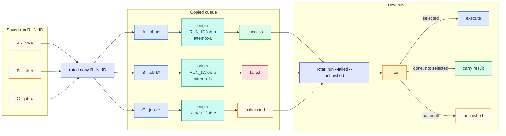

# Recovering failed runs

When a run ends with failed or unfinished jobs, start a new run that executes
only those jobs again. Successful jobs are not executed again; their results
and output carry forward to the new run. If you add jobs with a script and
want to run that script again instead, see
[Rerunning a job-generating script](#rerunning-a-job-generating-script).

Automatic retries within a run are a separate feature: `run --retry N` and
`add --retry N` make additional attempts before that run finishes; see
[Automatic retries](RUNNING.md#automatic-retries).

## Rerun failed jobs

```sh
rotari show -p sweep --failed-logs   # see why jobs failed
rotari retry -p sweep                # rerun failed and unfinished jobs
```

`retry` starts a new run in which failed and unfinished jobs execute again and
successful jobs carry forward their result. Carried-forward jobs are not
executed, but they appear on the new run with a link to their original
output, so the whole run can be inspected in one place.

`retry` starts from the latest run when the queue is empty. When the queue
holds jobs, such as ones edited with `change`, it uses those instead and
does not silently add the latest run's failures. The preview and run report
the latest run's failed or unfinished jobs that are not represented in the
queue, with a `copy --failed --unfinished --append` command to include them.

## Edit jobs before rerunning

`copy` puts a run's jobs back into the queue without running them, so that
`change` can edit them first:

```sh
rotari copy                                   # the latest run; copy -r RUN_ID for another
rotari change --job-name train --executor-option="-p gpu"
rotari change --job-name train ./train-v2.sh
rotari change --job-name train --status unfinished
rotari retry
```

An edited job keeps its previous result, even when its command, environment,
or working directory changes, so `retry` would not run an edited job that
succeeded before. Mark it with `change --status unfinished` to make it run
again.

`change` edits one job (`--job-id/-j`, `--job-name`) or many (`--stage`,
`--matrix`, `--all`); an array job is changed as a whole. `copy` keeps job IDs
(unless they collide with queued ones) and dependencies, can restore only some jobs with the same selectors as
`retry`, and asks before replacing a non-empty queue (`--append` adds,
`--overwrite` replaces). See the [CLI reference](CLI_REFERENCE.md) for every
option. In contrast, `retry --run-id RUN_ID` builds the new run directly from
that saved run's snapshot and leaves the next queue untouched; `--overwrite`
is not accepted by `run` or `retry`.

For a reviewable edit kept in a file, export the run as a
[workflow manifest](WORKFLOW_MANIFESTS.md), edit it, and import it.

## Choosing which jobs rerun

By default `retry` reruns failed and unfinished jobs. These options choose
something else. Jobs that depend on a rerun job run again too; every other job
carries forward its result, or stays unfinished if it has none.

| Option | Reruns |
| --- | --- |
| (none) | Failed and unfinished jobs. |
| `--failed` | Only jobs that finished with a non-zero exit code. |
| `--unfinished` | Only jobs without a completed result. |
| `--success` | Only jobs that finished with exit code zero. |
| `-j JOB_ID`, `--job-name NAME` | That job, whatever its result. |
| `--stage STAGE`, `--matrix NAME` | Failed and unfinished jobs in that stage or matrix. |
| `--filter-not-stage`, `--filter-not-matrix` | Failed and unfinished jobs outside that stage or matrix. |

```sh
rotari retry -p sweep --stage train
rotari retry -p sweep --filter-not-stage report
rotari retry -p sweep -j JOB_ID
rotari retry -p sweep --dry-run      # list the jobs it would execute
```

The result options (`--failed`, `--unfinished`, `--success`) may be combined;
`--stage`, `--matrix`, and the other `--filter-*` options narrow them. A job
named with `-j` or `--job-name` cannot be combined with any of them. `--help`
lists every filter under "Filters", and
[contracts/06-selectors.md](../contracts/06-selectors.md#filters) gives the
full rules.

For an array job, only the matching tasks rerun; `--partial-array=false`
reruns every task of an array when any task matches.

`-r RUN_ID` starts from a saved run instead of the latest one. It uses that
run's snapshot directly and leaves the next queue untouched. The same applies
to a result selection on an empty queue.

`run` takes the same options. `retry` is `run --failed --unfinished` when no
other selection is given; `run` without one executes the whole queue.
`run --failed` on an empty queue builds its snapshot from the latest run, as
`retry` does, without writing that snapshot into the next queue.

To guard a rerun against concurrent edits, see
[Previewing and guarding changes](#previewing-and-guarding-changes).

## How results carry forward

Each job in the queue that came from an earlier run records an `Origin`: the
source run, job, and (when available) attempt. `copy` records it when it
copies a job; `--match-by` creates it for a job it matches. When the run
starts, the selection looks up each job's result through its `Origin`:
selected jobs execute, other finished jobs carry their result forward, and
jobs without a result stay unfinished.



## Rerunning a job-generating script

Most recoveries start from a run, as described above, and do not need this
section. It applies when you add jobs with a script, and want to run that
script again instead of using `copy`.

### When this helps

Suppose a script adds a batch of training jobs, and some of them fail. You
fix the cause and run the same script again, perhaps after adding another
seed. Each `add` creates a new job, with a new job ID, so the queue now holds
the whole batch again. Executing all of it would repeat the jobs that already
succeeded.

`retry` avoids that. It recognizes a newly added job as the same job as one
in the project's previous run when the two have the same command and inputs,
and treats it the way it treats a copied job: an earlier success carries
forward, an earlier failure executes again, and a job with no earlier match
executes as new work. The value compared is the job's **fingerprint**; rotari
calculates it for you, and you do not have to store or pass it.

### How to use it

Add the jobs again and call `retry`. No other option is needed. For example,
seed 1 succeeds and seed 2 fails in the first run:

```sh
# First batch
rotari add -p sweep python train.py --seed 1
rotari add -p sweep python train.py --seed 2
rotari run -p sweep

# Run the generating script again, now with a third seed
rotari add -p sweep python train.py --seed 1
rotari add -p sweep python train.py --seed 2
rotari add -p sweep python train.py --seed 3
rotari retry -p sweep --dry-run      # preview: seed 2 and seed 3 execute
rotari retry -p sweep
```

The new seed 1 job matches the earlier success; it does not execute, and the
new run links to its original result and output. Seed 2 matches the earlier
failure and executes again. Seed 3 has no match and executes as new work.
This also works with a matrix-generated sweep.

Keep in mind:

* **Use `retry`, not `run`.** Matching only connects new jobs to earlier
  results; `retry` is what skips the successes. An unfiltered `run` executes
  every queued job, including the ones that match an earlier success. The
  [result options](#choosing-which-jobs-rerun) such as `--failed` work as
  usual.
* **Only the latest run is compared.** Rotari does not search older runs or
  other projects. A job left out of the new batch is not added back.
* **The same fingerprint does not mean up-to-date.** Editing `train.py` does
  not change the fingerprint of `python train.py --seed 1`; see
  [Fingerprints are not file freshness checks](#fingerprints-are-not-file-freshness-checks).
* **Copied jobs keep their own link.** A job restored with `copy`, or matched
  by job ID, keeps its link to its earlier result, even after `change` edits
  its command; fingerprints are only compared for the remaining jobs.

To continue a specific saved run instead of rebuilding the queue, use
`retry --run-id RUN_ID` or `copy --run-id RUN_ID`.

### What makes two fingerprints equal?

Fingerprints compare expanded execution units: one plain job, one matrix
combination, or one array task. They use only these recorded inputs:

| Included input | Comparison |
| --- | --- |
| Command and arguments | The exact argument list, including argument order. |
| Job `--env NAME=VALUE` | The final explicitly stored values, sorted by variable name; repeated names use the last value. |
| Job `--working-directory` | The explicitly stored path, with `.` and `..` cleaned lexically; it is not resolved against the caller's directory or through symlinks. |
| Matrix parameters | The expanded combination's names and values, not the whole range. |
| Array task number | The individual task number, not the whole range. |

Job IDs and names, executors and their options, timeouts, retry settings,
dependencies, stages, artifacts, and log destinations are **not** fingerprint
inputs. For example, changing only Slurm resource options still allows a
match; changing `--seed 2` to `--seed 3` does not.

Widening an array from `1-2` to `1-3` can match tasks 1 and 2 while task 3 is
new work. Adding matrix values works the same way: existing combinations can
match, and new combinations are unfinished. Result selection then determines
which matched tasks rerun; `--partial-array=false` instead reruns the whole
array if any task is selected.

### Matching modes and repeated commands

`--match-by` chooses how `run` and `retry` connect queued jobs to the previous
run. The default works for both copied and re-added jobs, so it rarely needs
to be changed.

| `--match-by` | How jobs are associated |
| --- | --- |
| `id-and-fingerprint` (default) | Preserve existing origins, match job IDs first, then match the remaining jobs by fingerprint. |
| `fingerprint` | Preserve existing origins, then compare fingerprints without using job IDs. |
| `job-id` | Preserve existing origins and match job IDs only; newly generated IDs do not match just because the command is the same. |

An ID or an existing origin identifies the earlier logical job even when its
command has changed. In particular, `--match-by fingerprint` does **not**
discard the origin of a copied job. To rerun an edited success, mark it
`change --status unfinished` or select that job explicitly.

If several remaining jobs have the same fingerprint, rotari pairs them in
queue occurrence order, but only when their counts agree on both sides. Two
identical commands can match two earlier identical commands; three cannot
match two. In the latter case, all three are new work rather than guessing
which result belongs to which job. Origins and ID matches are removed before
these remaining counts are compared. Fingerprints are recalculated for each
comparison, not stored.

### Fingerprints are not file freshness checks

**The same fingerprint does not prove the computation would produce the same
result now.** Rotari does not hash scripts, input files, output files, or
artifacts. Editing the contents of `train.py` leaves the fingerprint of
`python train.py --seed 1` unchanged. Likewise, changing the caller's directory,
inherited environment, or source repository revision does not change it. The
run's recorded source revision is evidence for inspection, not a matching key.

Use fingerprint-based retry when you intend to reuse those earlier results.
If changed code, data, or an inherited environment requires fresh results,
use an unfiltered `run` to execute the entire rebuilt queue, or explicitly
select the jobs that must run again. A recorded input such as an explicit
`--env DATA_VERSION=v2` can distinguish versions when your workflow defines
and maintains that value; rotari does not discover such changes for you.

## Previewing and guarding changes

The commands that change a project's queue or run history (`add`, `change`,
`copy`, `delete`, `import`, `remove`, and `reset`) take `--dry-run` and
`--if-revision REVISION`. `--dry-run` checks the change and prints what it
would do, prefixed with `dry run:`, and the project's revision, without
writing anything. `--if-revision` applies the change only if the project is
still at that revision, and prints the revision it produced; if anything has
written the project in between, such as another edit or a run, it fails with
`project changed since the planned revision` and changes nothing. `rotari
check` also prints the revision. Neither option is read from the environment
or a config file.

```sh
rotari remove -p sweep --dry-run JOB_ID         # prints revision=REVISION
rotari remove -p sweep --if-revision REVISION JOB_ID
```

`run` and `retry` take the same options. `--dry-run` lists the jobs the run
would execute and how many results it would carry, planned the way the run
itself is, without copying a run into the queue or starting anything.
`--if-revision` starts the run only if the project is still at that revision
and the run would execute the same jobs: a run preview's revision is the
project's revision followed by a hash of its plan, such as
`revision=7c28f3b699fcae20.59b54b04`. Give the start the same selection
options as the preview. A start that would execute other jobs, for example
because it left out a `--filter-*` option the preview had, is refused and
changes nothing; preview again with the options you mean. A revision from
`check`, which has no plan hash, guards only the project's state.

`--async` cannot be combined with `--dry-run`: a preview does not start a run
to detach from. Rotari reports the incompatible options rather than silently
ignoring `--async`.

When a preview is given `--run-name`, its summary includes `run_name=NAME`.
The preview does not reserve or persist that name.

The same selector rules apply to a `run --dry-run` preview as to execution:
result filters combine with a stage or matrix, while direct job selectors
cannot be combined with result filters or `--filter-*` conditions. A run
preview lists every task of the whole array when `--partial-array=false` is
supplied.

```sh
rotari retry -p sweep --dry-run                 # lists the jobs it would execute
rotari retry -p sweep --if-revision REVISION --async
```

A revision identifies the project's queue and metadata files; any write to
either changes it.
