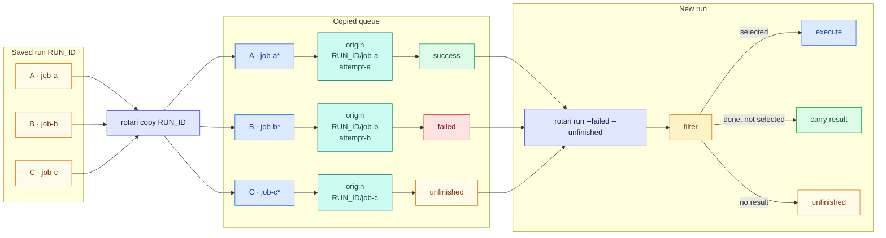
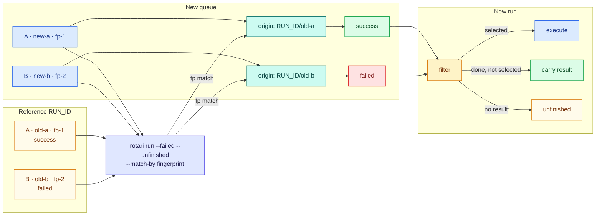

# Recovering failed runs

When a run ends with failed or unfinished jobs, start a new run that executes
only those jobs again. Successful jobs are not executed again; their results
and output carry forward to the new run.

Three different things are called "retry" in rotari:

| You want to | Use | See |
| --- | --- | --- |
| Rerun failed jobs after a run has finished | `rotari retry` | [Rerun failed jobs](#rerun-failed-jobs) |
| Fix a job's command or options, then rerun it | `copy`, `change`, then `retry` | [Edit jobs before rerunning](#edit-jobs-before-rerunning) |
| Retry a failing job automatically within the same run | `run --retry N`, `add --retry N` | [Automatic retries](RUNNING.md#automatic-retries) |

## Rerun failed jobs

```sh
rotari show -p sweep --failed-logs   # see why jobs failed
rotari retry -p sweep                # rerun failed and unfinished jobs
```

`retry` copies the latest run into the empty queue and starts a new run from
it; when the queue already holds jobs, such as ones edited with `change`, it
uses them instead. Failed and unfinished jobs execute again; successful jobs carry forward their previous result and output.
Carried-forward jobs are not re-executed, but they appear on the new run with
a link to their original output, so the whole run can be inspected in one
place.

Narrow what reruns:

```sh
rotari retry -p sweep -j JOB_ID            # only this job, whatever its result
rotari retry -p sweep --stage train        # failed or unfinished jobs in stage train
rotari retry -p sweep -r RUN_ID            # start from a saved run instead of the latest
rotari retry -p sweep --dry-run            # list the jobs it would execute
```

Jobs outside the selection carry forward. For array jobs, only the matching
tasks rerun; see [Choosing which jobs rerun](#choosing-which-jobs-rerun) for
this and the other options.

## Edit jobs before rerunning

Use `copy` when a job needs to be edited before it is run again. It restores
jobs from a previous run into the current queue without executing them; then
`change` can modify their commands or options while preserving the saved run
history:

```sh
rotari copy
rotari change --job-name train -e local
rotari change --job-name train --executor-option="-p gpu"
rotari change --job-name train --depends-on prepare -- ./train-v2.sh
rotari retry
```

A changed job keeps its previous result, even when its command, environment
(`--env`), or working directory changes. To run an edited job again with
`retry`, mark it with `change --status unfinished`: it then counts as
unfinished until it runs again, and the old result is never carried forward.

Without a selector, `copy` restores every job from the latest run; `copy -r
RUN_ID` restores a specific run. This keeps the full queue available for
inspection and editing before choosing which jobs to execute. `copy --failed`
and the other copy-side filters remain available when only a subset should be
restored:

```sh
rotari copy -p sweep --stage eval --failed # restore only failed jobs in stage eval
```

`copy` keeps the source job ID unless it would collide with the destination
queue, and preserves dependencies between copied jobs. A non-empty queue
requires confirmation before replacement; use `--append` to add jobs or
`--overwrite` to replace it without asking. Selection options include
`--failed`, `--unfinished`, `--success`, `--stage`, `--matrix`, and repeated
`--job-id/-j`; a job ID or `--job-name` is not combined with a result filter.
Copied jobs remain pending, with source run, status, and working-directory
metadata kept for later inspection.

`change` requires exactly one target selector: `--job-id/-j ID` or
`--job-name NAME` for one job, or `--stage STAGE`, `--matrix NAME` (the base job
name given to `add --matrix`), or `--all` for every matching job. It also
requires at least one change, such as a new command, `--executor/-e`,
`--executor-option`, `--set-job-name`, or `--depends-on`. A new command and
`--set-job-name` need a single job. An array job is changed as a whole; its
tasks cannot be changed one by one. It replaces only the options specified,
keeps the job IDs, and edits the current queue. A run leaves the queue empty,
and `change` does not restore it on its own: restore a run with `copy` first, or
pass `--run-id/-r ID` (or `latest`) to replace the queue with that run's jobs
before the change.

For a reproducible, reviewable edit, export the run as a
[workflow manifest](WORKFLOW_MANIFESTS.md), edit it, and import it.

## Choosing which jobs rerun

`retry` is `run --failed --unfinished` by default, but not an alias of it:
`--failed --unfinished` applies only when no result filter or job is given.
`run` and `retry` take the same selection options. Both select jobs from the latest run, or from a saved run given by
`--run-id/-r`, and execute them as a new run while carrying forward everything
else:

```sh
rotari run -p sweep --failed
rotari run -p sweep --unfinished
rotari run -p sweep --success
rotari run -p sweep --failed --unfinished
rotari run -j ATTEMPT_ID
```

The result filters select which jobs are actually re-executed:

| Option | Executed jobs |
| --- | --- |
| `--failed` | Finished jobs with a non-zero exit code. |
| `--unfinished` | Jobs without a completed result. |
| `--success` | Finished jobs with exit code zero. |
| `--failed --unfinished` | Failed or unfinished jobs. |

Result filters or repeated `--job-id/-j` select jobs to re-execute; a job
named with `--job-id/-j` or `--job-name` runs whatever its result, so the two
cannot be combined. Finished non-matching jobs carry forward their previous
result and output; jobs without a result remain unfinished. Use
`--failed --unfinished` to recover everything that did not complete
successfully.

When the queue is empty, `run --failed` restores the latest run automatically
before selecting failed jobs. `run --job-id/-j` and `--job-name` likewise run a
job from a non-empty queue, keeping edits made with `change`, and restore the
latest run only when the job is not queued.

`--stage STAGE` or `--matrix NAME` (the base job name given to `add --matrix`)
narrows the selection to one stage or matrix. Jobs outside it carry forward
like non-matching jobs. Alone, it re-executes every job in the stage or matrix;
with a result filter, only the matching jobs in it:

```sh
rotari retry -p sweep --stage train        # failed or unfinished jobs in stage train
rotari run -p sweep --matrix train         # every job of matrix train
```

Every option that filters jobs is also available as `--filter-*`, and the
options without a short form exist only in that form. `--help` lists them under
"Filters". `--filter-result RESULT` is the long form of `--failed`,
`--unfinished`, and `--success`, and `--filter-stage` and `--filter-matrix` are
the long forms of `--stage` and `--matrix`. `--filter-not-stage NAME` and
`--filter-not-matrix NAME` exclude a stage or matrix; they may be repeated, and
jobs without a stage or matrix are kept:

```sh
rotari retry -p sweep --filter-not-stage report   # failed or unfinished jobs outside stage report
rotari show -p sweep --failed --filter-not-matrix train
```

A `--filter-*` option narrows the result filter and the stage or matrix, and
like them cannot be combined with `--job-id` or `--job-name`. The full rules are
in [contracts/06-selectors.md](../contracts/06-selectors.md#filters).

`--run-id/-r ID` selects a saved run as both the queue snapshot and filter
reference. A non-empty queue requires confirmation; add `--overwrite` to
replace it without asking:

```sh
rotari run -p sweep -r RUN_ID --failed
```

For array jobs, filters select matching tasks by default
(`--partial-array=true`); use `--partial-array=false` to re-execute every task
when any task matches.

Rerunning a failed prerequisite also reruns the dependents it blocked; see
[Dependencies and stages](RUNNING.md#dependencies-and-stages). To preview a
run or guard it against concurrent edits, see
[Previewing and guarding changes](RUNNING.md#previewing-and-guarding-changes).

## Matching a new queue to an earlier run

If you create a new queue whose job IDs differ from those in the latest run,
`--match-by fingerprint` matches equivalent jobs by their command and saved
inputs, so the same result filter can decide what to execute or carry forward:

```sh
rotari add -p sweep ...
rotari run -p sweep # Run finished with some failed jobs.
# Add the same commands again to create a new queue with different job IDs.
rotari add -p sweep ...
rotari run -p sweep --failed --unfinished --match-by fingerprint
```

`run` matches the new queue's jobs to the reference run by identity mode:
`--match-by job-id`, `--match-by fingerprint`, or the default
`--match-by id-and-fingerprint`. The combined mode uses Job ID first and
fingerprint only for jobs that remain unmatched. Fingerprints are calculated
from the command, explicitly saved job inputs, and expanded array or matrix
parameters; they are recalculated for each comparison rather than stored in
queue or run files.

## How results carry forward

Every rerun decides per job whether to execute it or carry its result forward,
by looking up the job's result in the reference run through an `Origin`. An
`Origin` points to the source run and job, and (when available) the attempt.
The two workflows establish it differently.

`copy` copies jobs individually from a saved run into the current queue. Each
copied job records an `Origin` that points back to its source and preserves
the source status. The copied queue entry remains pending until a later `run`
applies its selection. During that `run`, the result filter uses each `Origin`
to resolve the saved result; matching jobs execute, while completed
non-matching jobs carry their results forward. `retry`, and `run --failed` on
an empty queue, copy the run this way before selecting.

```sh
rotari add -p sweep ...
rotari run -p sweep # Run finished with some failed jobs.
rotari copy -p sweep RUN_ID
rotari run -p sweep --failed --unfinished
```



A newly created queue has no such links, so `--match-by fingerprint` creates
them: a successful match creates an `Origin` to the corresponding job in the
reference run. A fingerprint is a matching key, not a stored ID.


