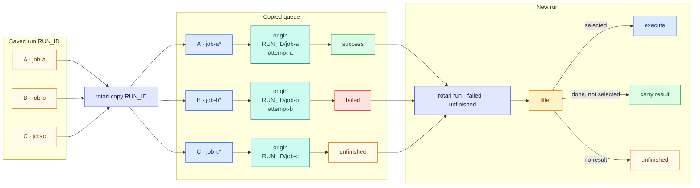

# Recovering failed runs

When a run ends with failed or unfinished jobs, start a new run that executes
only those jobs again. Successful jobs are not executed again; their results
and output carry forward to the new run.

Three different things are called "retry" in rotari:

| You want to | Use | See |
| --- | --- | --- |
| Rerun failed jobs after a run has finished | `rotari retry` | [Rerun failed jobs](#rerun-failed-jobs) |
| Fix a job's command or options, then rerun it | `copy`, `change`, then `retry` | [Edit jobs before rerunning](#edit-jobs-before-rerunning) |
| Retry a failing job automatically within the same run | `run --retry N`, `add --retry N` | [Automatic retries](RUNNING.md#automatic-retries) |

## Rerun failed jobs

```sh
rotari show -p sweep --failed-logs   # see why jobs failed
rotari retry -p sweep                # rerun failed and unfinished jobs
```

`retry` starts a new run in which failed and unfinished jobs execute again and
successful jobs carry forward their result. Carried-forward jobs are not
executed, but they appear on the new run with a link to their original
output, so the whole run can be inspected in one place.

`retry` starts from the latest run when the queue is empty. When the queue
holds jobs, such as ones edited with `change`, it uses those instead and
does not silently add the latest run's failures. The preview and run report
the latest run's failed or unfinished jobs that are not represented in the
queue, with a `copy --failed --unfinished --append` command to include them.

## Edit jobs before rerunning

`copy` puts a run's jobs back into the queue without running them, so that
`change` can edit them first:

```sh
rotari copy                                   # the latest run; copy -r RUN_ID for another
rotari change --job-name train --executor-option="-p gpu"
rotari change --job-name train ./train-v2.sh
rotari change --job-name train --status unfinished
rotari retry
```

An edited job keeps its previous result, even when its command, environment,
or working directory changes, so `retry` would not run an edited job that
succeeded before. Mark it with `change --status unfinished` to make it run
again.

`change` edits one job (`--job-id/-j`, `--job-name`) or many (`--stage`,
`--matrix`, `--all`); an array job is changed as a whole. `copy` keeps job IDs
(unless they collide with queued ones) and dependencies, can restore only some jobs with the same selectors as
`retry`, and asks before replacing a non-empty queue (`--append` adds,
`--overwrite` replaces). See the [CLI reference](CLI_REFERENCE.md) for every
option. In contrast, `retry --run-id RUN_ID` builds the new run directly from
that saved run's snapshot and leaves the next queue untouched; `--overwrite`
is not accepted by `run` or `retry`.

For a reviewable edit kept in a file, export the run as a
[workflow manifest](WORKFLOW_MANIFESTS.md), edit it, and import it.

## Choosing which jobs rerun

By default `retry` reruns failed and unfinished jobs. These options choose
something else. Jobs that depend on a rerun job run again too; every other job
carries forward its result, or stays unfinished if it has none.

| Option | Reruns |
| --- | --- |
| (none) | Failed and unfinished jobs. |
| `--failed` | Only jobs that finished with a non-zero exit code. |
| `--unfinished` | Only jobs without a completed result. |
| `--success` | Only jobs that finished with exit code zero. |
| `-j JOB_ID`, `--job-name NAME` | That job, whatever its result. |
| `--stage STAGE`, `--matrix NAME` | Failed and unfinished jobs in that stage or matrix. |
| `--filter-not-stage`, `--filter-not-matrix` | Failed and unfinished jobs outside that stage or matrix. |

```sh
rotari retry -p sweep --stage train
rotari retry -p sweep --filter-not-stage report
rotari retry -p sweep -j JOB_ID
rotari retry -p sweep --dry-run      # list the jobs it would execute
```

The result options (`--failed`, `--unfinished`, `--success`) may be combined;
`--stage`, `--matrix`, and the other `--filter-*` options narrow them. A job
named with `-j` or `--job-name` cannot be combined with any of them. `--help`
lists every filter under "Filters", and
[contracts/06-selectors.md](../contracts/06-selectors.md#filters) gives the
full rules.

For an array job, only the matching tasks rerun; `--partial-array=false`
reruns every task of an array when any task matches.

`-r RUN_ID` starts from a saved run instead of the latest one. It uses that
run's snapshot directly and leaves the next queue untouched. The same applies
to a result selection on an empty queue.

`run` takes the same options. `retry` is `run --failed --unfinished` when no
other selection is given; `run` without one executes the whole queue.
`run --failed` on an empty queue builds its snapshot from the latest run, as
`retry` does, without writing that snapshot into the next queue.

To guard a rerun against concurrent edits, see
[Previewing and guarding changes](#previewing-and-guarding-changes).

## Matching a new queue to an earlier run

If you add the jobs again instead of copying them, they get new job IDs.
`--match-by fingerprint` finds the earlier result of each job by its command,
saved inputs, and array or matrix parameters:

```sh
rotari add -p sweep ...              # the same commands as the earlier run
rotari run -p sweep --failed --unfinished --match-by fingerprint
```

The default `--match-by id-and-fingerprint` matches by job ID first and by
fingerprint for jobs that remain unmatched; `--match-by job-id` uses job IDs
only. Fingerprints are recalculated for each comparison, not stored.

## How results carry forward

Each job in the queue that came from an earlier run records an `Origin`: the
source run, job, and (when available) attempt. `copy` records it when it
copies a job; `--match-by` creates it for a job it matches. When the run
starts, the selection looks up each job's result through its `Origin`:
selected jobs execute, other finished jobs carry their result forward, and
jobs without a result stay unfinished.



## Previewing and guarding changes

The commands that change a project's queue or run history (`add`, `change`,
`copy`, `delete`, `import`, `remove`, and `reset`) take `--dry-run` and
`--if-revision REVISION`. `--dry-run` checks the change and prints what it
would do, prefixed with `dry run:`, and the project's revision, without
writing anything. `--if-revision` applies the change only if the project is
still at that revision, and prints the revision it produced; if anything has
written the project in between, such as another edit or a run, it fails with
`project changed since the planned revision` and changes nothing. `rotari
check` also prints the revision. Neither option is read from the environment
or a config file.

```sh
rotari remove -p sweep --dry-run JOB_ID         # prints revision=REVISION
rotari remove -p sweep --if-revision REVISION JOB_ID
```

`run` and `retry` take the same options. `--dry-run` lists the jobs the run
would execute and how many results it would carry, planned the way the run
itself is, without copying a run into the queue or starting anything.
`--if-revision` starts the run only if the project is still at that revision.

`--async` cannot be combined with `--dry-run`: a preview does not start a run
to detach from. Rotari reports the incompatible options rather than silently
ignoring `--async`.

When a preview is given `--run-name`, its summary includes `run_name=NAME`.
The preview does not reserve or persist that name.

The same selector rules apply to a `run --dry-run` preview as to execution:
result filters combine with a stage or matrix, while direct job selectors
cannot be combined with result filters or `--filter-*` conditions. A run
preview lists every task of the whole array when `--partial-array=false` is
supplied.

```sh
rotari retry -p sweep --dry-run                 # lists the jobs it would execute
rotari retry -p sweep --if-revision REVISION --async
```

A revision identifies the project's queue and metadata files; any write to
either changes it.
