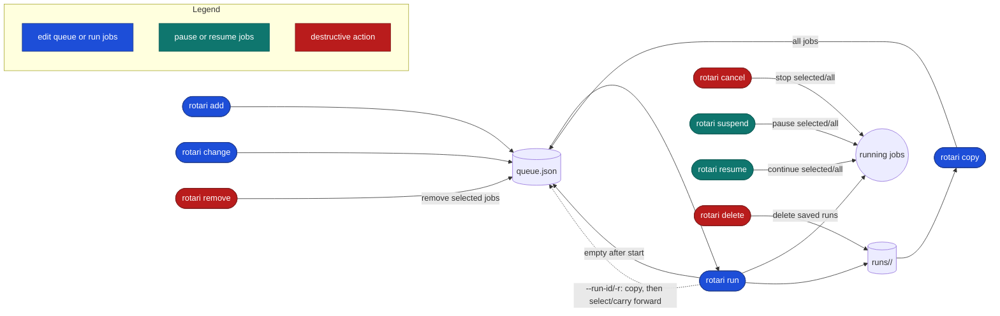

# Running and recovering

Background runs, reruns and retries, and controlling queued and running jobs.

## Async runs

```sh
rotari run -p sweep --async
rotari wait sweep
```

To add a command and then start the queue asynchronously:

```sh
rotari add ./train.sh
rotari run -p sweep --async
```

The async start message prints commands for checking status and cancelling the
run. `wait` returns the overall run exit code. Pass a project name, run name,
or run ID as a positional selector. Rotari checks them in that order, so a
project name wins over a run name and a run ID when the same string is used for
more than one kind of identifier. Use `--run-id/-r` to select a run explicitly.
Pass multiple selectors to wait for independent async runs together:

```sh
rotari run -p sweep --async
rotari run -p eval --async
rotari wait sweep eval
```

`--async` starts the run in a detached session (`setsid`), so it survives
terminal closure. Use `rotari wait` with a project, run name, or run ID from any
terminal, and `rotari cancel` to stop it. Without a selector, `wait` scans the
resolved basedir: it waits when exactly one project is running, and lists the
running projects and run IDs and asks for a selector when several are running.
If the run stops without finishing, for example because its supervisor was
killed, `wait` reports the interrupted run and exits with status 1.

Coding agents should use `--async` with `wait`. A synchronous `run` requests
cancellation when its client disconnects, so an agent's command timeout that
kills the client cancels the run. `rotari guide` prints this and other
agent-facing rules.

### Interrupting a synchronous run

During a synchronous `rotari run`, the terminal keys behave as follows:

| Key | Effect |
| --- | --- |
| Ctrl-C | Requests cancellation and returns immediately with exit code 130. The supervisor cancels the remaining jobs and then finishes its normal cleanup (run summary, queue clearing, and run-lock removal) in the background, so `run`, `add`, or `copy` on the same project may be rejected briefly. No `unlock` or `server shutdown` is needed. |
| Ctrl-D | Detaches the client without cancelling. The run continues as if it had been started with `--async`; follow it with `rotari wait -r RUN_ID` or `rotari show -r RUN_ID`. |
| Ctrl-Z | Only suspends the client through shell job control. The run continues, and `fg` resumes the progress view. Closing the terminal while the client is stopped disconnects it and requests cancellation, so use Ctrl-D or `--async` to leave the progress view. |

### Supervisor failure

The supervisor is not restarted automatically if the process crashes or is
killed. The run lock records its PID and host, and local jobs report their own
status through wrappers, so `rotari show -r RUN_ID` still sees results written
after the supervisor disappeared. `show` then reports the interrupted run.
After confirming jobs have stopped, use `unlock` to keep the queue or
`reset --recover` to discard it.

## Recover and rerun
### run and retry

`run` can select jobs from the latest run, or from a saved run given by
`--run-id/-r`, and execute them as a new run while carrying forward everything
else. Result filters select which jobs in the queue are re-executed; jobs with
completed results that do not match are carried forward. To inspect or edit the
whole previous queue before selecting work, copy it first and apply the filter
when running.

```sh
rotari run -p sweep --failed
rotari run -p sweep --unfinished
rotari run -p sweep --success
rotari run -p sweep --failed --unfinished
rotari run -j ATTEMPT_ID
```

`retry` is shorthand for `run --failed --unfinished`. It selects failed and
unfinished jobs from the reference run, copies them into the next run with
successful results carried forward, and executes that run:

```sh
rotari retry -p sweep
```

`--retry N` is different: it retries failed jobs within the same run, up to N
additional attempts. The default is `0`; use `--retry -1` to retry indefinitely.
Jobs explicitly cancelled by the user are not retried by this option. For
example, these commands allow two additional attempts or retry indefinitely:

```sh
# Run the queue; failed jobs may be attempted twice more.
rotari run --retry 2

# Keep retrying failed jobs until they succeed or are cancelled.
rotari run --retry -1
```

Without `--retry`, each failed job is attempted only once.

A failed job is retried as soon as it fails; it does not wait for the other
jobs of the run. To retry only jobs that fail for transient reasons, such as a
flaky file system or network, give them their own limit when adding them. A job's
`--retry` replaces the run's for that job; `0` turns retries off even when the
run uses `--retry`:

```sh
rotari add --retry 3 -- ./download-data.sh
rotari add --retry 0 -- python evaluate.py
rotari change -p sweep --job-name download --retry 5
rotari change -p sweep --job-name download --clear-retry   # use the run's limit again
```

To change a setting for many jobs at once, select them by stage, by matrix, or
all together:

```sh
rotari change -p sweep --stage train --retry 0
rotari change -p sweep --matrix train --executor-option="-p gpu"
rotari change -p sweep --all --timeout 3h
```

To give a transient problem time to clear, or to keep many failed jobs from
retrying against a shared service at once, space the retries out. The first
retry waits `--retry-delay`, each further retry multiplies the wait by
`--retry-backoff`, and `--retry-max-delay` caps it:

```sh
# Wait 30s, 1m, 2m, then 5m between attempts.
rotari add --retry 4 --retry-delay 30s --retry-backoff 2 --retry-max-delay 5m -- ./download-data.sh
```

The delay settings apply to retries from `run --retry` as well as the job's
own `--retry`. Cancelling the run stops pending retries.

The result filters select which jobs are actually re-executed:

| Option | Executed jobs |
| --- | --- |
| `--failed` | Finished jobs with a non-zero exit code. |
| `--unfinished` | Jobs without a completed result. |
| `--success` | Finished jobs with exit code zero. |
| `--failed --unfinished` | Failed or unfinished jobs. |

Result filters and repeated `--job-id/-j` select jobs to re-execute. Finished
non-matching jobs carry forward their previous result and output; jobs without
a result remain unfinished. Carried-forward jobs are not re-executed, but they
appear on the new run with a link to their original output, so the whole run
can be inspected in one place. Use `--failed --unfinished` to recover everything
that did not complete successfully.

`--stage STAGE` or `--matrix NAME` (the base job name given to `add --matrix`)
narrows the selection to one stage or matrix. Jobs outside it carry forward
like non-matching jobs. Alone, it re-executes every job in the stage or matrix;
with a result filter, only the matching jobs in it:

```sh
rotari retry -p sweep --stage train        # failed or unfinished jobs in stage train
rotari run -p sweep --matrix train         # every job of matrix train
rotari copy -p sweep --stage eval --failed # restore only failed jobs in stage eval
```

`--run-id/-r ID` selects a saved run as both the queue snapshot and filter
reference. A non-empty queue requires confirmation; add `--overwrite` to
replace it without asking:

```sh
rotari run -p sweep -r RUN_ID --failed
```

For array jobs, filters select matching tasks by default
(`--partial-array=true`); use `--partial-array=false` to re-execute every task
when any task matches.


### copy and change

Copy jobs from a previous run into the current queue without executing them:

```sh
rotari copy -p sweep
rotari run -p sweep --failed
```

Without a selector, `copy` restores every job from the latest run. Then apply
`--failed`, `--unfinished`, `--success`, or explicit job selectors to `run`.
This keeps the full queue available for inspection and editing before choosing
which jobs to execute. `copy --failed` and the other copy-side filters remain
available when only a subset should be restored. When the queue is empty,
`run --failed` restores the latest run automatically before selecting failed
jobs.

`copy` keeps the source job ID unless it would collide with the destination
queue, and preserves dependencies between copied jobs. A non-empty queue
requires confirmation before replacement; use `--append` to add jobs or
`--overwrite` to replace it without asking. Selection options include
`--failed`, `--unfinished`, `--success`, `--stage`, `--matrix`, and repeated
`--job-id/-j`. Copied jobs
remain pending, with source run, status, and working-directory metadata kept
for later inspection.

Use `copy` when a selected job needs to be edited before it is run again. It
restores jobs into the current queue without executing them; then `change` can
modify their commands or options while preserving the saved run history:

```sh
rotari copy
rotari change --job-name train -e local
rotari change --job-name train --executor-option="-p gpu"
rotari change --job-name train --depends-on prepare -- ./train-v2.sh
rotari run --failed
```

`change` requires exactly one target selector: `--job-id/-j ID` or
`--job-name NAME` for one job, or `--stage STAGE`, `--matrix NAME` (the base job
name given to `add --matrix`), or `--all` for every matching job. It also
requires at least one change, such as a new command, `--executor/-e`,
`--executor-option`, `--set-job-name`, or `--depends-on`. A new command and
`--set-job-name` need a single job. An array job is changed as a whole; its
tasks cannot be changed one by one. It replaces only the options specified,
keeps the job IDs, and edits the current batch. If the queue is empty, the
latest run snapshot is restored first. Use `--run-id/-r` to select another run.

### Job timeouts

Stop a job that runs too long, for example one that hangs on a stalled file
system or collective operation:

```sh
rotari add --timeout 2h -- python train.py
rotari change -p sweep --job-name train --timeout 3h
rotari change -p sweep --job-name train --clear-timeout
```

The limit counts from when the job starts running, not from submission, so
time waiting in a scheduler queue is not included. When it runs out, rotari
sends SIGTERM to the job, gives it 30 seconds to exit (for example, to save a
checkpoint), then sends SIGKILL. The job fails with exit code 124 and the error
`timed out after 2h0m0s`, and its log ends with a matching `rotari:` line. A
timed-out job is an ordinary failure, so `run --retry`, `retry`, and
`--depends-on` treat it like any other failed job. The timeout works the same
way for every executor and is independent of scheduler walltime options such
as Slurm `--time`, which still apply.

## Queue and job control

Remove jobs from the current queue without affecting saved run history:

```sh
rotari remove -p sweep --job-name train
rotari remove -p sweep -j JOB_ID -j OTHER_JOB_ID
rotari remove -p sweep --stage eval
```

If the queue is empty, `remove` restores the latest run snapshot first. Use
`--run-id/-r` to select another run. Specify exactly one target selector:
`--job-name NAME`, one or more `--job-id/-j ID` options, `--stage STAGE`,
`--matrix NAME`, or `--all`, as for `change`. Removing a job that another queued
job depends on is rejected.

Stop running jobs without stopping the supervisor:

```sh
rotari cancel -p sweep
rotari cancel -j ATTEMPT_ID
rotari cancel ATTEMPT_ID
rotari cancel RUN_ID
```

`--job-id/-j` is optional. Without it, all running jobs in the queue are
cancelled. With it, only the specified running jobs are cancelled, and the
option may be repeated. `--job-id/-j` cannot be used with `--wait`, nor combined
with a positional `JOB_ID`/`ATTEMPT_ID`/`RUN_ID`.

Whole-run cancel (no `--job-id/-j`) and, for `local`-executor jobs, `--job-id/-j`
cancel/suspend/resume all signal the runner or job by PID, which only means
something on the host that actually runs it; run these commands from that
host if it differs from wherever `cancel`/`suspend`/`resume` is invoked. See
the [FAQ](FAQ.md#client-control-and-job-cancellation) for what happens
when you can't.

Temporarily suspend and resume running jobs:

```sh
rotari suspend -p sweep
rotari suspend -j ATTEMPT_ID
rotari resume -j ATTEMPT_ID
rotari suspend ATTEMPT_ID
rotari resume RUN_ID
```

Without `--job-id/-j`, all currently running jobs are affected. Repeat `--job-id/-j`
to control selected jobs. Local jobs use `SIGSTOP`/`SIGCONT`; Slurm jobs use
`scontrol suspend`/`scontrol resume`.

Delete saved run logs while keeping queued commands:

```sh
rotari delete -p sweep
rotari delete -p sweep RUN_ID
```

`--run-id/-r` removes only the specified run. Without it, all saved run logs are removed.

The commands affect the current queue and saved run history differently:


