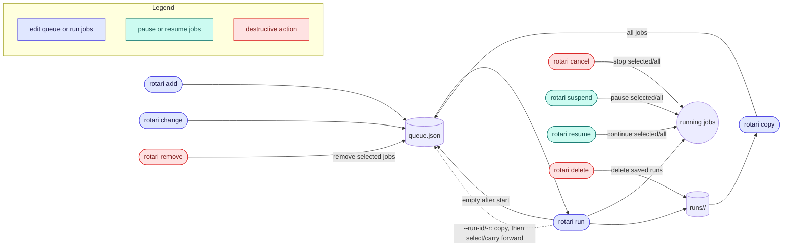

# Running and controlling jobs

Define jobs, start runs, monitor them, and control queued or running work. To
rerun failed jobs after a run, see [Recovering failed runs](RECOVERING.md).

## Async runs

```sh
rotari add ./train.sh
rotari run -p sweep --async
rotari wait sweep
```

`run --async` starts the run in asynchronous mode and returns while its jobs
continue. `wait` attaches a client to that run, prints new progress, then the
completion message and run exit code. If the run has already finished, it
prints only the completion message. Runs inherit the caller's working
directory and environment unless overridden; use `--env=NONE` to suppress
inherited variables. Job variables and rotari metadata still apply. See
[Workflow and execution environment](CONCEPTS.md#workflow-and-execution-environment).

Pass several selectors to wait for those runs concurrently, or omit selectors
to wait for every active project in the resolved basedir:

```sh
rotari run -p sweep --async
rotari run -p eval --async
rotari wait sweep eval
rotari wait  # waits for all active projects
```

Pass a run ID/name or project name to wait for it:

```sh
rotari wait RUN_ID
rotari wait PROJECT
```

For a project, `wait` automatically selects its active run; if none is active,
it returns the latest run's result. A positional selector is checked as project
name, run name, then run ID; use `-r RUN_ID` to select an ID explicitly. With
no selector or `-p`, it waits for all active projects in the basedir, ignoring
`ROTARI_PROJECT_NAME`; if none are active, it succeeds silently.

Return as soon as a job fails with no retries left:

```sh
rotari wait sweep --until-failure
```

This exits with status 1 and reports failures grouped by cause (see
[Inspecting](INSPECT.md#inspect)). An attempt that will be retried does not
count. Add `--json` for a running-status result with the failures. `--quiet`
hides normal progress but keeps failures, errors, and timeouts; JSON prints
only the result. Quiet defaults come from `ROTARI_QUIET` and configuration; an
explicit CLI value overrides them. Neither `--timeout` nor `--until-failure`
cancels a run.

If a tool timeout may kill a command, start the run asynchronously:

```sh
rotari run -p sweep --async
rotari wait sweep --timeout 3h
# If wait is stopped by a timeout, reconnect:
rotari wait sweep
```

If a timeout ends `wait`, only the attached client stops; the run remains in
asynchronous mode. Run `rotari wait sweep` again to attach another client.
By contrast, if a timeout kills a synchronous `rotari run`, that run requests
cancellation.

## Controlling attached clients

Both `wait` and a synchronous `run` respond to Ctrl-C, Ctrl-D, and Ctrl-Z. The
key actions are similar, but Ctrl-D changes a synchronous run to asynchronous
mode; detaching from `wait` only stops waiting.

| Client | Ctrl-C | Ctrl-D | Ctrl-Z |
| --- | --- | --- | --- |
| `rotari wait` | Request cancellation of selected active runs; exit 130. | Stop waiting; the run continues in its current mode. | Suspend the wait client only; `fg` resumes waiting. The run continues. |
| Synchronous `rotari run` | Request cancellation; client exits 130. | Detach the client and switch the run to asynchronous mode. Reattach with `rotari wait`. | Suspend the client only; `fg` resumes its view. The run continues. |

After Ctrl-C on synchronous `run`, cleanup continues in the background, so
starting another run for the same project may briefly fail. Closing a terminal
with a synchronous-run client stopped by Ctrl-Z disconnects it and requests
cancellation.

## Array and matrix jobs

Add an array with a numeric range or a comma-separated task list:

```sh
rotari add --array 1-10 -e local ./train.sh
rotari add --array 1-10 -e slurm ./train.sh
rotari add --array 1-10 -e sge ./train.sh
rotari add --array 1,3,4 -e slurm ./train.sh
```

Each task is tracked separately. Local and SSH execution starts one process per
task. Slurm, PBS, and LSF may submit a complete contiguous range as a native
scheduler array, while SGE always submits independent jobs to avoid relying on
fork-specific native array syntax. Sparse selections use independent jobs
where native arrays are not applicable. Array tasks receive:

- `ROTARI_ARRAY_TASK_ID`: current task number
- `ROTARI_ARRAY_FIRST`: first task number
- `ROTARI_ARRAY_LAST`: last task number
- `ROTARI_ARRAY_SIZE`: total task count

Native scheduler arrays map their index variables into these values, such as
`SLURM_ARRAY_TASK_ID`, `PBS_ARRAY_INDEX`, or `LSB_JOBINDEX`.

Register a matrix as independent jobs by repeating `--matrix`:

```sh
rotari add --job-name train \
  --matrix python=3.10,3.11 \
  --matrix cuda=cpu,cuda \
  ./train.sh
```

This registers the Cartesian product as four jobs named like
`train-python3.10-cudacpu`. Each job receives its values as environment
variables. Matrix jobs can be combined with `--array`; the array is applied to
each matrix combination. `--depends-on train` waits for every combination if
`train` is the matrix's `--job-name`. Repeat
`--matrix-exclude KEY=VALUE[,KEY=VALUE...]` to omit matching combinations; all
assignments in one rule must match, and separate rules are alternatives. The
option requires `--matrix`. Workflow export retains exclusions, and manifests
accept the equivalent `matrix_exclude` list. If `copy`, `remove`, or `change`
later touches only part of a matrix, dependencies on it are rewritten to the
remaining combination names.

## Dependencies and stages

Use `--depends-on NAME` to wait for a prerequisite job or stage to succeed.
Repeat it to require multiple prerequisites:

```sh
rotari add --job-name prepare ./prepare.sh
rotari add --job-name train --depends-on prepare ./train.sh
rotari run
```

For a barrier between batches, put jobs in a stage and depend on that stage.
Jobs in a stage run concurrently; the dependent job starts only after every
stage member succeeds:

```sh
rotari add --stage prepare ./prepare-data.sh
rotari add --stage prepare ./prepare-config.sh
rotari add --job-name train --depends-on prepare ./train.sh
rotari run
```

A job name and stage name cannot be the same within one queue. An array job's
name represents all its tasks, like a stage name. Use `--depends-on-finished`
for aggregation or cleanup that should run after prerequisites finish,
whatever their result:

```sh
rotari add --stage sweep --matrix LR=0.1,0.01 python train.py
rotari add --job-name collect --depends-on-finished sweep python collect.py
rotari run
```

The dependent waits while a failed prerequisite still has `run --retry`
attempts left, and runs after prerequisites are blocked or cancelled. A later
`run --failed` or `retry` that re-executes a prerequisite also re-executes such
dependents so their output reflects the new results. A name cannot be listed
in both dependency options. `show` lists these prerequisites as
`finished:NAME`; use `change --depends-on-finished` or
`--clear-depends-on-finished` to edit them.

Select one stage or matrix with `show --stage NAME` or `show --matrix NAME`.
The same selectors work with `change`, `remove`, `copy`, `run`, and `retry`.

## Automatic retries

`run --retry N` retries failed jobs in the same run, up to N additional
attempts. This is separate from `rotari retry`, which starts a new run after
one has finished; see [Recovering failed runs](RECOVERING.md).

```sh
rotari run --retry 2   # allow two additional attempts
rotari run --retry -1  # retry until success or cancellation
```

The default is `0`; without `--retry`, each failed job is attempted once.
Explicitly cancelled jobs are not retried. A failed job is retried as soon as
it fails, without waiting for other jobs in the run.

A job's own `--retry` replaces the run's limit; `0` disables retries for that
job. Clear it to use the run's setting again:

```sh
rotari add --retry 3 ./download-data.sh
rotari add --retry 0 python evaluate.py
rotari change -p sweep --job-name download --retry 5
rotari change -p sweep --job-name download --clear-retry
```

Space retries out with `--retry-delay`, multiply each delay with
`--retry-backoff`, and cap it with `--retry-max-delay`:

```sh
rotari add --retry 4 --retry-delay 30s --retry-backoff 2 \
  --retry-max-delay 5m ./download-data.sh
```

The delay settings apply to run-level and job-level retries. Cancelling the
run stops pending retries.

## Job timeouts

Set a timeout when adding or changing a job:

```sh
rotari add --timeout 2h python train.py
rotari change -p sweep --job-name train --timeout 3h
rotari change -p sweep --job-name train --clear-timeout
```

The limit starts when execution begins, not when a scheduler accepts the job.
At timeout, rotari sends SIGTERM, waits 30 seconds, then sends SIGKILL. The job
fails with exit code 124 and an error such as `timed out after 2h0m0s` in its
log. A timeout is an ordinary failure for `run --retry`, `retry`, and
`--depends-on`; it works across executors and is independent of scheduler
walltime options such as Slurm `--time`.

## Supervisor failure

The supervisor is not restarted after a crash. Inspect the run, confirm its
jobs have stopped, then unlock and retry unfinished work:

```sh
rotari show -r RUN_ID
rotari unlock -p sweep
rotari retry --run-id RUN_ID
```

The interrupted run's jobs are not put back in the queue. `reset` only clears
the next queue, and `unlock` refuses while the supervisor is still alive on
this host; cancel that run instead.

## Queue and job control

Cancel all running jobs or select specific jobs, attempts, or runs:

```sh
rotari cancel -p sweep
rotari cancel -j ATTEMPT_ID
rotari cancel ATTEMPT_ID
rotari cancel RUN_ID
```

`--job-id/-j` is optional; without it, all running jobs in the selected queue
are cancelled. Repeat it to select multiple jobs. It cannot be combined with
`--wait` or a positional `JOB_ID`/`ATTEMPT_ID`/`RUN_ID`. An array job ID
selects all unfinished tasks. A run or attempt ID must belong to the active
run; an earlier run's ID is rejected rather than cancelling the current run.
Without `-p`, a job ID is looked up in every project's active run.

A cancelled job records the error `cancelled`, so
`--filter-failure-kind cancelled` selects it and failure summaries group it
under that cause. Whole-run cancellation and, for local jobs, job-level
cancellation/suspend/resume signal PIDs; run these commands on the host that
executes the jobs. See the
[FAQ](FAQ.md#client-control-and-job-cancellation) when that is not possible.

Suspend and resume running jobs:

```sh
rotari suspend -p sweep
rotari suspend -j ATTEMPT_ID
rotari resume -j ATTEMPT_ID
rotari suspend ATTEMPT_ID
rotari resume RUN_ID
```

Without `--job-id/-j`, all running jobs are affected. Repeat the option to
select jobs; an array ID selects only its running tasks. Local jobs use
`SIGSTOP`/`SIGCONT`, Slurm uses `scontrol suspend`/`scontrol resume`, and SGE
uses `qmod` suspend/unsuspend.

Remove jobs from the queue without changing saved run history:

```sh
rotari remove -p sweep --job-name train
rotari remove -p sweep -j JOB_ID -j OTHER_JOB_ID
rotari remove -p sweep --stage eval
```

`remove` edits the current queue; it does not restore an empty one. Restore a
run with `copy`, or select `--run-id/-r ID` (or `latest`) to replace the queue
with that run's jobs first. Specify exactly one selector: `--job-name NAME`,
one or more `--job-id/-j ID`, `--stage STAGE`, `--matrix NAME`, or `--all`.
Removing a job that another queued job depends on is rejected.

Delete saved run logs while keeping queued commands:

```sh
rotari delete -p sweep RUN_ID
rotari delete -p sweep --all
```

Delete a run by `RUN_ID` or `--run-id/-r ID`. Deleting every saved run requires
`--all`; without a run ID or `--all`, nothing is deleted.

The commands affect the current queue and saved run history differently:


```mermaid
flowchart LR
  add([rotari add]) --> queue[(queue.json)]
  change([rotari change]) --> queue
  remove([rotari remove]) -->|remove selected jobs| queue

  queue --> run([rotari run])
  run --> active((running jobs))
  run --> history[(runs/<run-id>/)]
  run -->|empty after start| queue
  history --> copy([rotari copy])
  copy -->|all jobs| queue
  run -.->|--run-id/-r: copy, then select/carry forward| queue
  cancel([rotari cancel]) -->|stop selected/all| active
  suspend([rotari suspend]) -->|pause selected/all| active
  resume([rotari resume]) -->|continue selected/all| active
  delete([rotari delete]) -->|delete saved runs| history

  classDef edit fill:#e0e7ff,stroke:#4f46e5,color:#1e1b4b
  classDef control fill:#ccfbf1,stroke:#0f766e,color:#134e4a
  classDef destructive fill:#fee2e2,stroke:#dc2626,color:#7f1d1d
  class add,change,run,copy edit
  class suspend,resume control
  class remove,cancel,delete destructive

  subgraph legend[Legend]
    legendEdit[edit queue or run jobs]
    legendControl[pause or resume jobs]
    legendDestructive[destructive action]
  end
  class legendEdit edit
  class legendControl control
  class legendDestructive destructive
```
