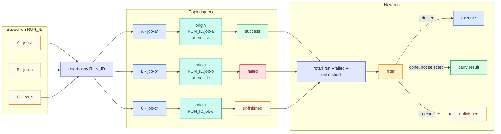
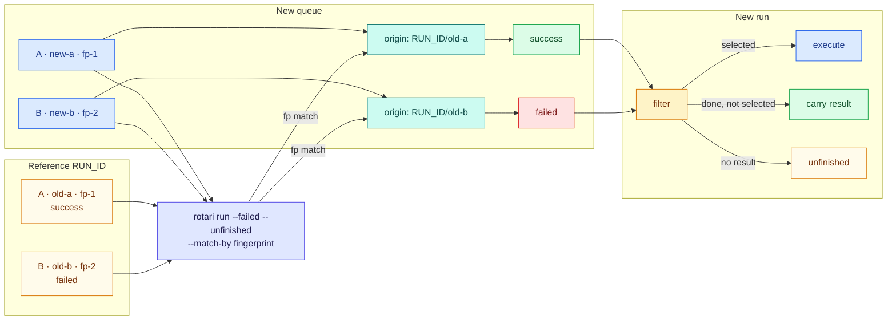

# Running and recovering

Background runs, reruns and retries, and controlling queued and running jobs.

## Array and matrix jobs

Array jobs can be added with a numeric range or a comma-separated task list:

```sh
rotari add --array 1-10 -e local ./train.sh
rotari add --array 1-10 -e slurm ./train.sh
rotari add --array 1-10 -e sge ./train.sh
rotari add --array 1,3,4 -e slurm ./train.sh
```

Each task is tracked separately. Local and SSH execution starts one process per
task. Slurm, PBS, and LSF may submit a complete contiguous range as a native
scheduler array, while SGE always submits independent jobs to avoid relying on
fork-specific native array syntax. Sparse selections use independent jobs
where native arrays are not applicable. For each array task, rotari exposes:

- `ROTARI_ARRAY_TASK_ID`: current task number
- `ROTARI_ARRAY_FIRST`: first task number in the array
- `ROTARI_ARRAY_LAST`: last task number in the array
- `ROTARI_ARRAY_SIZE`: total number of tasks

Scheduler-backed native arrays also map the scheduler index variable into
these values, for example `SLURM_ARRAY_TASK_ID`, `PBS_ARRAY_INDEX`, or
`LSB_JOBINDEX`.

To register a matrix as independent jobs, repeat `--matrix` on `add`:

```sh
rotari add --job-name train \
  --matrix python=3.10,3.11 \
  --matrix cuda=cpu,cuda \
  -- ./train.sh
```

This registers the Cartesian product as four jobs named like
`train-python3.10-cudacpu`. Each job receives its values as ordinary
environment variables, such as `python=3.10` and `cuda=cpu`. Matrix jobs have
independent job IDs and can be combined with `--array`; the array is applied to
each matrix combination. `--depends-on` can name the matrix's `--job-name` (for
example `--depends-on train`) to wait for every combination. If `copy`,
`remove`, or `change` later touches only part of the matrix, such dependencies
are rewritten to the remaining combination names. `include` and `exclude`
customization is not supported by the version 1 workflow manifest.

The Slurm and PBS executors are integration-tested in CI against a Slurm
container and an OpenPBS container. These tests do not certify compatibility
with every real cluster configuration. The LSF executor is covered by unit
tests using fake scheduler commands, but has not yet been tested against a
real LSF installation. SGE is covered by unit tests using fake commands and
can also be tested on demand through the Scheduler integration workflow's
`sge` choice. That job uses a digest-pinned, CentOS 7 Grid Engine image last
published in 2021; it is a compatibility smoke test, not certification for
every Grid Engine fork or a recommendation to use that image in production.

## Dependencies and stages

Use `--depends-on NAME` to define prerequisites.
Use a job's name as `NAME`; the job waits until that prerequisite succeeds.
Repeat the option to require multiple prerequisites.

For example, run `train.sh` only after `prepare.sh` completes successfully:

```sh
rotari add --job-name prepare -- ./prepare.sh
rotari add --job-name train --depends-on prepare -- ./train.sh
rotari run
```

For a barrier between batches of jobs, assign the jobs to a stage and depend on
the stage name. Jobs in a stage run concurrently; a dependent job starts only
after every job in the stage succeeds:

```sh
rotari add --stage prepare -- ./prepare-data.sh
rotari add --stage prepare -- ./prepare-config.sh
rotari add --job-name train --depends-on prepare -- ./train.sh
rotari run
```

`--depends-on` accepts either a job name or a stage name. A job name and stage
name cannot be the same within one queue. The name of an array job stands for
all of its tasks, like a stage name: `--depends-on train` waits until every
task of the array `train` succeeds.

Use `--depends-on-finished NAME` for a job that should run once its
prerequisites finish, whatever their result, like Slurm's `afterany`. It suits
aggregation and cleanup jobs that must still run when part of a sweep fails:

```sh
rotari add --stage sweep --matrix LR=0.1,0.01 -- python train.py
rotari add --job-name collect --depends-on-finished sweep -- python collect.py
rotari run
```

`collect` waits while a failed prerequisite still has `run --retry` attempts
left, and it also runs after a prerequisite is blocked or cancelled. A later
`run --failed` or `retry` that re-executes a prerequisite re-executes such
dependents too, so their output reflects the new results. A name cannot be
listed in both `--depends-on` and `--depends-on-finished` of one job. `show`
lists these prerequisites as `finished:NAME`. Use `change
--depends-on-finished` or `--clear-depends-on-finished` to edit them.

Use `rotari show --stage NAME` to list only the jobs in one stage of the
selected run or queue, and `rotari show --matrix NAME` for the jobs of one
matrix. The same `--stage` and `--matrix` select jobs for `change`, `remove`,
`copy`, `run`, and `retry`.

## Async runs

```sh
rotari run -p sweep --async
rotari wait sweep
```

To add a command and then start the queue asynchronously:

```sh
rotari add ./train.sh
rotari run -p sweep --async
```

Jobs run in the working directory and with the environment of the shell that
runs `rotari run`, sync or async, unless a job sets its own with
`--working-directory` or `--env`; see
[Workflow and execution environment](CONCEPTS.md#workflow-and-execution-environment).
Use `run --env=NONE` or `retry --env=NONE` to suppress ordinary caller
environment variables for that run. The default `--env=ALL` propagates them;
job `--env` values and rotari metadata still apply in either mode.

The async start message prints commands for checking status and cancelling the
run. `wait` returns the overall run exit code. Pass a project name, run name,
or run ID as a positional selector. Rotari checks them in that order, so a
project name wins over a run name and a run ID when the same string is used for
more than one kind of identifier. Use `--run-id/-r` to select a run explicitly.
Pass multiple selectors to wait for independent async runs together:

```sh
rotari run -p sweep --async
rotari run -p eval --async
rotari wait sweep eval
```

To learn of a failure without waiting for the rest of a long run, pass
`--until-failure`. `wait` then also returns, with status 1, as soon as a job
of the run has failed with no retry left: it prints the failures grouped by
cause (see [Inspecting](INSPECT.md#inspect)) and the commands to keep waiting
or cancel. A failed attempt that the run will retry does not count. With
`--json`, it prints `{"run_id": ..., "status": "running", "failures": [...]}`
instead of a completed run's summary.

```sh
rotari wait sweep --until-failure
```

Waiting for a project that has not been created yet succeeds immediately and
does not create it, whether selected by name or `--project-name`. A missing
explicit `--run-id` (including `latest`) remains an error. A name that matches
neither a project nor a run is treated as an uncreated project unless it looks
like a run ID; use explicit run IDs when a missing run must be reported.

`--async` starts the run in a detached session (`setsid`), so it survives
terminal closure. Use `rotari wait` with a project, run name, or run ID from any
terminal, and `rotari cancel` to stop it. Without a selector, `wait` scans the
resolved basedir: it waits when exactly one project is running, and lists the
running projects and run IDs and asks for a selector when several are running.
If the run stops without finishing, for example because its supervisor was
killed, `wait` reports the interrupted run and exits with status 1.

Coding agents should use `--async` with `wait`. A synchronous `run` requests
cancellation when its client disconnects, so an agent's command timeout that
kills the client cancels the run. `rotari guide` prints this and other
agent-facing rules.

### Interrupting a synchronous run

During a synchronous `rotari run`, the terminal keys behave as follows:

| Key | Effect |
| --- | --- |
| Ctrl-C | Requests cancellation and returns immediately with exit code 130. The supervisor cancels the remaining jobs and then finishes its normal cleanup (run summary, queue clearing, and run-lock removal) in the background, so `run`, `add`, or `copy` on the same project may be rejected briefly. No `unlock` or `server shutdown` is needed. |
| Ctrl-D | Detaches the client without cancelling. The run continues as if it had been started with `--async`; follow it with `rotari wait -r RUN_ID` or `rotari show -r RUN_ID`. |
| Ctrl-Z | Only suspends the client through shell job control. The run continues, and `fg` resumes the progress view. Closing the terminal while the client is stopped disconnects it and requests cancellation, so use Ctrl-D or `--async` to leave the progress view. |

### Supervisor failure

The supervisor is not restarted automatically if the process crashes or is
killed. The run lock records its PID and host, and local jobs report their own
status through wrappers, so `rotari show -r RUN_ID` still sees results written
after the supervisor disappeared. `show` then reports the interrupted run.
After confirming jobs have stopped, use `unlock` to keep the queue or
`reset --recover` to discard it. Both refuse a run whose supervisor is still
alive on this host; stop that one with `cancel`.

## Recover and rerun
### run and retry

`run` can select jobs from the latest run, or from a saved run given by
`--run-id/-r`, and execute them as a new run while carrying forward everything
else. Result filters select which jobs in the queue are re-executed; jobs with
completed results that do not match are carried forward. To inspect or edit the
whole previous queue before selecting work, copy it first and apply the filter
when running.

```sh
rotari run -p sweep --failed
rotari run -p sweep --unfinished
rotari run -p sweep --success
rotari run -p sweep --failed --unfinished
rotari run -j ATTEMPT_ID
```
When a new queue has different job IDs, `run` can match its jobs to the
reference run by identity mode: `--match-by job-id`, `--match-by fingerprint`,
or the default `--match-by id-and-fingerprint`. The combined mode uses Job ID
first and fingerprint only for jobs that remain unmatched. Fingerprints are
calculated from the command, explicitly saved job inputs, and expanded array
or matrix parameters; they are recalculated for each comparison rather than
stored in queue or run files.

The two workflows establish source links differently. Copying a saved run
records an `Origin` for each copied job or task. A newly created queue has no
such links, so `--match-by fingerprint` can match its execution units to a
reference run. A fingerprint is a matching key, not a stored ID; an `Origin`
points to the source run and job, and (when available) the attempt. Result
filters use the source result to decide whether to execute a job or carry its
result forward.

`copy` copies jobs individually from a saved run into the current queue. Each
copied job records an `Origin` that points back to its source run, job, and
(when available) attempt, and preserves the source status. The copied queue
entry remains pending until a later `run` applies its selection. The source
job ID is kept unless it conflicts with an ID already in the queue. During
that `run`, the result filter uses each `Origin` to resolve the saved result;
matching jobs execute, while completed non-matching jobs carry their results
forward.

For example, to retry selected jobs from a saved run, copy its queue first:

```sh
rotari add -p sweep ...
rotari run -p sweep # Run finished with some failed jobs.
rotari copy -p sweep RUN_ID
rotari run -p sweep --failed --unfinished
```


```mermaid
flowchart LR
  subgraph SavedRun["Saved run RUN_ID"]
    SourceA["A · job-a"]
    SourceB["B · job-b"]
    SourceC["C · job-c"]
  end

  CopyCmd["rotari copy RUN_ID"]

  subgraph CurrentQueue["Copied queue"]
    CopiedA["A · job-a*"]
    OriginA["origin<br/>RUN_ID/job-a<br/>attempt-a"]
    StatusA["success"]
    CopiedB["B · job-b*"]
    OriginB["origin<br/>RUN_ID/job-b<br/>attempt-b"]
    StatusB["failed"]
    CopiedC["C · job-c*"]
    OriginC["origin<br/>RUN_ID/job-c"]
    StatusC["unfinished"]
    CopiedA --> OriginA --> StatusA
    CopiedB --> OriginB --> StatusB
    CopiedC --> OriginC --> StatusC
  end

  SourceA --> CopyCmd
  SourceB --> CopyCmd
  SourceC --> CopyCmd
  CopyCmd --> CopiedA
  CopyCmd --> CopiedB
  CopyCmd --> CopiedC

  subgraph NewRun["New run"]
    RunCmd["rotari run --failed --unfinished"]
    Filter["filter"]
    RunCmd --> Filter
    Filter -->|"selected"| Execute["execute"]
    Filter -->|"done, not selected"| Carry["carry result"]
    Filter -->|"no result"| Unfinished["unfinished"]
  end
  StatusA --> RunCmd
  StatusB --> RunCmd
  StatusC --> RunCmd

  classDef source fill:#fffbeb,stroke:#d97706,color:#78350f
  classDef queue fill:#dbeafe,stroke:#2563eb,color:#1e3a8a
  classDef origin fill:#ccfbf1,stroke:#0f766e,color:#134e4a
  classDef filter fill:#fef3c7,stroke:#d97706,color:#78350f
  classDef execute fill:#dbeafe,stroke:#2563eb,color:#1e3a8a
  classDef carried fill:#dcfce7,stroke:#16a34a,color:#14532d
  classDef unfinished fill:#fffbeb,stroke:#d97706,color:#78350f
  classDef command fill:#e0e7ff,stroke:#4f46e5,color:#1e1b4b
  classDef success fill:#dcfce7,stroke:#16a34a,color:#14532d
  classDef failed fill:#fee2e2,stroke:#dc2626,color:#7f1d1d
  class SourceA,SourceB,SourceC source
  class CopiedA,CopiedB,CopiedC queue
  class OriginA,OriginB,OriginC origin
  class StatusA success
  class StatusB failed
  class StatusC unfinished
  class CopyCmd,RunCmd command
  class Filter filter
  class Execute execute
  class Carry carried
  class Unfinished unfinished
```

If you create a new queue whose job IDs differ from those in the latest run,
`--match-by fingerprint` matches equivalent jobs by their command and saved
inputs. A successful match creates an `Origin` to the corresponding job in
the reference run, so the same result filter can decide what to execute or
carry forward.

```sh
rotari add -p sweep ...
rotari run -p sweep # Run finished with some failed jobs.
# Add the same commands again to create a new queue with different job IDs.
rotari add -p sweep ...
rotari run -p sweep --failed --unfinished --match-by fingerprint
```


```mermaid
flowchart LR
  subgraph ReferenceRun["Reference RUN_ID"]
    SourceA["A · old-a · fp-1<br/>success"]
    SourceB["B · old-b · fp-2<br/>failed"]
  end

  RunCmd["rotari run --failed --unfinished<br/>--match-by fingerprint"]

  subgraph NewQueue["New queue"]
    NewA["A · new-a · fp-1"]
    NewB["B · new-b · fp-2"]
    OriginA["origin: RUN_ID/old-a"]
    OriginB["origin: RUN_ID/old-b"]
    StatusA["success"]
    StatusB["failed"]
    NewA --> OriginA --> StatusA
    NewB --> OriginB --> StatusB
  end

  SourceA --> RunCmd
  SourceB --> RunCmd
  NewA --> RunCmd
  NewB --> RunCmd
  RunCmd -->|"fp match"| OriginA
  RunCmd -->|"fp match"| OriginB
  StatusA --> Filter
  StatusB --> Filter

  subgraph NewRun["New run"]
    Filter["filter"]
    Filter -->|"selected"| Execute["execute"]
    Filter -->|"done, not selected"| Carry["carry result"]
    Filter -->|"no result"| Unfinished["unfinished"]
  end

  classDef source fill:#fffbeb,stroke:#d97706,color:#78350f
  classDef queue fill:#dbeafe,stroke:#2563eb,color:#1e3a8a
  classDef origin fill:#ccfbf1,stroke:#0f766e,color:#134e4a
  classDef filter fill:#fef3c7,stroke:#d97706,color:#78350f
  classDef execute fill:#dbeafe,stroke:#2563eb,color:#1e3a8a
  classDef carried fill:#dcfce7,stroke:#16a34a,color:#14532d
  classDef unfinished fill:#fffbeb,stroke:#d97706,color:#78350f
  classDef command fill:#e0e7ff,stroke:#4f46e5,color:#1e1b4b
  classDef success fill:#dcfce7,stroke:#16a34a,color:#14532d
  classDef failed fill:#fee2e2,stroke:#dc2626,color:#7f1d1d
  class SourceA,SourceB source
  class NewA,NewB queue
  class OriginA,OriginB origin
  class StatusA success
  class StatusB failed
  class RunCmd command
  class Filter filter
  class Execute execute
  class Carry carried
  class Unfinished unfinished
```

`retry` is `run --failed --unfinished` by default, but not an alias of it:
`--failed --unfinished` applies only when no result filter or job is given. It selects failed and
unfinished jobs from the reference run, copies them into the next run with
successful results carried forward, and executes that run. Given `--job-id/-j`,
it runs only those jobs instead:

```sh
rotari retry -p sweep
rotari retry -p sweep -j JOB_ID
```

`--retry N` is different: it retries failed jobs within the same run, up to N
additional attempts. The default is `0`; use `--retry -1` to retry indefinitely.
Jobs explicitly cancelled by the user are not retried by this option. For
example, these commands allow two additional attempts or retry indefinitely:

```sh
# Run the queue; failed jobs may be attempted twice more.
rotari run --retry 2

# Keep retrying failed jobs until they succeed or are cancelled.
rotari run --retry -1
```

Without `--retry`, each failed job is attempted only once.

A failed job is retried as soon as it fails; it does not wait for the other
jobs of the run. To retry only jobs that fail for transient reasons, such as a
flaky file system or network, give them their own limit when adding them. A job's
`--retry` replaces the run's for that job; `0` turns retries off even when the
run uses `--retry`:

```sh
rotari add --retry 3 -- ./download-data.sh
rotari add --retry 0 -- python evaluate.py
rotari change -p sweep --job-name download --retry 5
rotari change -p sweep --job-name download --clear-retry   # use the run's limit again
```

To change a setting for many jobs at once, select them by stage, by matrix, or
all together:

```sh
rotari change -p sweep --stage train --retry 0
rotari change -p sweep --matrix train --executor-option="-p gpu"
rotari change -p sweep --all --timeout 3h
```

To give a transient problem time to clear, or to keep many failed jobs from
retrying against a shared service at once, space the retries out. The first
retry waits `--retry-delay`, each further retry multiplies the wait by
`--retry-backoff`, and `--retry-max-delay` caps it:

```sh
# Wait 30s, 1m, 2m, then 5m between attempts.
rotari add --retry 4 --retry-delay 30s --retry-backoff 2 --retry-max-delay 5m -- ./download-data.sh
```

The delay settings apply to retries from `run --retry` as well as the job's
own `--retry`. Cancelling the run stops pending retries.

The result filters select which jobs are actually re-executed:

| Option | Executed jobs |
| --- | --- |
| `--failed` | Finished jobs with a non-zero exit code. |
| `--unfinished` | Jobs without a completed result. |
| `--success` | Finished jobs with exit code zero. |
| `--failed --unfinished` | Failed or unfinished jobs. |

Result filters or repeated `--job-id/-j` select jobs to re-execute; a job
named with `--job-id/-j` or `--job-name` runs whatever its result, so the two
cannot be combined. Finished
non-matching jobs carry forward their previous result and output; jobs without
a result remain unfinished. Carried-forward jobs are not re-executed, but they
appear on the new run with a link to their original output, so the whole run
can be inspected in one place. Use `--failed --unfinished` to recover everything
that did not complete successfully.

`--stage STAGE` or `--matrix NAME` (the base job name given to `add --matrix`)
narrows the selection to one stage or matrix. Jobs outside it carry forward
like non-matching jobs. Alone, it re-executes every job in the stage or matrix;
with a result filter, only the matching jobs in it:

```sh
rotari retry -p sweep --stage train        # failed or unfinished jobs in stage train
rotari run -p sweep --matrix train         # every job of matrix train
rotari copy -p sweep --stage eval --failed # restore only failed jobs in stage eval
```

Every option that filters jobs is also available as `--filter-*`, and the
options without a short form exist only in that form. `--help` lists them under
"Filters". `--filter-result RESULT` is the long form of `--failed`,
`--unfinished`, and `--success`, and `--filter-stage` and `--filter-matrix` are
the long forms of `--stage` and `--matrix`. `--filter-not-stage NAME` and
`--filter-not-matrix NAME` exclude a stage or matrix; they may be repeated, and
jobs without a stage or matrix are kept:

```sh
rotari retry -p sweep --filter-not-stage report   # failed or unfinished jobs outside stage report
rotari show -p sweep --failed --filter-not-matrix train
```

A `--filter-*` option narrows the result filter and the stage or matrix, and
like them cannot be combined with `--job-id` or `--job-name`. The full rules are
in [contracts/06-selectors.md](../contracts/06-selectors.md#filters).

`--run-id/-r ID` selects a saved run as both the queue snapshot and filter
reference. A non-empty queue requires confirmation; add `--overwrite` to
replace it without asking:

```sh
rotari run -p sweep -r RUN_ID --failed
```

For array jobs, filters select matching tasks by default
(`--partial-array=true`); use `--partial-array=false` to re-execute every task
when any task matches.


### copy and change

Copy jobs from a previous run into the current queue without executing them:

```sh
rotari copy -p sweep
rotari run -p sweep --failed
```

Without a selector, `copy` restores every job from the latest run. Then apply
`--failed`, `--unfinished`, `--success`, or explicit job selectors to `run`.
This keeps the full queue available for inspection and editing before choosing
which jobs to execute. `copy --failed` and the other copy-side filters remain
available when only a subset should be restored. When the queue is empty,
`run --failed` restores the latest run automatically before selecting failed
jobs. `run --job-id/-j` and `--job-name` likewise run a job from a non-empty
queue, keeping edits made with `change`, and restore the latest run only when
the job is not queued.

`copy` keeps the source job ID unless it would collide with the destination
queue, and preserves dependencies between copied jobs. A non-empty queue
requires confirmation before replacement; use `--append` to add jobs or
`--overwrite` to replace it without asking. Selection options include
`--failed`, `--unfinished`, `--success`, `--stage`, `--matrix`, and repeated
`--job-id/-j`; a job ID or `--job-name` is not combined with a result filter.
Copied jobs
remain pending, with source run, status, and working-directory metadata kept
for later inspection.

Use `copy` when a selected job needs to be edited before it is run again. It
restores jobs into the current queue without executing them; then `change` can
modify their commands or options while preserving the saved run history:

```sh
rotari copy
rotari change --job-name train -e local
rotari change --job-name train --executor-option="-p gpu"
rotari change --job-name train --depends-on prepare -- ./train-v2.sh
rotari retry
```

A changed job keeps its previous result, even when its command, environment
(`--env`), or working directory changes. To run an edited job again with
`retry`, mark it with `change --status unfinished`: it then counts as
unfinished until it runs again, and the old result is never carried forward.

`change` requires exactly one target selector: `--job-id/-j ID` or
`--job-name NAME` for one job, or `--stage STAGE`, `--matrix NAME` (the base job
name given to `add --matrix`), or `--all` for every matching job. It also
requires at least one change, such as a new command, `--executor/-e`,
`--executor-option`, `--set-job-name`, or `--depends-on`. A new command and
`--set-job-name` need a single job. An array job is changed as a whole; its
tasks cannot be changed one by one. It replaces only the options specified,
keeps the job IDs, and edits the current queue. A run leaves the queue empty,
and `change` does not restore it on its own: restore a run with `copy` first, or
pass `--run-id/-r ID` (or `latest`) to replace the queue with that run's jobs
before the change.

### Job timeouts

Stop a job that runs too long, for example one that hangs on a stalled file
system or collective operation:

```sh
rotari add --timeout 2h -- python train.py
rotari change -p sweep --job-name train --timeout 3h
rotari change -p sweep --job-name train --clear-timeout
```

The limit counts from when the job starts running, not from submission, so
time waiting in a scheduler queue is not included. When it runs out, rotari
sends SIGTERM to the job, gives it 30 seconds to exit (for example, to save a
checkpoint), then sends SIGKILL. The job fails with exit code 124 and the error
`timed out after 2h0m0s`, and its log ends with a matching `rotari:` line. A
timed-out job is an ordinary failure, so `run --retry`, `retry`, and
`--depends-on` treat it like any other failed job. The timeout works the same
way for every executor and is independent of scheduler walltime options such
as Slurm `--time`, which still apply.

## Previewing and guarding changes

The commands that change a project's queue or run history (`add`, `change`,
`copy`, `delete`, `import`, `remove`, and `reset`) take `--dry-run` and
`--if-revision REVISION`. `--dry-run` checks the change and prints what it
would do, prefixed with `dry run:`, and the project's revision, without
writing anything. `--if-revision` applies the change only if the project is
still at that revision, and prints the revision it produced; if anything has
written the project in between, such as another edit or a run, it fails with
`project changed since the planned revision` and changes nothing. `rotari
check` also prints the revision. Neither option is read from the environment
or a config file.

```sh
rotari remove -p sweep --dry-run JOB_ID         # prints revision=REVISION
rotari remove -p sweep --if-revision REVISION JOB_ID
```

`run` and `retry` take the same options. `--dry-run` lists the jobs the run
would execute and how many results it would carry, planned the way the run
itself is, without copying a run into the queue or starting anything.
`--if-revision` starts the run only if the project is still at that revision.

```sh
rotari retry -p sweep --dry-run                 # lists the jobs it would execute
rotari retry -p sweep --if-revision REVISION --async
```

A revision identifies the project's queue and metadata files; any write to
either changes it.

## Queue and job control

Remove jobs from the current queue without affecting saved run history:

```sh
rotari remove -p sweep --job-name train
rotari remove -p sweep -j JOB_ID -j OTHER_JOB_ID
rotari remove -p sweep --stage eval
```

Like `change`, `remove` edits the current queue and does not restore an empty
one; restore a run with `copy`, or pass `--run-id/-r ID` (or `latest`) to replace
the queue with that run's jobs first. Specify exactly one target selector:
`--job-name NAME`, one or more `--job-id/-j ID` options, `--stage STAGE`,
`--matrix NAME`, or `--all`, as for `change`. Removing a job that another queued
job depends on is rejected.

Stop running jobs without stopping the supervisor:

```sh
rotari cancel -p sweep
rotari cancel -j ATTEMPT_ID
rotari cancel ATTEMPT_ID
rotari cancel RUN_ID
```

`--job-id/-j` is optional. Without it, all running jobs in the queue are
cancelled. With it, only the specified running jobs are cancelled, and the
option may be repeated. `--job-id/-j` cannot be used with `--wait`, nor combined
with a positional `JOB_ID`/`ATTEMPT_ID`/`RUN_ID`. An array job's ID selects
all of its unfinished tasks. A `RUN_ID` or `ATTEMPT_ID` must belong to the
project's active run; `rotari cancel` of an earlier run's ID fails instead of
cancelling the run that is active now. Without `-p`, a `JOB_ID` is looked for
in the active run of every project.

A cancelled job's result records the error `cancelled`, so
`--filter-failure-kind cancelled` selects it and failure summaries list it
under `cancelled` rather than by its exit code.

Whole-run cancel (no `--job-id/-j`) and, for `local`-executor jobs, `--job-id/-j`
cancel/suspend/resume all signal jobs by PID, which only means
something on the host that actually runs it; run these commands from that
host if it differs from wherever `cancel`/`suspend`/`resume` is invoked. See
the [FAQ](FAQ.md#client-control-and-job-cancellation) for what happens
when you can't.

Temporarily suspend and resume running jobs:

```sh
rotari suspend -p sweep
rotari suspend -j ATTEMPT_ID
rotari resume -j ATTEMPT_ID
rotari suspend ATTEMPT_ID
rotari resume RUN_ID
```

Without `--job-id/-j`, all currently running jobs are affected. Repeat `--job-id/-j`
to control selected jobs; job IDs select as for `cancel`, except that an array
job's ID selects only its running tasks. Local jobs use `SIGSTOP`/`SIGCONT`; Slurm jobs use
`scontrol suspend`/`scontrol resume`; SGE jobs use `qmod` suspend/unsuspend.

Delete saved run logs while keeping queued commands:

```sh
rotari delete -p sweep RUN_ID
rotari delete -p sweep --all
```

`delete` removes the run given as `RUN_ID` or `--run-id/-r`. Removing every
saved run of the project needs `--all`; without a run or `--all`, nothing is
deleted.

The commands affect the current queue and saved run history differently:


```mermaid
flowchart LR
  add([rotari add]) --> queue[(queue.json)]
  change([rotari change]) --> queue
  remove([rotari remove]) -->|remove selected jobs| queue

  queue --> run([rotari run])
  run --> active((running jobs))
  run --> history[(runs/<run-id>/)]
  run -->|empty after start| queue
  history --> copy([rotari copy])
  copy -->|all jobs| queue
  run -.->|--run-id/-r: copy, then select/carry forward| queue
  cancel([rotari cancel]) -->|stop selected/all| active
  suspend([rotari suspend]) -->|pause selected/all| active
  resume([rotari resume]) -->|continue selected/all| active
  delete([rotari delete]) -->|delete saved runs| history

  classDef edit fill:#e0e7ff,stroke:#4f46e5,color:#1e1b4b
  classDef control fill:#ccfbf1,stroke:#0f766e,color:#134e4a
  classDef destructive fill:#fee2e2,stroke:#dc2626,color:#7f1d1d
  class add,change,run,copy edit
  class suspend,resume control
  class remove,cancel,delete destructive

  subgraph legend[Legend]
    legendEdit[edit queue or run jobs]
    legendControl[pause or resume jobs]
    legendDestructive[destructive action]
  end
  class legendEdit edit
  class legendControl control
  class legendDestructive destructive
```
